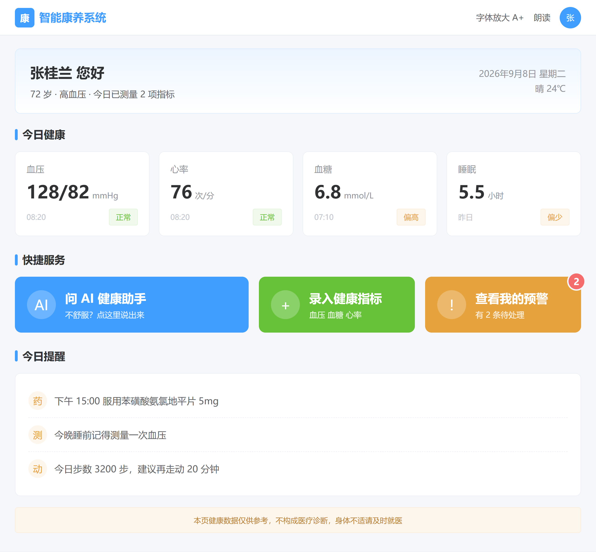
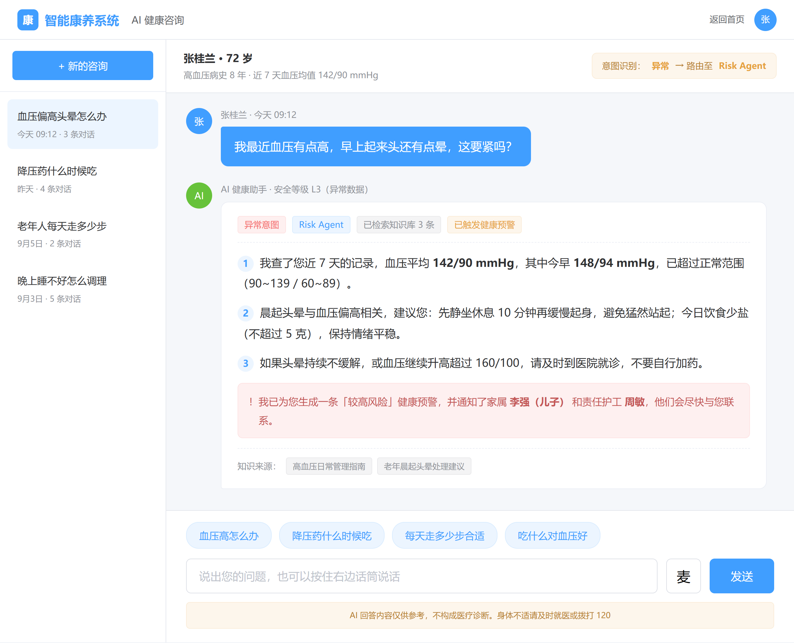
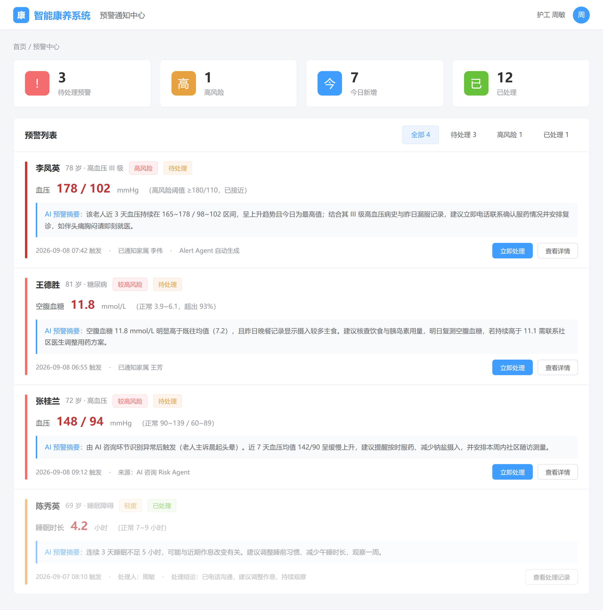
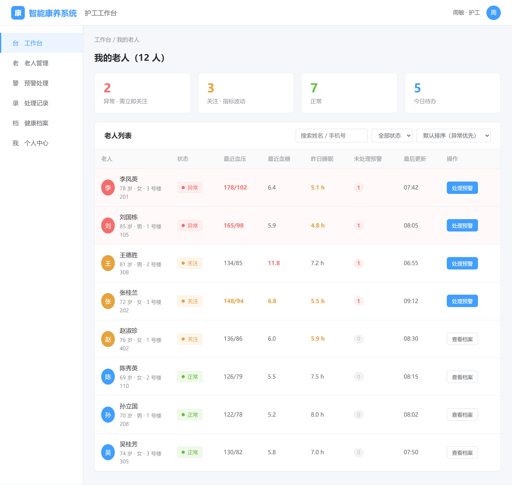
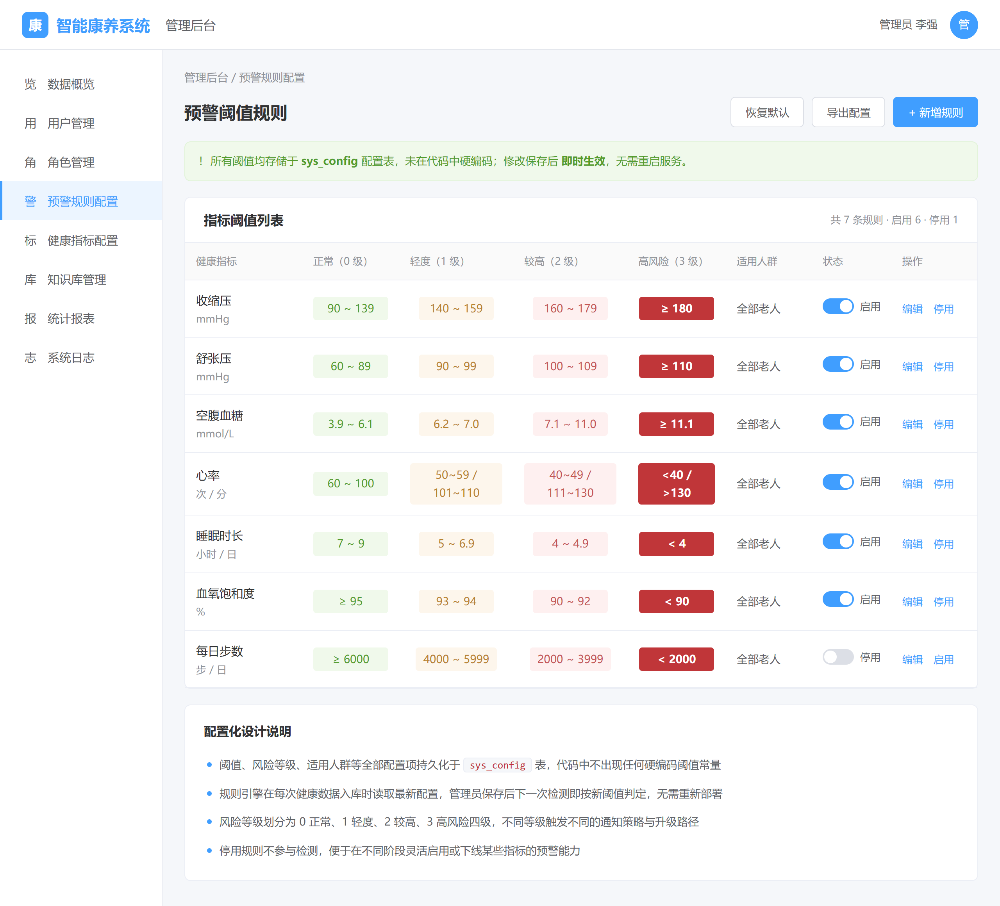
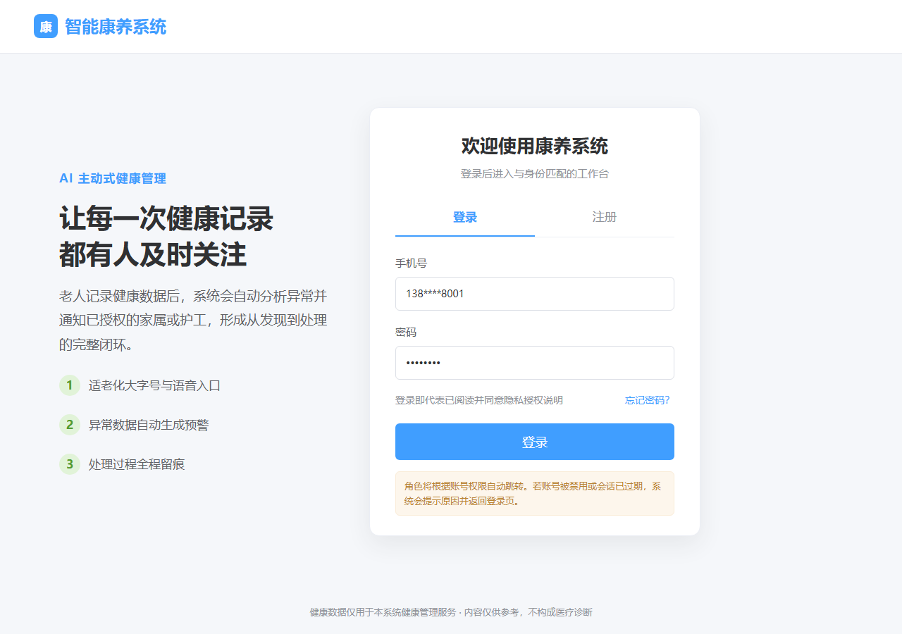
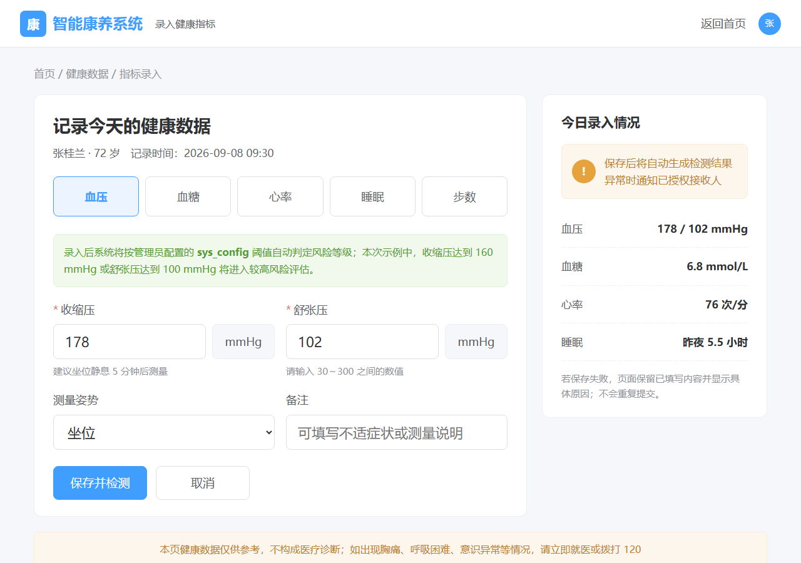
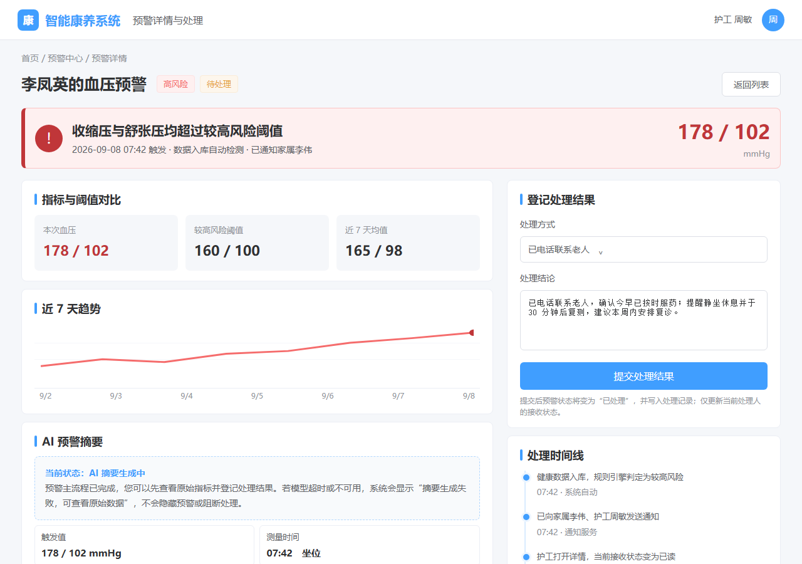
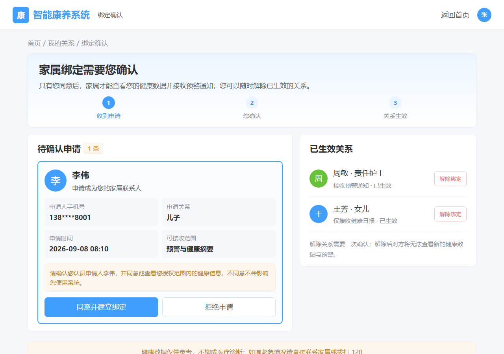

<!-- ============================================================
     基于 AI 智能体的康养系统 · 原型设计说明书 v1.0
     用途：9/11 原型评审交付物
     图片：界面原型/效果图_P*.png（本文件同目录下子目录）
     标注约定：【核心】= 必做（P0/P1 主线闭环）；【选配】= 可裁剪扩展项
     铁律：本 md 为源文件，docx 由 pandoc 生成，不要直接编辑 docx
     ============================================================ -->

# 基于 AI 智能体的康养系统 · 原型设计说明书

> 文档版本：v1.0（待评审）
> 编写日期：2026-09-08
> 上游文档：需求分析说明书 v1.0（125 条 FR）、界面清单 v1.0（38 个界面）
> 用途：2026-09-11 原型评审

---

## 0. 文档信息

| 项 | 内容 |
|---|---|
| 项目名称 | 基于 AI 智能体的智能康养系统 |
| 文档版本 | v1.0（待评审） |
| 编写日期 | 2026-09-08 |
| 指导教师 | 吴剑光 |
| 原型工具 | HTML + CSS 高保真静态原型 |
| 界面总数 | 38 个（核心 29 + 选配 9），本说明书展示其中 9 个 MVP/代表性界面 |

### 修订记录

| 版本 | 日期 | 修改人 | 修改内容 |
|---|---|---|---|
| v1.0 | 2026-09-08 | 丘宇乾 | 首版输出 P1~P5，后续补齐 P6~P9 并同步界面计数 |

---

## 1. 原型概述

### 1.1 展示范围

本项目共规划 38 个界面（核心 29 个、选配 9 个），完整清单见《界面清单_康养系统_v1.0.md》。本次原型评审优先展示最小闭环所需的 8 个界面，并保留管理员规则配置作为第 9 个评审界面：

| 序号 | 界面名称 | 所属角色 | 选取理由 |
|---|---|---|---|
| P1 | 老人端首页 | 老年用户 | 体现适老化设计核心诉求 |
| P2 | AI 健康咨询 | 老年用户 | 系统技术核心，AI 智能体主入口 |
| P3 | 预警通知中心 | 护工 / 家属 | 体现"主动式"预警与处理闭环 |
| P4 | 护工端老人列表 | 护工 | 体现多老人状态管理与优先级排序 |
| P5 | 预警规则配置 | 系统管理员 | 体现阈值配置化设计（非硬编码） |
| P6 | 登录 / 注册 | 公共 | 体现角色白名单、会话过期与登录失败状态 |
| P7 | 指标录入 | 老年用户 | 体现适老化录入、范围校验与录入即判定 |
| P8 | 预警详情与处理 | 家属 / 护工 | 体现 AI 降级不阻断、处理状态流转与留痕 |
| P9 | 绑定确认 | 老年用户 | 体现家属申请必须由老人同意后生效 |

### 1.2 设计原则

1. **适老化优先**：面向老年用户的界面默认字号 ≥18px、主按钮高度 ≥48px、文字与背景对比度达标、主功能操作路径 ≤3 步
2. **状态可视化**：健康状态、风险等级一律采用颜色编码（绿=正常、橙=关注/轻度、红=异常/高风险），并辅以文字标注，不依赖颜色单一通道
3. **AI 可信可控**：AI 相关界面必须展示意图路由结果、安全等级，并固定免责声明
4. **配置不写死**：阈值、指标范围等业务参数一律由后台配置下发，界面不内置常量
5. **视觉体系统一**：沿用 Element Plus 设计语言（主色 #409EFF、圆角 8px、卡片式布局），保证三个角色端视觉一致

---

## 2. 界面原型

### 2.1 P1 老人端首页（【核心】P0）

**对应需求**：FR-ELDER-001~005、FR-ELDER-009~011、FR-HEALTH-002、FR-ALERT-005

**界面构成**

| 区域 | 内容 | 说明 |
|---|---|---|
| 顶部问候区 | 姓名、年龄、慢病标签、当日测量进度 | 建立身份确认与使用信心 |
| 今日健康 | 血压、心率、血糖、睡眠四项指标卡片 | 数值字号 38px，状态色标签区分正常与异常 |
| 快捷服务 | AI 健康咨询、录入健康指标、查看我的预警 | 三个大按钮，主按钮高度 120px；预警按钮带未处理数量角标 |
| 今日提醒 | 用药、测量、运动提醒 | 降低老人记忆负担 |
| 免责声明 | 底部固定提示 | 满足合规要求 |

**设计说明**

- 字号基线提升至 20px、数值 38px，显著高于常规 Web 界面，符合老年用户视力特点
- 主操作按钮采用 120px 高度与高饱和底色，"问 AI 健康助手"占据最大面积，引导核心功能使用
- 预警入口设置红色数字角标，实现"主动提醒"而非被动查询
- 顶部提供"字体放大""朗读"两个全局适老化开关入口

---

### 2.2 P2 AI 健康咨询（【核心】P0）

**对应需求**：FR-AI-001~009、FR-AI-011、FR-AI-014、FR-ALERT-004

**界面构成**

| 区域 | 内容 | 说明 |
|---|---|---|
| 会话侧栏 | 历史咨询记录列表 | 按时间倒序，支持新建咨询 |
| 档案摘要条 | 老人姓名、年龄、病史、近期指标均值 | 为 AI 提供个性化上下文 |
| 意图路由标识 | 识别结果与路由目标 Agent | 展示系统内部决策过程，增强可信度 |
| 对话区 | 用户提问与 AI 回答 | AI 回答分点编号、长句分段 |
| 引用来源 | 命中的知识库条目 | RAG 检索结果可追溯 |
| 输入区 | 预设问题按钮、输入框、语音输入 | 预设问题解决老人打字困难 |
| 免责声明 | 底部固定 | 明确不构成医疗诊断 |

**设计说明**

- **展示意图路由结果**是本界面的关键设计：顶部明确标注"意图识别：异常 → 路由至 Risk Agent"，使评审者直观理解多 Agent 编排机制，而非黑盒问答
- AI 回答采用"1 / 2 / 3"编号分点，避免长段落，适配老年用户阅读习惯
- 回答中嵌入 L3 安全等级标识，异常场景自动追加"已触发预警并通知家属"提示，体现咨询与预警联动
- 回答末尾标注知识来源条目，实现 RAG 检索结果可追溯，降低幻觉质疑

---

### 2.3 P3 预警通知中心（【核心】P0）

**对应需求**：FR-ALERT-001~012、FR-CARE-004~005、FR-FAMILY-007~008

**界面构成**

| 区域 | 内容 | 说明 |
|---|---|---|
| 统计卡片 | 待处理、高风险、今日新增、已处理 | 一眼掌握预警总量与结构 |
| 分类筛选 | 全部 / 待处理 / 高风险 / 已处理 | 支持快速定位 |
| 预警列表 | 四级风险预警条目 | 左侧色条区分风险等级 |
| AI 预警摘要 | 结合历史趋势的个性化分析 | 区别于机械告警 |
| 处理操作 | 立即处理、查看详情、查看处理记录 | 支撑状态流转闭环 |

**设计说明**

- 风险等级采用四级色标（轻度橙 / 较高红 / 高风险深红），同时以文字标签标注，**不依赖颜色单一通道**识别
- 每条预警附 **AI 预警摘要**，结合近 3 天趋势、病史、服药记录生成个性化分析，这是"主动式健康管理"区别于普通阈值告警的核心体现
- 预警来源可区分"数据入库自动触发"与"AI 咨询环节识别触发"，体现两条预警触发路径
- 已处理条目降低透明度并展示处理人与处理结论，实现留痕可追溯

---

### 2.4 P4 护工端老人列表（【核心】P0）

**对应需求**：FR-CARE-001~004、FR-CARE-007~010

**界面构成**

| 区域 | 内容 | 说明 |
|---|---|---|
| 统计概览 | 异常 2、关注 3、正常 7、今日待办 5 | 量化负责老人的整体健康状况 |
| 搜索筛选 | 姓名/手机号搜索、状态筛选、排序 | 支持异常优先排序 |
| 老人列表 | 头像、姓名、年龄、住址、核心指标、预警数 | 一行掌握一位老人全貌 |
| 操作列 | 处理预警 / 查看档案 | 按状态动态切换主操作 |

**设计说明**

- 列表默认按**异常优先**排序，异常行以浅红底色置顶，确保护工打开即见最高优先级事项
- 状态列采用圆点 + 文字标签，异常指标数值以红色加粗显示，实现"扫视即得"
- 未处理预警数以红色药丸标签呈现，为 0 时置灰，避免视觉噪音
- 操作按钮随状态动态变化（有预警时显示"处理预警"，否则显示"查看档案"），减少无效点击

---

### 2.5 P5 预警规则配置（【核心】P0）

**对应需求**：FR-ADMIN-004、FR-ADMIN-005、FR-ADMIN-009、FR-ADMIN-010、FR-ALERT-002

**界面构成**

| 区域 | 内容 | 说明 |
|---|---|---|
| 配置提示条 | 说明配置存储位置与生效方式 | 明确配置化设计 |
| 阈值表格 | 指标、单位、四级阈值区间、适用人群 | 一表呈现全部规则 |
| 状态开关 | 启用 / 停用 | 支持单条规则灵活启停 |
| 操作 | 编辑、启用/停用、新增、恢复默认、导出 | 支撑规则全生命周期管理 |
| 配置化说明 | 设计要点文字说明 | 供评审核对 |

**设计说明**

- 四级阈值以**分色单元格**横向排列（正常绿、轻度橙、较高红、高风险深红），规则结构一目了然
- 页面顶部显著提示"所有阈值均存储于 sys_config 配置表，未在代码中硬编码；修改保存后即时生效"，直接回应设计评审关注点
- 支持按适用人群差异化配置，为后续扩展（如按年龄段、慢病类型设定不同阈值）预留结构
- 提供“恢复默认”与“导出配置”，便于演示环境重置与配置备份

### 2.6 P6 登录 / 注册（【核心】P0）

**对应需求**：FR-AUTH-001~004、FR-AUTH-008、FR-AUTH-012

原型采用登录 / 注册 Tab 结构，登录页明确手机号、密码、角色自动跳转和隐私授权提示。评审时重点确认以下状态均有承载位置：手机号或密码校验失败、账号被禁用、JWT 会话过期，以及注册角色白名单。错误提示应保留在当前表单上下文中，不清空用户已填写内容。

### 2.7 P7 指标录入（【核心】P0）

**对应需求**：FR-HEALTH-005~010、FR-ALERT-001~003

老人端采用大字号、分指标入口和单位固定展示。血压示例明确展示收缩压 / 舒张压、测量姿势、备注和范围校验；保存动作命名为“保存并检测”，直接表达“录入 → 规则判定 → 必要时生成预警”的主链路。阈值说明标注来自 `sys_config`，不在页面硬编码业务规则。

### 2.8 P8 预警详情与处理（【核心】P0）

**对应需求**：FR-ALERT-012、FR-CARE-004~006、FR-FAMILY-008

页面将原始指标、阈值对比、趋势、接收人、处理表单和时间线放在同一上下文中。示例特意展示“AI 摘要生成中”状态，说明摘要为空或失败时，原始数据仍可查看、处理结果仍可提交，符合 D-04 的降级设计；提交后只更新当前处理人的接收状态，并将预警转为已处理、留下记录。

### 2.9 P9 绑定确认（【核心】P0）

**对应需求**：FR-FAMILY-001、FR-FAMILY-003

绑定申请展示申请人、关系、申请时间和授权范围，老人必须明确点击“同意并建立绑定”后关系才生效；“拒绝申请”和已生效关系的“解除绑定”均作为独立操作呈现，并预留二次确认。该页直接落实 D-02 的授权边界，避免家属提交申请后自动获得老人数据权限。

---

## 3. 全局设计约定

| 约定项 | 规范 |
|---|---|
| 主色 | #409EFF（Element Plus 默认蓝） |
| 状态色 | 正常/成功 #67C23A、警告 #E6A23C、危险 #F56C6C、高风险深红 #C03639 |
| 圆角 | 卡片 8px、按钮 6px、老人端大按钮 12~14px |
| 字号 | 常规端 14px；老人端 20px 起，数值 38px |
| 按钮 | 常规 ≥32px 高；老人端主按钮 ≥120px 高 |
| 免责声明 | 所有 AI 相关界面底部固定"内容仅供参考，不构成医疗诊断" |
| 响应式 | 本期 Web 优先，适配手机浏览器，不做原生 App |

---

## 4. 待确认事项

1. 原型工具最终选型（Axure / 墨刀 / Figma）是否需要在评审前统一？当前为 HTML 静态高保真原型
2. 老人端是否需要单独输出大字体版本（更大字号）用于可用性演示？
3. 预警详情采用独立页面还是抽屉组件？（当前按独立页面规划）
4. 家属端首页、统计报表等非 MVP 页面在编码阶段按同一组件规范扩展；本次先补齐登录、指标录入、预警处理、绑定确认四个闭环缺口。

---

> 本说明书中的界面原型为静态高保真效果图，仅用于评审确认信息架构与视觉方向；实际开发以需求分析与概要设计文档为准。
> 原型源文件（HTML + CSS）位于 `02.需求分析/界面原型/` 目录，P1~P9 均可直接打开；修改后运行 `_shot.js` 重新生成图片即可同步更新本文档。
