# 基于 AI 智能体的康养系统 · 原型设计说明书

> 本文档为界面原型的唯一索引：界面清单中的每一个界面编号，在此都有一张对应的效果图与一段设计说明。
> 用途：9/11 原型评审的扩充交付、9/24 概要设计 + 数据库设计评审的界面基线、前端开发的实现依据。

---

## 0. 文档信息

| 项 | 内容 |
|---|---|
| 项目名称 | 基于 AI 智能体的康养系统 |
| 文档版本 | v2.0 |
| 编写日期 | 2026-09-14 |
| 上游文档 | 需求分析说明书 v1.0（125 条 FR）、界面清单 v1.0（38 个界面）、设计决策记录 v1.0 |
| 覆盖界面 | **38 个 = 核心 29 + 选配 9**，一界面一图，无遗漏 |
| 效果图数量 | 38 张（1280 宽、2 倍像素密度） |
| 责任分工 | 公共 / 认证、老人端、家属端：梁霁鸣；护工端、管理员端：周彦龙；口径与出图管线：丘宇乾 |

### 修订记录

| 版本 | 日期 | 修订人 | 变更 |
|---|---|---|---|
| v1.0 | 2026-09-08 | 丘宇乾 | 首版输出 P1~P5，用于 9/11 原型评审 |
| v1.0（补） | 2026-09-11 | 丘宇乾 | 补齐 P6~P9，同步界面计数 |
| **v2.0** | **2026-09-14** | **丘宇乾** | **由 9 张扩充为全量 38 张；文件按界面清单编号（UI-XXX-NN）重新命名，与清单逐条对应；v1.0 的 P1~P9 已归档至 `界面原型/_v1_评审版/`** |

---

### 目录

| 章节 | 内容 |
|---|---|
| 0 | 文档信息、修订记录 |
| 1 | 原型概述：交付范围与统计口径、设计原则、文件组织与出图管线、状态覆盖口径 |
| 2 | 界面原型：2.1 公共 / 认证（4 个）、2.2 老人端（13 个）、2.3 家属端（5 个）、2.4 护工端（6 个）、2.5 管理员端（10 个） |
| 3 | 全局设计约定 |
| 4 | v1.0 编号映射与归档 |
| 5 | 状态覆盖总表（38 行） |
| 6 | 待确认事项 |

> 第 2 章按界面清单编号（UI-AUTH-01 ~ UI-ADMIN-10）顺序排列，每节包含：对应 FR、优先级、关键要素、覆盖状态、源文件路径、效果图与设计说明。

---

## 1. 原型概述

### 1.1 交付范围与统计口径

- **统计口径**：独立页面。弹窗、抽屉、确认框归入其所属页面，不单独计数。
- **覆盖范围**：界面清单 v1.0 中的全部 38 个界面，含【核心】29 个与【选配】9 个。选配界面同样出图，但在标题与页内标注中明确其为可裁剪项。
- 分组数量：公共 / 认证 4 个、老人端 13 个、家属端 5 个、护工端 6 个、管理员端 10 个。

| 分组 | 核心 | 选配 | 小计 | 担当 |
|---|---|---|---|---|
| 公共 / 认证 | 3 | 1 | 4 | 梁霁鸣（界面）· 丘宇乾（后端） |
| 老人端 | 11 | 2 | 13 | 梁霁鸣 |
| 家属端 | 4 | 1 | 5 | 梁霁鸣 |
| 护工端 | 5 | 1 | 6 | 周彦龙 |
| 管理员端 | 6 | 4 | 10 | 周彦龙 |
| **合计** | **29** | **9** | **38** | |

### 1.2 设计原则

1. **适老化不是皮肤，是约束**：老人端正文 ≥18px、关键数值更大、主按钮 ≥48px、主流程 ≤3 步。本说明书 2.2 节全部 13 个界面均按此实现。
2. **状态必须画出来**：列表页要有空数据，表单页要有校验失败，权限页要有无权限提示。每个界面顶部的标注条列出该图覆盖了哪些状态，第 5 章给出总表。
3. **配置不写死**：阈值、指标范围、绑定上限一律从 sys_config 读取。界面上只展示"当前生效值"与"来源"，不出现硬编码数字。
4. **AI 失败不能拖垮主流程**：摘要生成中、失败、模型不可用三种情况都只降级展示区域，预警与指标录入照常可用。
5. **权限边界写在界面上**：绑定未确认看不到数据、护工只看负责老人、家属只见已绑定老人——这些规则在页面上直接说明，而不是等用户撞到 1002 才解释。
6. **免责声明固定页脚**：所有涉及健康建议与 AI 输出的页面，页脚固定"不构成医疗诊断"。

### 1.3 文件组织与出图管线

```
02.需求分析/界面原型/
├── prototype.css                共享样式（v2.0 追加通用组件，不改动 v1.0 部分）
├── pages/                       38 个 HTML 源文件，按 UI 编号命名
│   ├── UI-AUTH-01_登录页.html
│   └── ...
├── 效果图/                      38 张 PNG，与 pages/ 同名
│   └── UI-AUTH-01_登录页.png
├── _gen/                        生成器（可重跑，改内容后一键重建 38 页）
│   ├── _lib.py                  外壳与组件库（适老化 / 家属 / 护工 / 管理后台四套外壳）
│   ├── _pages_a.py              公共 4 + 老人端 13
│   ├── _pages_b.py              家属端 5 + 护工端 6
│   ├── _pages_c.py              管理员端 10
│   ├── _gen.py                  生成 38 个 HTML
│   └── _make_doc.py             生成本说明书
├── _shot.js                     批量截图（Playwright + 系统 Chrome，1280×900 @2x）
└── _v1_评审版/                   v1.0 的 9 张原型与效果图（含当时的 css 快照），仅供追溯
```

出图命令：

```bash
# 1) 重新生成 38 个页面
cd 02.需求分析/界面原型/_gen && python _gen.py
# 2) 批量截图到 效果图/
cd .. && NODE_PATH=<node workspace>/node_modules node _shot.js
```

### 1.4 状态覆盖口径

每个界面顶部有一条蓝色标注条，写明该界面编号、名称与所覆盖的状态，例如：

> UI-ELDER-10　预警详情　｜　覆盖状态：正常（含 AI 摘要）/ AI 摘要失败降级不阻断 / 已被他人处理 / 已读未读独立

未单独绘制状态变形的界面，其状态以页内卡片的形式呈现（如"空数据状态""无权限状态""弹窗形态示意"卡片），而不是只写一句文字说明。第 5 章汇总了全部 38 个界面的状态清单。

---

## 2. 界面原型


### 2.1 公共 / 认证（4 个：核心 3 + 选配 1）

> 担当：梁霁鸣（界面）· 丘宇乾（后端）


#### 2.1.1 UI-AUTH-01　登录页

| 项 | 内容 |
|---|---|
| 对应 FR | FR-AUTH-002 / 003 / 004 / 012 |
| 优先级 | 【核心】P0 |
| 关键要素 | 手机号 + 密码、角色自动跳转、会话过期提示、连续失败锁定 |
| 覆盖状态 | 正常 / 登录失败提示 / 会话过期 / 账号锁定风险提示 |
| 源文件 | `界面原型/pages/UI-AUTH-01_登录页.html` |

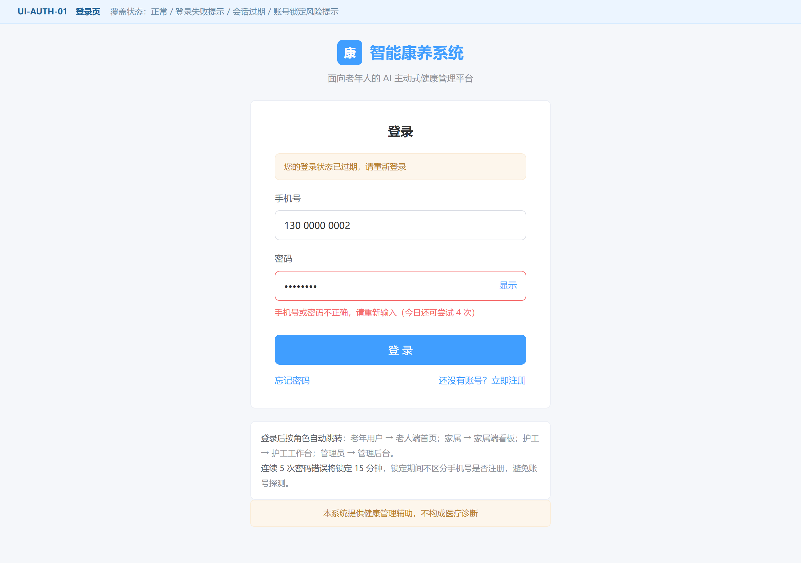{width=6.3in}

设计说明：系统单一入口承载四类角色，登录成功后按 role 自动跳转到对应端，避免让老年人在登录页做「我该进哪个端」的二次选择。失败提示不区分「手机号未注册」与「密码错误」，防止账号枚举。


#### 2.1.2 UI-AUTH-02　注册页

| 项 | 内容 |
|---|---|
| 对应 FR | FR-AUTH-001 / 011 |
| 优先级 | 【核心】P0 |
| 关键要素 | 手机号格式校验、验证码、密码强度、隐私授权确认、角色白名单 |
| 覆盖状态 | 正常 / 格式校验失败 / 角色白名单限制 / 隐私授权未勾选 |
| 源文件 | `界面原型/pages/UI-AUTH-02_注册页.html` |

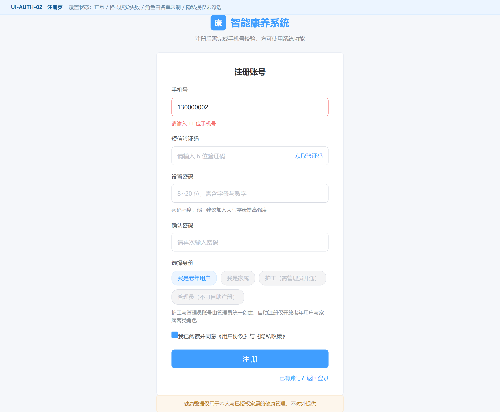{width=6.3in}

设计说明：自助注册仅开放老年用户与家属两类角色，护工与管理员必须由管理员创建（D-01）。身份选择项对不可自助注册的角色采用置灰而非隐藏的方式呈现，让用户知道该路径存在、只是需要联系管理员。


#### 2.1.3 UI-AUTH-03　个人中心

| 项 | 内容 |
|---|---|
| 对应 FR | FR-AUTH-010 |
| 优先级 | 【核心】P2 |
| 关键要素 | 查看 / 修改基本资料、修改密码、更换手机号、退出登录 |
| 覆盖状态 | 正常 / 修改密码成功 / 手机号已被占用 / 未登录跳转 |
| 源文件 | `界面原型/pages/UI-AUTH-03_个人中心.html` |

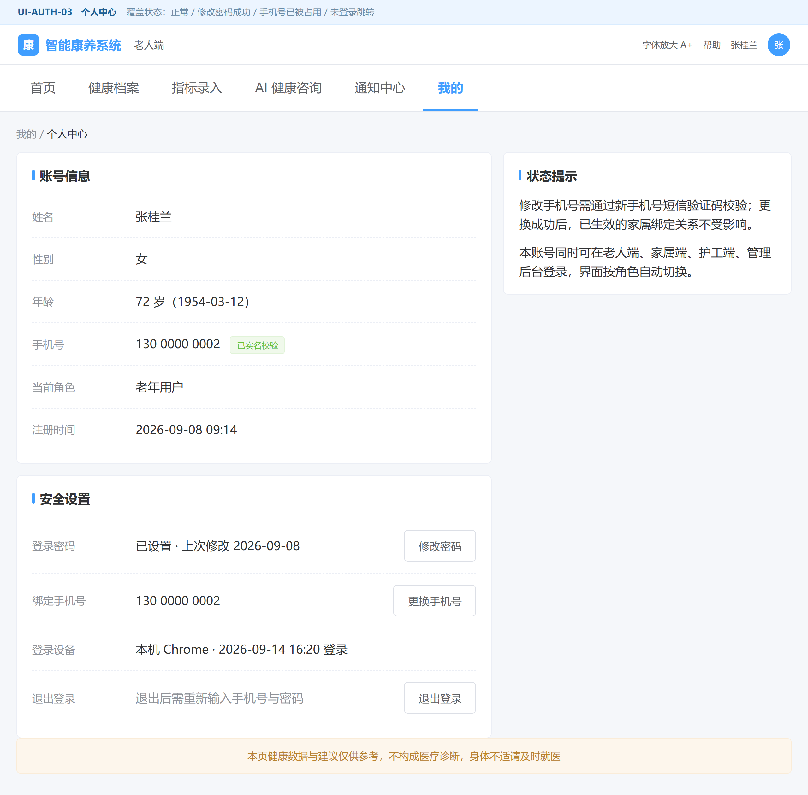{width=6.3in}

设计说明：四类角色共用同一页面，内容按角色裁剪。修改手机号需短信验证码校验，更换成功后已生效的绑定关系不受影响。


#### 2.1.4 UI-AUTH-04　忘记密码

| 项 | 内容 |
|---|---|
| 对应 FR | FR-AUTH-006 / 009 |
| 优先级 | 【选配】P1 |
| 关键要素 | 手机验证码找回、三步流程、失败不区分提示 |
| 覆盖状态 | 正常 / 验证码错误 / 手机号未注册（不区分提示）/ 次数超限 |
| 源文件 | `界面原型/pages/UI-AUTH-04_忘记密码.html` |

{width=6.3in}

设计说明：【选配】找回流程为「手机号 → 验证码 → 新密码」三步。校验失败统一提示，不区分手机号是否已注册；若工期不足，登录页保留「联系管理员重置」作为兜底路径。


### 2.2 老人端（13 个：核心 11 + 选配 2）

> 担当：梁霁鸣


#### 2.2.1 UI-ELDER-01　老人首页

| 项 | 内容 |
|---|---|
| 对应 FR | FR-ELDER-001~005 / 009~011 / 014 |
| 优先级 | 【核心】P0 |
| 关键要素 | 适老化（正文 ≥18px、主按钮 ≥48px）、健康卡片、AI 入口、预警入口、主功能 ≤3 步 |
| 覆盖状态 | 正常 / 空数据（今日未测量）/ 未读预警红点 / 数据不足时趋势占位 |
| 源文件 | `界面原型/pages/UI-ELDER-01_老人首页.html` |

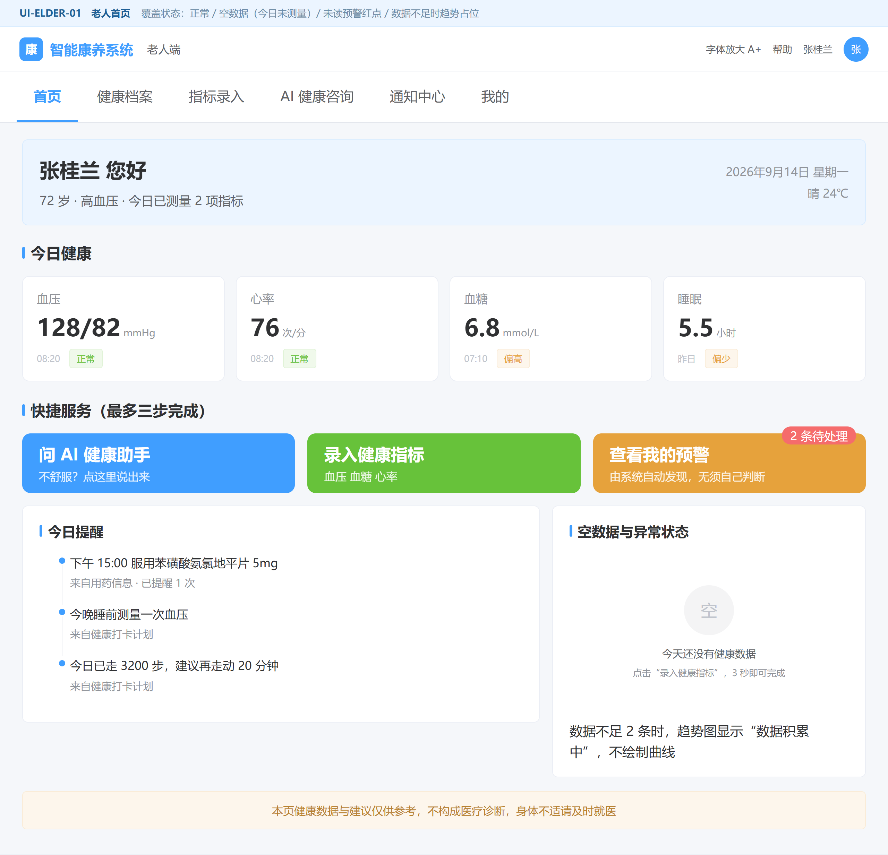{width=6.3in}

设计说明：适老化基线的示范页：正文 19~20px、关键数值 34px、主按钮高度 ≥48px。把「问 AI / 录指标 / 看预警」三个高频动作做成整块大按钮，主流程不超过 3 步；预警入口直接带出待处理条数，无须老人自己判断是否异常。


#### 2.2.2 UI-ELDER-02　健康档案

| 项 | 内容 |
|---|---|
| 对应 FR | FR-HEALTH-002 |
| 优先级 | 【核心】P0 |
| 关键要素 | 基本信息、病史、慢病标签、紧急联系人、已授权家属 |
| 覆盖状态 | 正常 / 空档案（引导完善）/ 未确认家属无权限 / 慢病标签空 |
| 源文件 | `界面原型/pages/UI-ELDER-02_健康档案.html` |

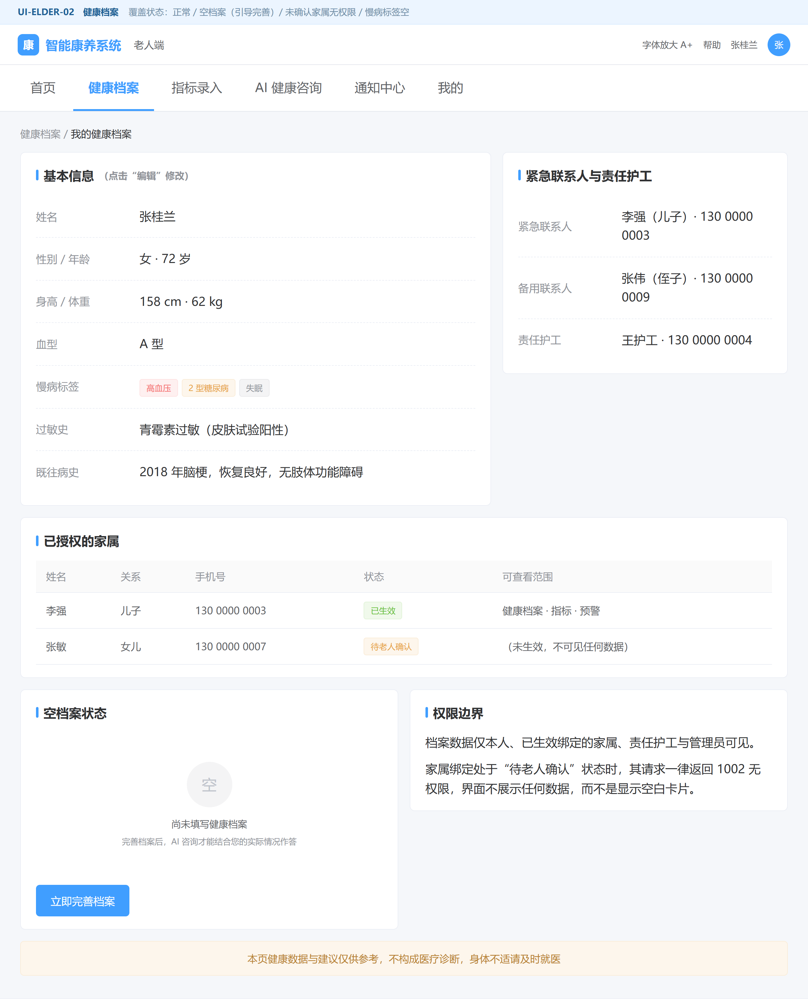{width=6.3in}

设计说明：健康档案是 AI 咨询能「结合本人实际情况」作答的前提，因此慢病与过敏史以结构化标签存储而非自由文本。页面同时写明数据可见范围，让老人明确知道谁能看到自己的数据。


#### 2.2.3 UI-ELDER-03　档案编辑

| 项 | 内容 |
|---|---|
| 对应 FR | FR-HEALTH-001 / 003 / 004 |
| 优先级 | 【核心】P0 |
| 关键要素 | 新增 / 修改 / 删除（二次确认）、字段范围校验 |
| 覆盖状态 | 正常 / 字段越界校验 / 保存成功提示 / 删除二次确认 / 未登录 |
| 源文件 | `界面原型/pages/UI-ELDER-03_档案编辑.html` |

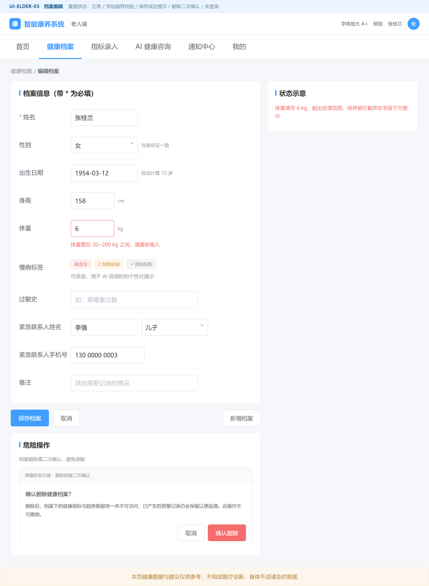{width=6.3in}

设计说明：表单逐字段做范围校验并在字段下方就地给出提示，而不是提交后统一弹错。删除档案等高危动作一律二次确认，原型中单独示意弹窗形态，避免评审时无法判断该状态是否已设计。


#### 2.2.4 UI-ELDER-04　指标录入

| 项 | 内容 |
|---|---|
| 对应 FR | FR-HEALTH-005~010 |
| 优先级 | 【核心】P0 |
| 关键要素 | 血压 / 血糖 / 心率 / 睡眠 / 步数统一表单、范围校验、录入即判定 |
| 覆盖状态 | 正常 / 范围校验拦截 / 保存失败重试 / 录入即触发判定 |
| 源文件 | `界面原型/pages/UI-ELDER-04_指标录入.html` |

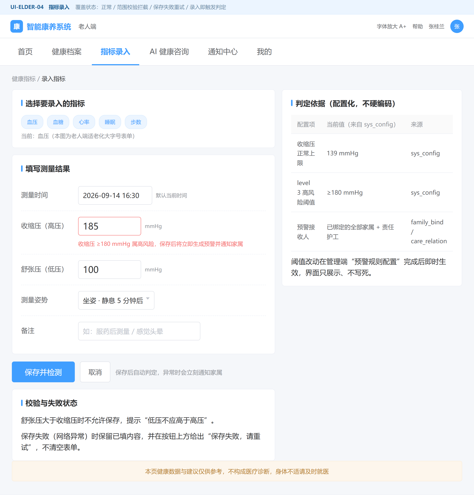{width=6.3in}

设计说明：五类指标共用一个表单、以类型切换，对应 health_record 单表设计，避免建 5 张同构表。页面显式标注阈值来自 sys_config，并说明「保存即判定、异常即通知家属」——这是主动式健康管理链条的起点。


#### 2.2.5 UI-ELDER-05　指标历史

| 项 | 内容 |
|---|---|
| 对应 FR | FR-HEALTH-011 |
| 优先级 | 【核心】P1 |
| 关键要素 | 按时间倒序、类型筛选、分页、异常跳转 |
| 覆盖状态 | 正常 / 空数据 / 筛选无结果 / 无权限 |
| 源文件 | `界面原型/pages/UI-ELDER-05_指标历史.html` |

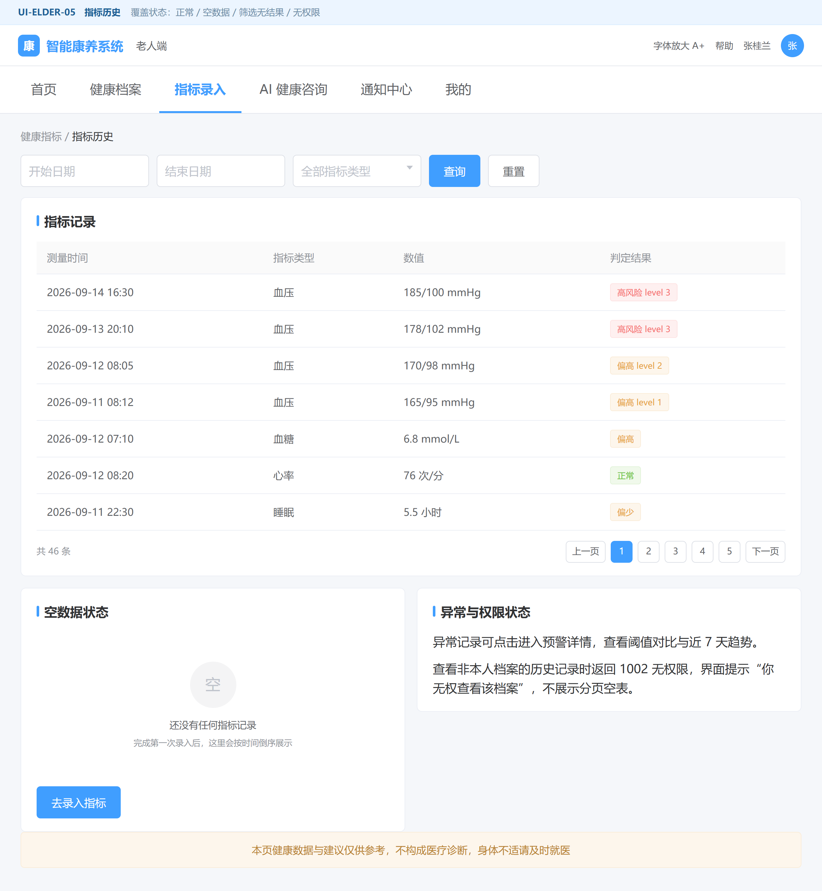{width=6.3in}

设计说明：按时间倒序 + 类型筛选 + 分页；异常记录带出判定级别，可直接跳转预警详情。空数据与无权限分别给出不同引导，无权限时不渲染空表，避免被误读为「没有数据」。


#### 2.2.6 UI-ELDER-06　健康趋势图

| 项 | 内容 |
|---|---|
| 对应 FR | FR-HEALTH-012 / 013 |
| 优先级 | 【核心】P1 |
| 关键要素 | 近 30 天曲线、异常点高亮、统计摘要 |
| 覆盖状态 | 正常 / 数据不足（<2 条占位）/ 异常点高亮 / AI 解读降级 |
| 源文件 | `界面原型/pages/UI-ELDER-06_健康趋势图.html` |

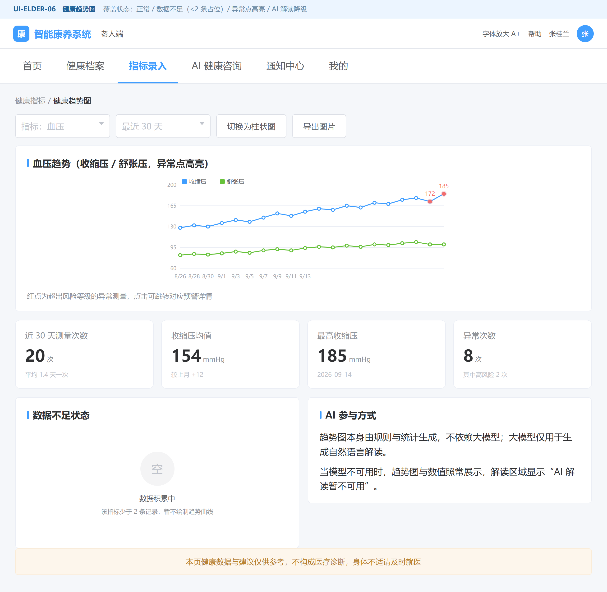{width=6.3in}

设计说明：趋势图由统计与规则生成，不调用大模型，因此模型故障不影响本页。异常点高亮并可点击跳转对应预警；记录少于 2 条时明确显示「数据积累中」，不绘制一条会被误读的趋势线。


#### 2.2.7 UI-ELDER-07　AI 健康咨询

| 项 | 内容 |
|---|---|
| 对应 FR | FR-AI-001~009 / 011 / 014 / 015 |
| 优先级 | 【核心】P0 |
| 关键要素 | 对话界面、意图路由结果展示、预设问题、免责声明页脚、紧急升级落预警 |
| 覆盖状态 | 正常（多意图路由）/ 紧急症状升级并落预警 / 模型不可用降级 / 超频限流 / 敏感词兜底 |
| 源文件 | `界面原型/pages/UI-ELDER-07_AI健康咨询.html` |

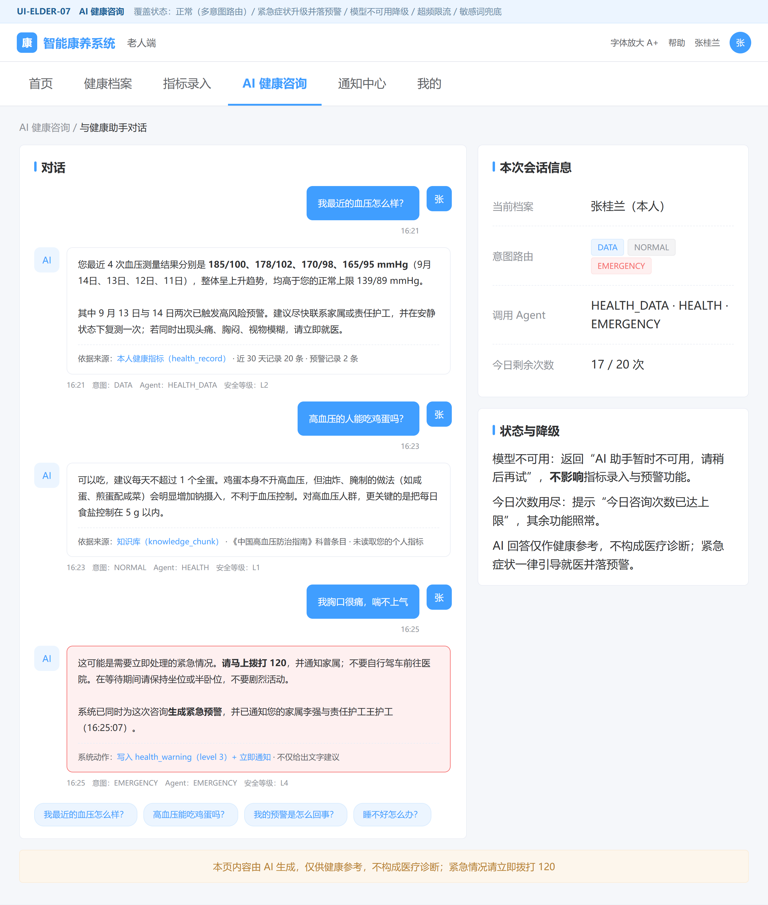{width=6.3in}

设计说明：系统技术核心页。四条意图路径在界面上直接可见：DATA 查本人指标、NORMAL 查知识库、ABNORMAL 查预警与趋势、EMERGENCY 强制写入预警并立即通知——用于证明多 Agent 真的按数据路径分流，而不是在聊天框上挂了个模型名。


#### 2.2.8 UI-ELDER-08　咨询历史

| 项 | 内容 |
|---|---|
| 对应 FR | FR-AI-010 |
| 优先级 | 【核心】P1 |
| 关键要素 | 按档案查看历史问答、会话回看 |
| 覆盖状态 | 正常 / 空数据 / 按档案筛选 / 权限隔离（仅本人与已绑定家属） |
| 源文件 | `界面原型/pages/UI-ELDER-08_咨询历史.html` |

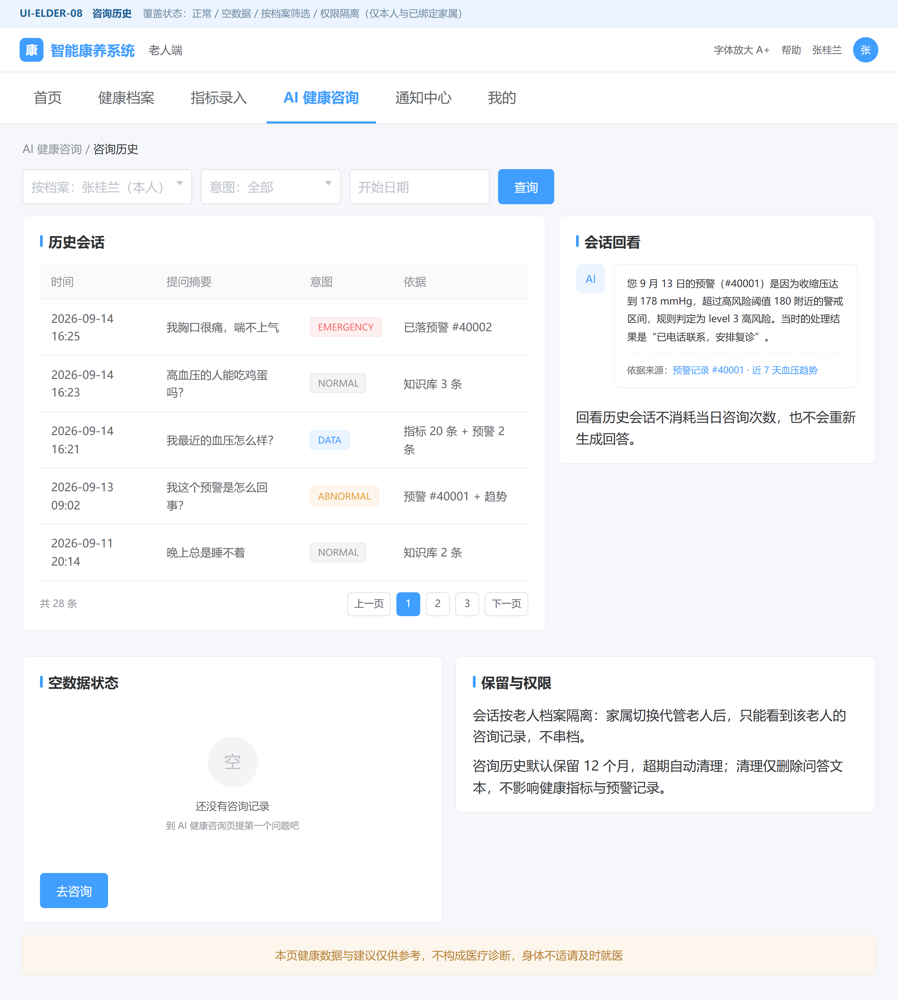{width=6.3in}

设计说明：回看历史会话不消耗当日咨询次数，也不会重新触发模型调用。会话按档案隔离，家属切换代管老人后只看到该老人的记录，不串档。


#### 2.2.9 UI-ELDER-09　通知中心

| 项 | 内容 |
|---|---|
| 对应 FR | FR-ALERT-005 / 011 |
| 优先级 | 【核心】P0 |
| 关键要素 | 预警汇总、已读 / 未读、级别筛选 |
| 覆盖状态 | 正常 / 未读红点 / 全部已读（空态）/ 已读与已处理状态正交 |
| 源文件 | `界面原型/pages/UI-ELDER-09_通知中心.html` |

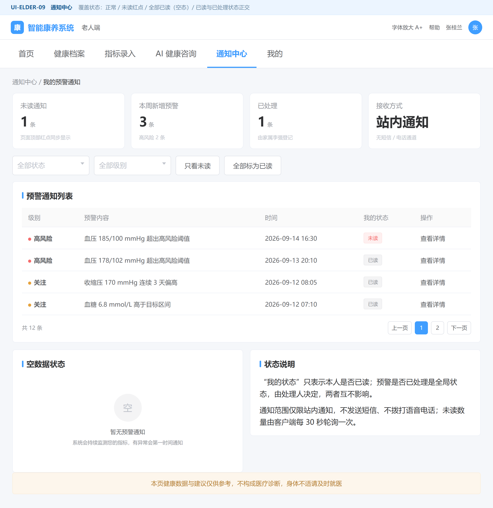{width=6.3in}

设计说明：本页只表达「我读了没有」；预警是否已处理是全局状态，留给详情页展示（D-05 状态分离）。页面明确标注通知仅走站内通道，不含短信与电话（D-03）。


#### 2.2.10 UI-ELDER-10　预警详情

| 项 | 内容 |
|---|---|
| 对应 FR | FR-ALERT-012 |
| 优先级 | 【核心】P1 |
| 关键要素 | 指标值、阈值对比、历史趋势、AI 预警摘要、处理记录 |
| 覆盖状态 | 正常（含 AI 摘要）/ AI 摘要失败降级不阻断 / 已被他人处理 / 已读未读独立 |
| 源文件 | `界面原型/pages/UI-ELDER-10_预警详情.html` |

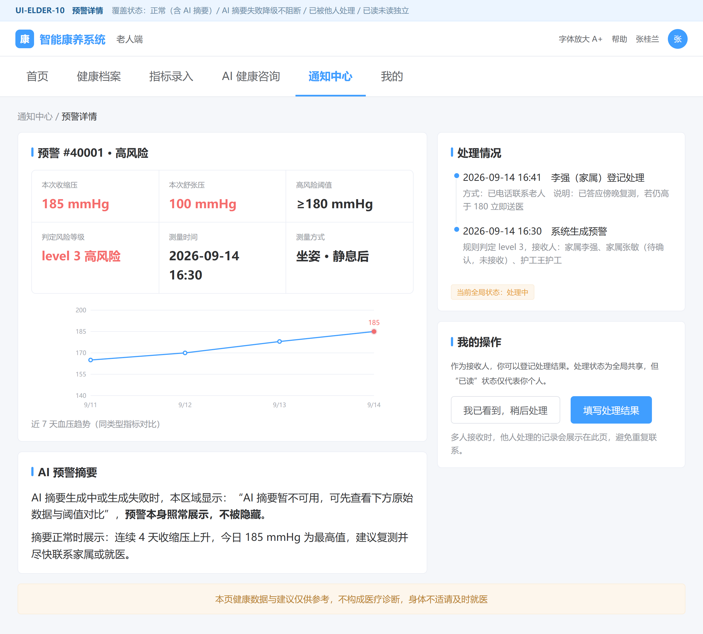{width=6.3in}

设计说明：指标值 + 阈值对比 + 近 7 天趋势构成「为什么报警」的完整证据链。AI 摘要为异步增强，生成中或失败时只降级该区域并提示可查看原始数据，预警本身照常展示（D-04）。


#### 2.2.11 UI-ELDER-11　健康打卡

| 项 | 内容 |
|---|---|
| 对应 FR | FR-HEALTH-015 |
| 优先级 | 【选配】P2 |
| 关键要素 | 每日血压 / 睡眠 / 运动一键打卡、连续天数 |
| 覆盖状态 | 正常 / 部分未打卡 / 全部完成 / 重复打卡覆盖提示 |
| 源文件 | `界面原型/pages/UI-ELDER-11_健康打卡.html` |

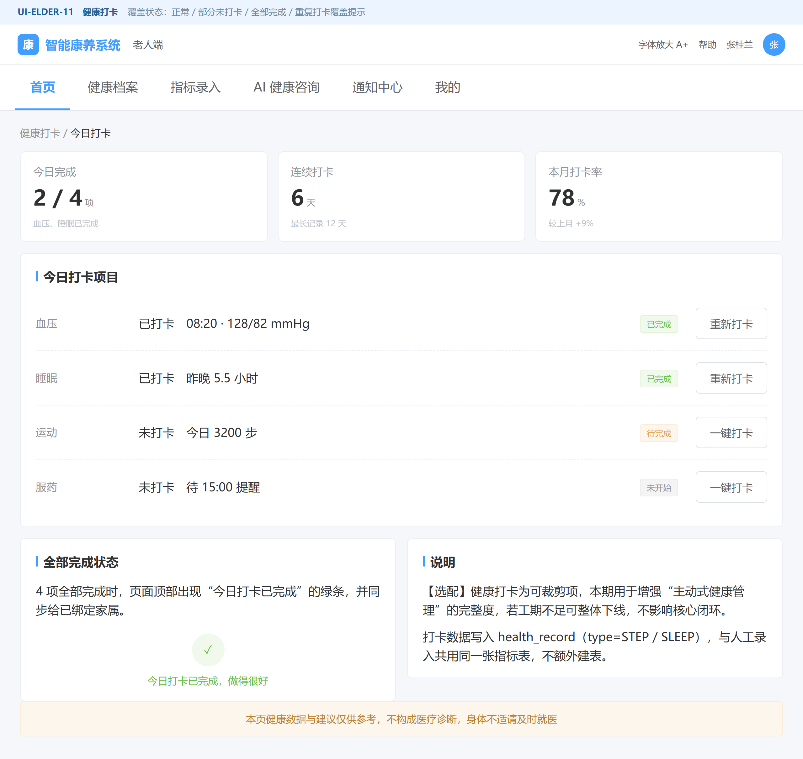{width=6.3in}

设计说明：【选配】打卡数据写入 health_record（type=SLEEP / STEPS），与人工录入共用同一张指标表，不额外建表；工期不足可整体下线，不影响核心预警闭环。


#### 2.2.12 UI-ELDER-12　用药信息

| 项 | 内容 |
|---|---|
| 对应 FR | FR-HEALTH-016 |
| 优先级 | 【选配】P2 |
| 关键要素 | 药名 / 剂量 / 时间录入、按时提醒 |
| 覆盖状态 | 正常 / 空数据 / 新增校验失败 / 停用药品 |
| 源文件 | `界面原型/pages/UI-ELDER-12_用药信息.html` |

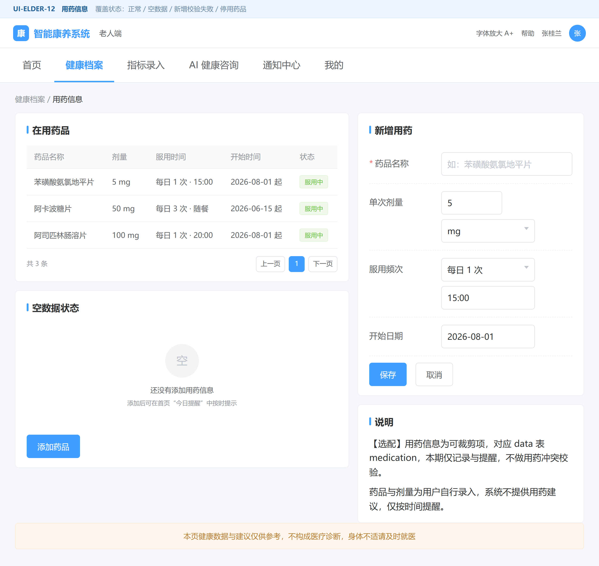{width=6.3in}

设计说明：【选配】仅做用药记录与按时提醒，系统不提供用药建议、不做药物冲突校验，避免越界到医疗诊断。


#### 2.2.13 UI-ELDER-13　绑定确认

| 项 | 内容 |
|---|---|
| 对应 FR | FR-FAMILY-001 / 003 |
| 优先级 | 【核心】P0 |
| 关键要素 | 待确认绑定申请、同意 / 拒绝、解绑已生效关系 |
| 覆盖状态 | 正常 / 无待确认申请（空态）/ 拒绝后不可见数据 / 解绑二次确认 |
| 源文件 | `界面原型/pages/UI-ELDER-13_绑定确认.html` |

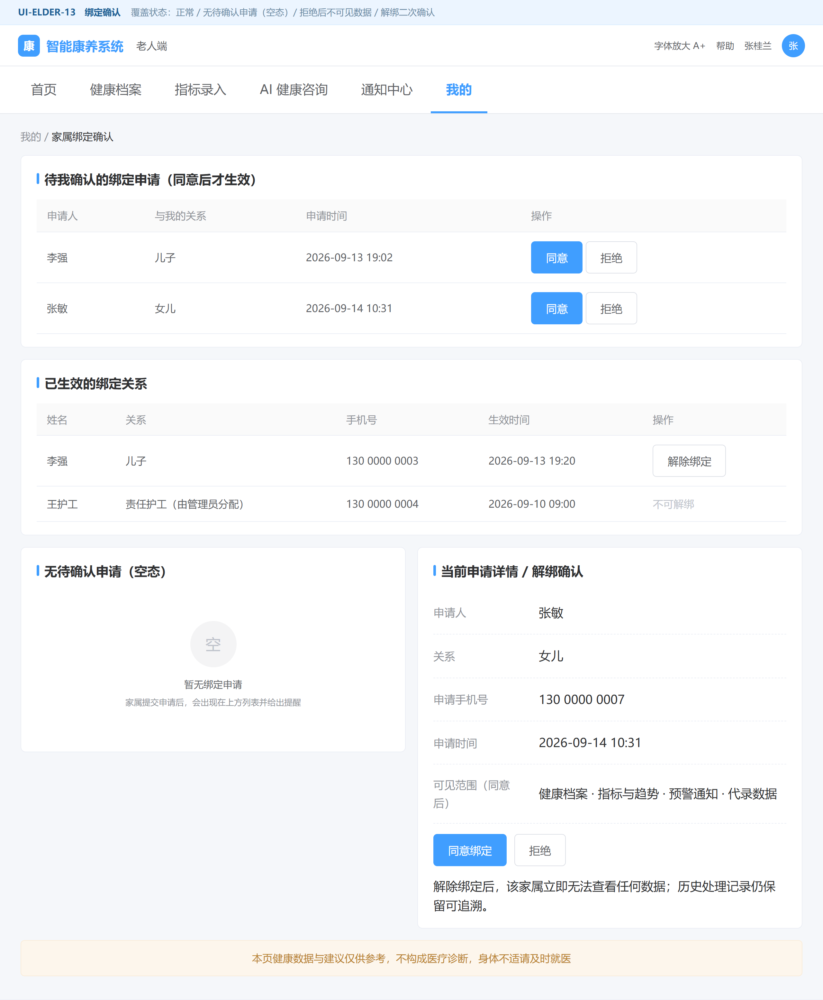{width=6.3in}

设计说明：家属绑定必须由老人本人同意才生效（D-02），因此老人端需要独立的待确认列表。同意后才授权；拒绝或解绑后立刻收回权限，但历史处理记录保留以便追溯。


### 2.3 家属端（5 个：核心 4 + 选配 1）

> 担当：梁霁鸣


#### 2.3.1 UI-FAMILY-01　家属首页

| 项 | 内容 |
|---|---|
| 对应 FR | FR-FAMILY-002 / 005 / 011 |
| 优先级 | 【核心】P0 |
| 关键要素 | 代管老人看板、多老人切换、数据归属隔离 |
| 覆盖状态 | 正常 / 多老人切换 / 无绑定老人（空态）/ 未读红点 |
| 源文件 | `界面原型/pages/UI-FAMILY-01_家属首页.html` |

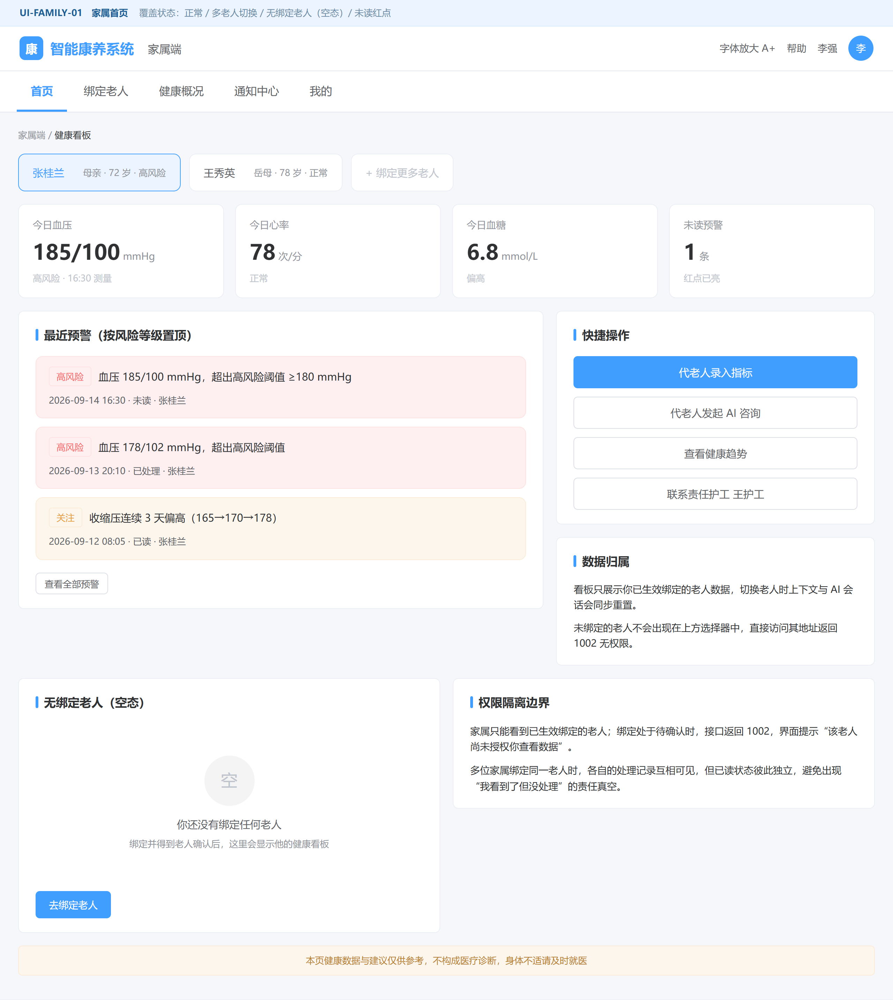{width=6.3in}

设计说明：家属端第一屏要回答「我今天需要管什么」，因此把未读预警与高风险指标置顶。支持多老人切换；未绑定的老人不会出现在选择器中，直接访问其地址返回 1002 无权限。


#### 2.3.2 UI-FAMILY-02　绑定老人

| 项 | 内容 |
|---|---|
| 对应 FR | FR-FAMILY-001 / 003 |
| 优先级 | 【核心】P0 |
| 关键要素 | 提交绑定申请（手机号 + 关系）、申请状态、解绑 |
| 覆盖状态 | 正常 / 待确认（数据不可见）/ 已被拒绝 / 解绑二次确认 / 超出绑定上限 |
| 源文件 | `界面原型/pages/UI-FAMILY-02_绑定老人.html` |

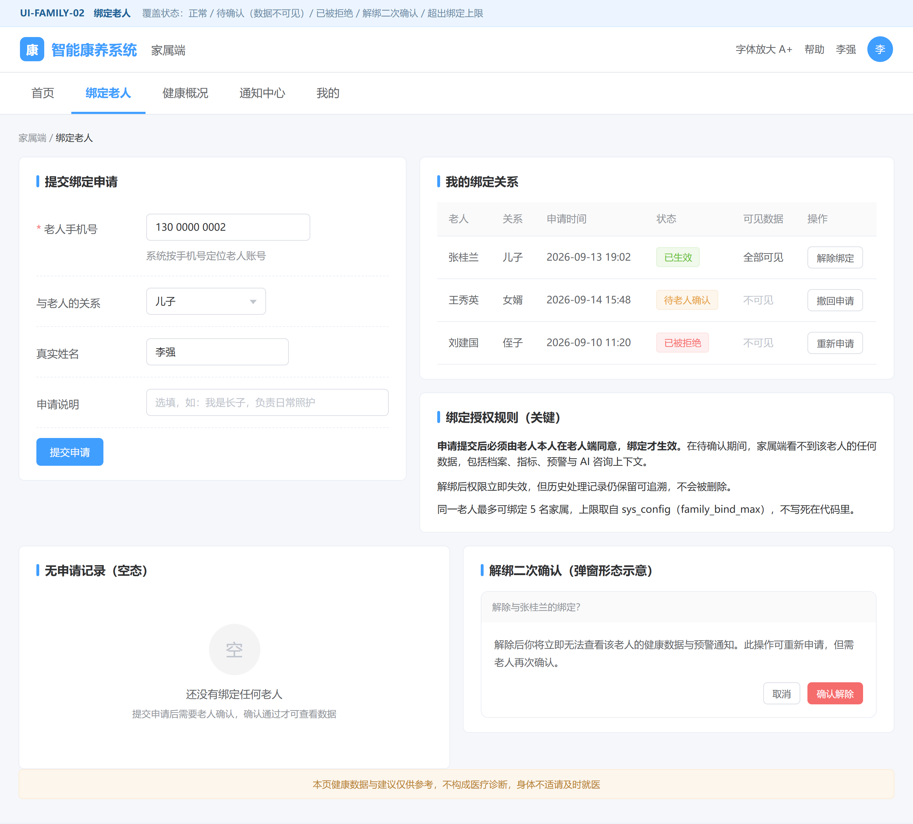{width=6.3in}

设计说明：绑定申请、状态跟踪与解绑集中在一个页面完成。页面显式说明「待确认期间看不到任何数据」，把授权规则前置告知，避免家属误判为系统故障。


#### 2.3.3 UI-FAMILY-03　老人健康概况

| 项 | 内容 |
|---|---|
| 对应 FR | FR-FAMILY-005 / 006 / 009 |
| 优先级 | 【核心】P0 |
| 关键要素 | 档案、趋势、代录数据、代发起 AI 咨询入口 |
| 覆盖状态 | 正常 / 无权限（未绑定）/ 空数据（无指标）/ 代录数据 |
| 源文件 | `界面原型/pages/UI-FAMILY-03_老人健康概况.html` |

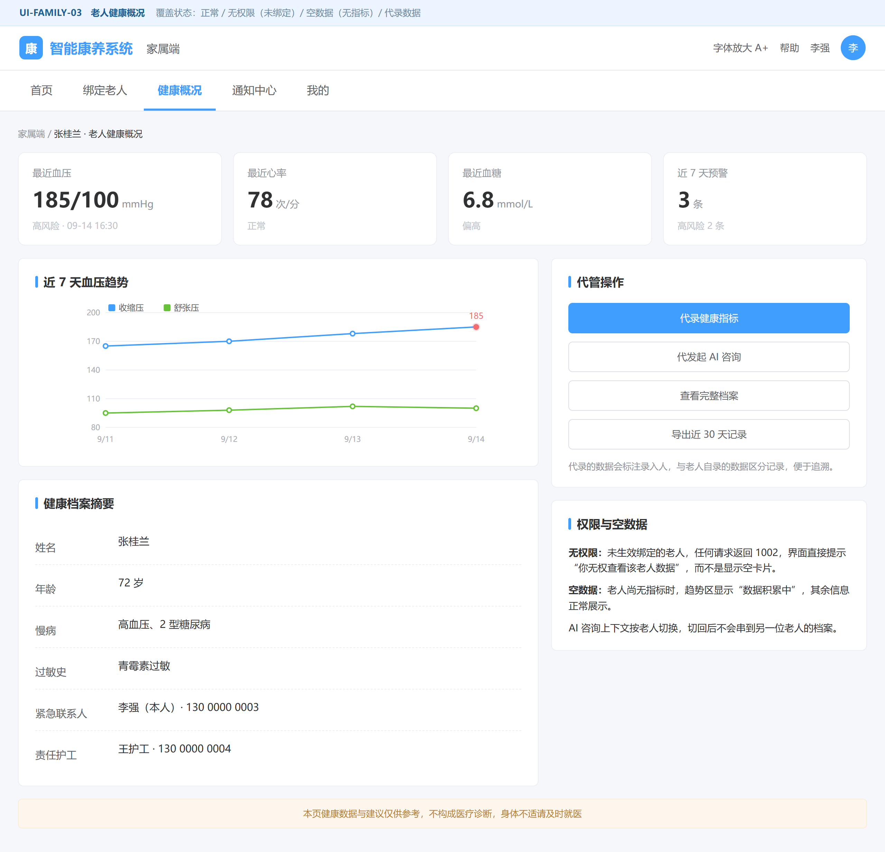{width=6.3in}

设计说明：家属视角的档案 + 趋势 + 代录 / 代发起咨询入口。代录数据标注录入人，与老人自录数据可区分，便于事后责任界定。


#### 2.3.4 UI-FAMILY-04　通知中心

| 项 | 内容 |
|---|---|
| 对应 FR | FR-FAMILY-007 / 008 / 012 |
| 优先级 | 【核心】P0 |
| 关键要素 | 接收预警、确认处理（已电话联系 / 已上门 / 已协助就医） |
| 覆盖状态 | 正常 / 未读红点 / 已被他人处理 / 提交失败重试 / 已读与处理状态正交 |
| 源文件 | `界面原型/pages/UI-FAMILY-04_通知中心.html` |

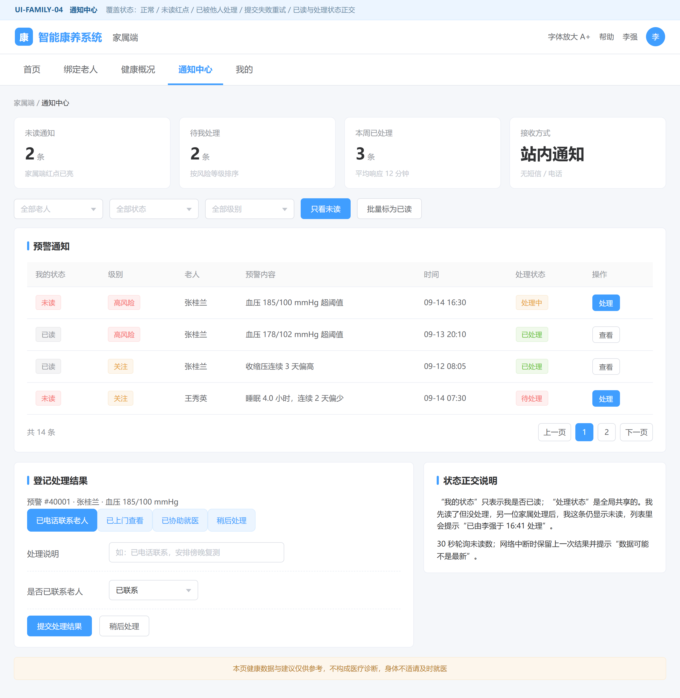{width=6.3in}

设计说明：接收、确认处理与留痕在同一页完成。处理方式做成一键可选项（已电话联系 / 已上门查看 / 已协助就医），降低填写成本，同时保证处理记录规范、可统计、可回归。


#### 2.3.5 UI-FAMILY-05　健康日报周报

| 项 | 内容 |
|---|---|
| 对应 FR | FR-FAMILY-010 |
| 优先级 | 【选配】P2 |
| 关键要素 | 按周期汇总、导出 |
| 覆盖状态 | 正常 / 数据不足（<3 条）/ 导出失败 / AI 不可用时回退表格 |
| 源文件 | `界面原型/pages/UI-FAMILY-05_健康日报周报.html` |

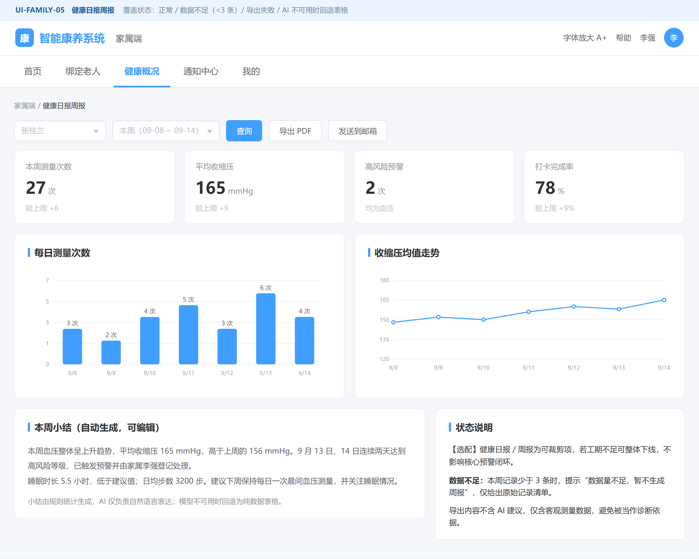{width=6.3in}

设计说明：【选配】周报文字由规则统计生成，AI 只负责自然语言表达；记录少于 3 条时不给结论、只列原始数据，避免用少量样本下判断。


### 2.4 护工端（6 个：核心 5 + 选配 1）

> 担当：周彦龙


#### 2.4.1 UI-CARE-01　护工工作台

| 项 | 内容 |
|---|---|
| 对应 FR | FR-CARE-008 |
| 优先级 | 【核心】P1 |
| 关键要素 | 今日待办汇总（预警 / 打卡）、高风险置顶 |
| 覆盖状态 | 正常 / 待办清零（空态）/ 高风险置顶 / 无负责老人 |
| 源文件 | `界面原型/pages/UI-CARE-01_护工工作台.html` |

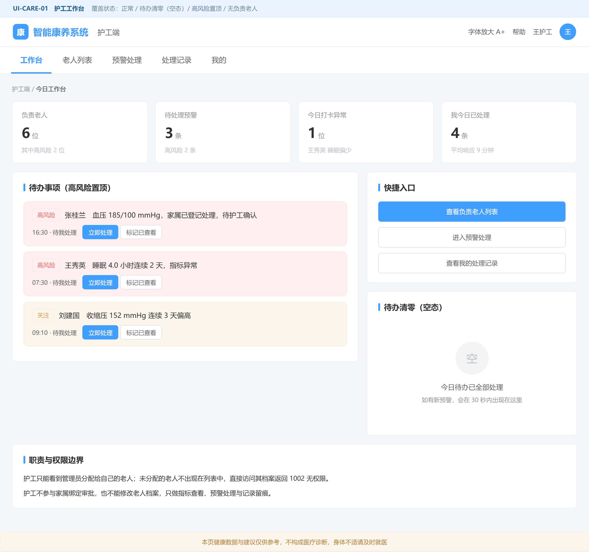{width=6.3in}

设计说明：护工按天工作，因此第一屏是「今日待办」而不是数据看板；待办按风险等级排序，高风险置顶。护工只能看到管理员分配给自己的老人。


#### 2.4.2 UI-CARE-02　负责老人列表

| 项 | 内容 |
|---|---|
| 对应 FR | FR-CARE-001 / 002 / 009 / 010 |
| 优先级 | 【核心】P0 |
| 关键要素 | 状态分色（正常 / 关注 / 异常）、筛选、高风险置顶 |
| 覆盖状态 | 正常 / 状态分色 / 高风险置顶 / 筛选无结果 / 未分配老人（空态） |
| 源文件 | `界面原型/pages/UI-CARE-02_负责老人列表.html` |

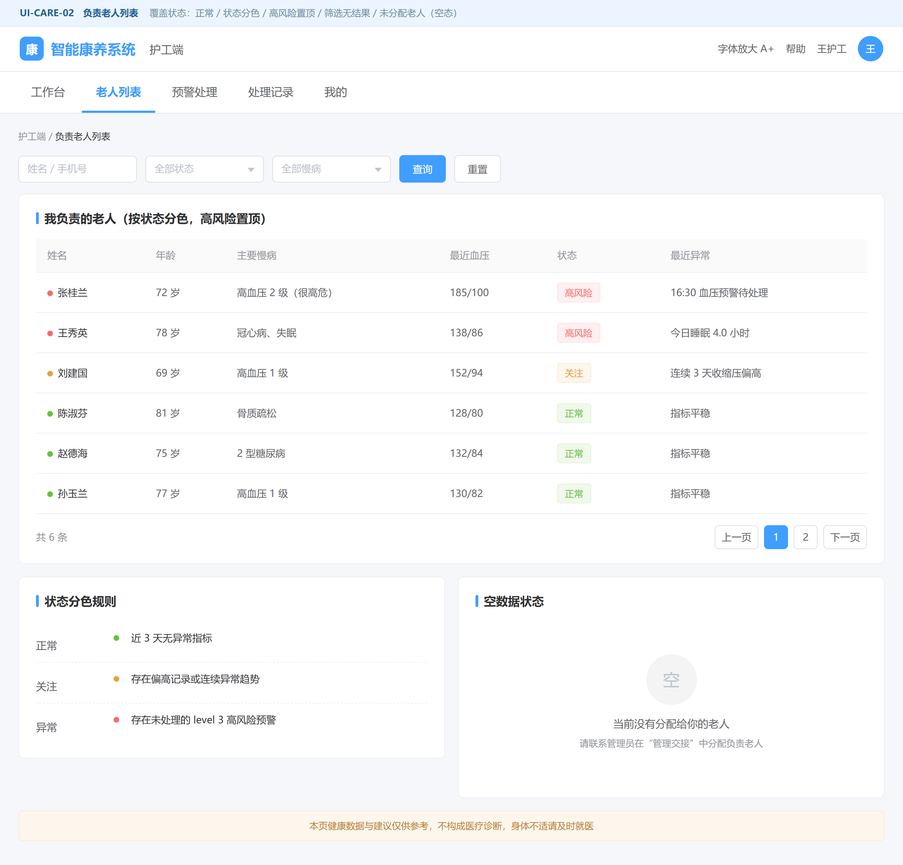{width=6.3in}

设计说明：用状态分色（正常 / 关注 / 异常）替代长文本描述，让护工在列表层就能判断处理优先级。列表数据与 care_relation 表一致，未分配的老人不出现。


#### 2.4.3 UI-CARE-03　老人档案查看

| 项 | 内容 |
|---|---|
| 对应 FR | FR-CARE-003 |
| 优先级 | 【核心】P1 |
| 关键要素 | 档案与指标（只读为主） |
| 覆盖状态 | 正常（只读）/ 无权限（非负责老人）/ 空数据 / 字段脱敏 |
| 源文件 | `界面原型/pages/UI-CARE-03_老人档案查看.html` |

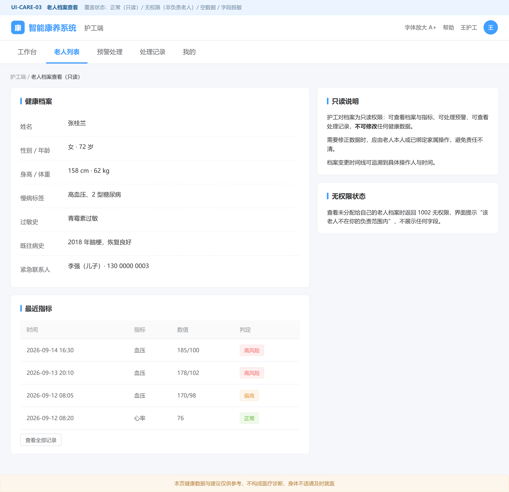{width=6.3in}

设计说明：护工对档案为只读权限，职责是「看得见、能处理、有记录」。需要修正数据时由老人本人或已绑定家属操作，保证责任边界清晰。


#### 2.4.4 UI-CARE-04　预警处理

| 项 | 内容 |
|---|---|
| 对应 FR | FR-CARE-004 / 005 |
| 优先级 | 【核心】P0 |
| 关键要素 | 预警列表 + 登记处理结果（方式 / 说明 / 时间） |
| 覆盖状态 | 正常 / 已被他人处理（并发）/ 提交失败重试 / 必填校验 / 无待处理（空态） |
| 源文件 | `界面原型/pages/UI-CARE-04_预警处理.html` |

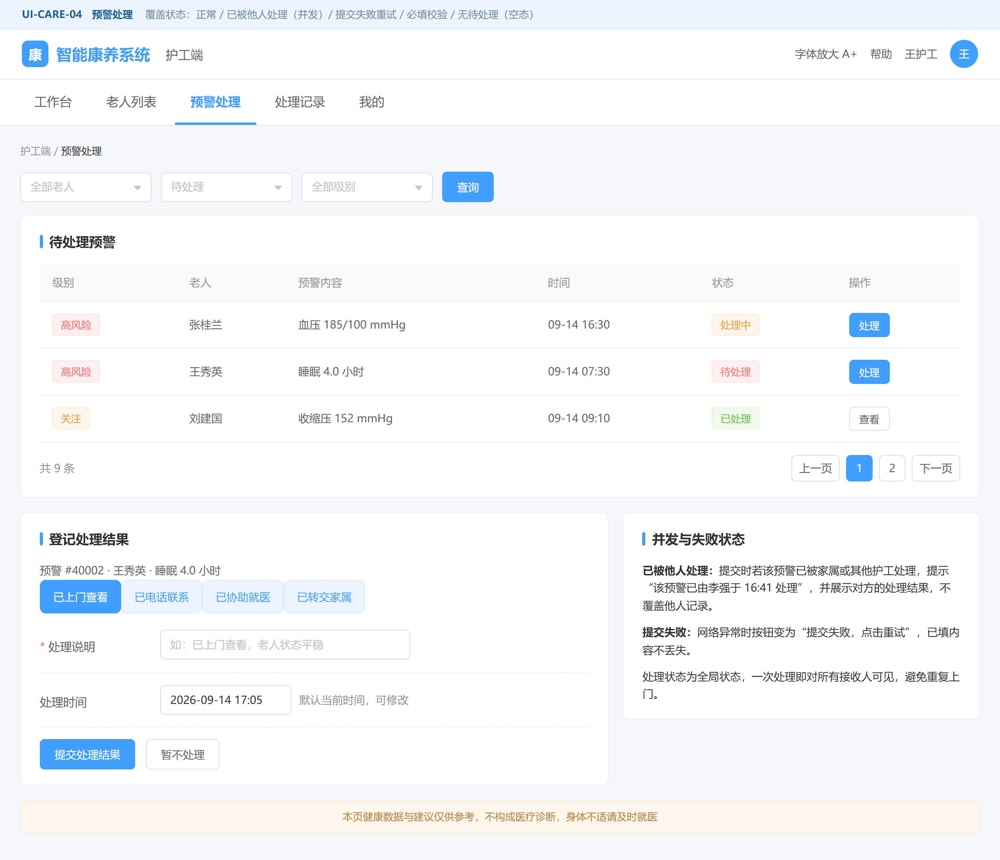{width=6.3in}

设计说明：处理结果必须包含处理人、处理方式、处理说明、处理时间四项。并发场景下若预警已被家属先行处理，界面展示对方的处理结果而不覆盖，避免重复上门。


#### 2.4.5 UI-CARE-05　处理记录

| 项 | 内容 |
|---|---|
| 对应 FR | FR-CARE-006 |
| 优先级 | 【核心】P1 |
| 关键要素 | 本人历史处理记录追溯 |
| 覆盖状态 | 正常 / 空数据 / 按时间与老人筛选 / 导出 |
| 源文件 | `界面原型/pages/UI-CARE-05_处理记录.html` |

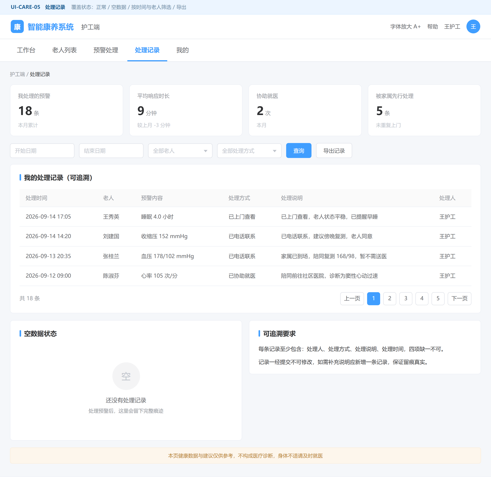{width=6.3in}

设计说明：处理记录一经提交不可修改，需要补充应新增一条记录，保证留痕真实可追溯，这是闭环成立的底线。


#### 2.4.6 UI-CARE-06　管理交接

| 项 | 内容 |
|---|---|
| 对应 FR | FR-CARE-011 |
| 优先级 | 【选配】P2 |
| 关键要素 | 老人分配 / 交接 |
| 覆盖状态 | 正常 / 空数据 / 交接后权限立即切换 / 未处理预警转移 |
| 源文件 | `界面原型/pages/UI-CARE-06_管理交接.html` |

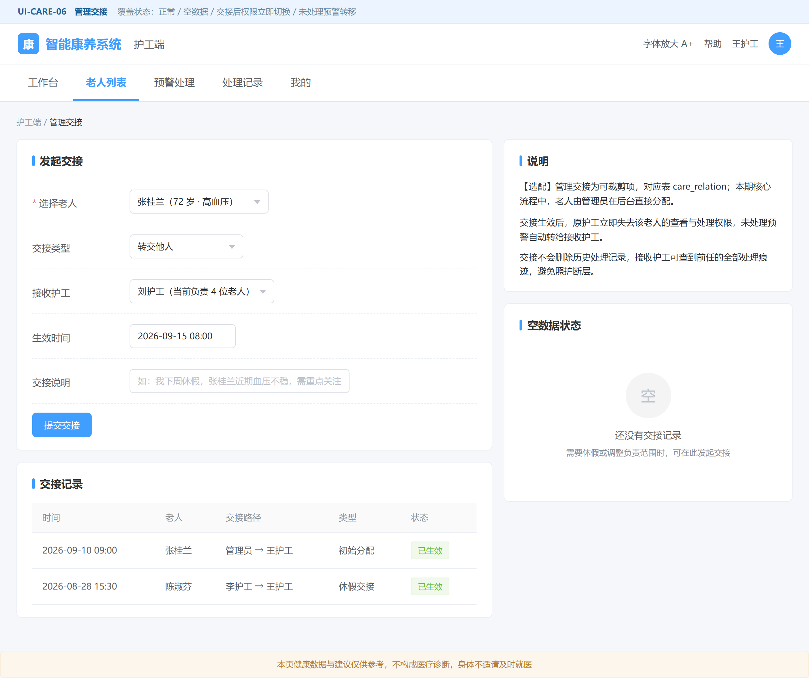{width=6.3in}

设计说明：【选配】交接生效后原护工立即失权、未处理预警自动转给接收护工；历史处理记录不随交接删除，避免照护断层。


### 2.5 管理员端（10 个：核心 6 + 选配 4）

> 担当：周彦龙


#### 2.5.1 UI-ADMIN-01　用户管理

| 项 | 内容 |
|---|---|
| 对应 FR | FR-ADMIN-001 / 002 / 003 |
| 优先级 | 【核心】P2 |
| 关键要素 | 查看 / 禁用 / 启用，禁用后不可登录 |
| 覆盖状态 | 正常 / 筛选无结果 / 禁用后不可登录 / 新增校验失败 / 不允许禁用自己 |
| 源文件 | `界面原型/pages/UI-ADMIN-01_用户管理.html` |

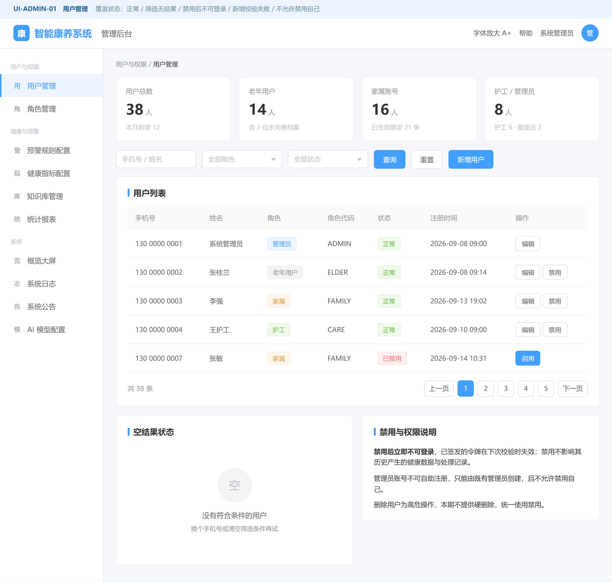{width=6.3in}

设计说明：禁用即不可登录，且不允许管理员禁用自己。本期不提供硬删除，统一走禁用，以保护历史健康数据与处理记录。


#### 2.5.2 UI-ADMIN-02　角色管理

| 项 | 内容 |
|---|---|
| 对应 FR | FR-ADMIN-003 |
| 优先级 | 【核心】P2 |
| 关键要素 | 角色 / 权限分配 |
| 覆盖状态 | 正常 / 权限只读（业务规则锁定项）/ 保存失败 / 恢复默认 |
| 源文件 | `界面原型/pages/UI-ADMIN-02_角色管理.html` |

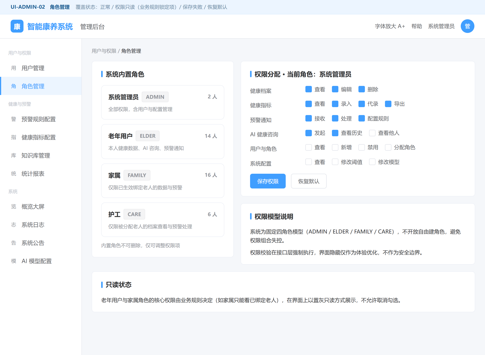{width=6.3in}

设计说明：采用固定四角色模型，不开放自由建角色，避免权限组合失控。家属「仅见已绑定老人」等由业务规则决定的权限以置灰只读方式呈现，不允许取消勾选。


#### 2.5.3 UI-ADMIN-03　预警规则配置

| 项 | 内容 |
|---|---|
| 对应 FR | FR-ADMIN-004 / 009 / 010 |
| 优先级 | 【核心】P0 |
| 关键要素 | 各指标阈值 + 风险等级配置，改后即时生效，入 sys_config |
| 覆盖状态 | 正常 / 阈值区间冲突校验 / 保存失败回退保护 / 恢复默认 / 冷却时间生效 |
| 源文件 | `界面原型/pages/UI-ADMIN-03_预警规则配置.html` |

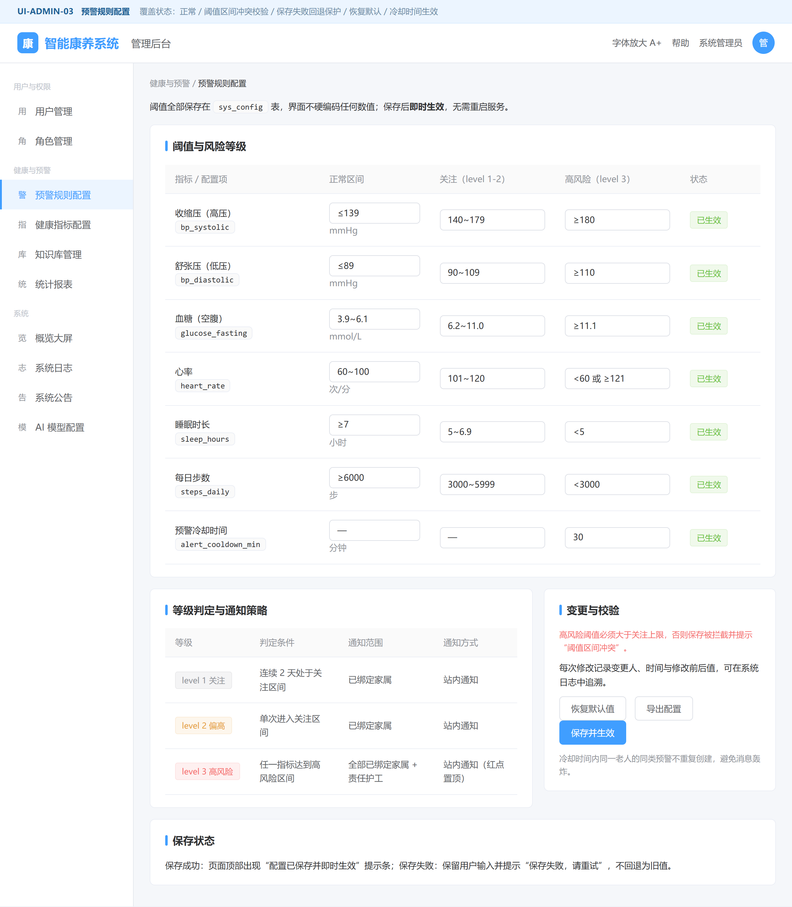{width=6.3in}

设计说明：阈值配置化的落地点：所有阈值存 sys_config、界面不硬编码、保存后即时生效。同页定义三个风险等级的通知范围与冷却时间，避免同一老人的同类预警在短时间内反复轰炸家属。


#### 2.5.4 UI-ADMIN-04　健康指标配置

| 项 | 内容 |
|---|---|
| 对应 FR | FR-ADMIN-005 |
| 优先级 | 【核心】P1 |
| 关键要素 | 指标类型 / 单位 / 正常范围配置 |
| 覆盖状态 | 正常 / 空数据 / 代码重复校验 / 停用二次确认 / 有数据时禁止改代码 |
| 源文件 | `界面原型/pages/UI-ADMIN-04_健康指标配置.html` |

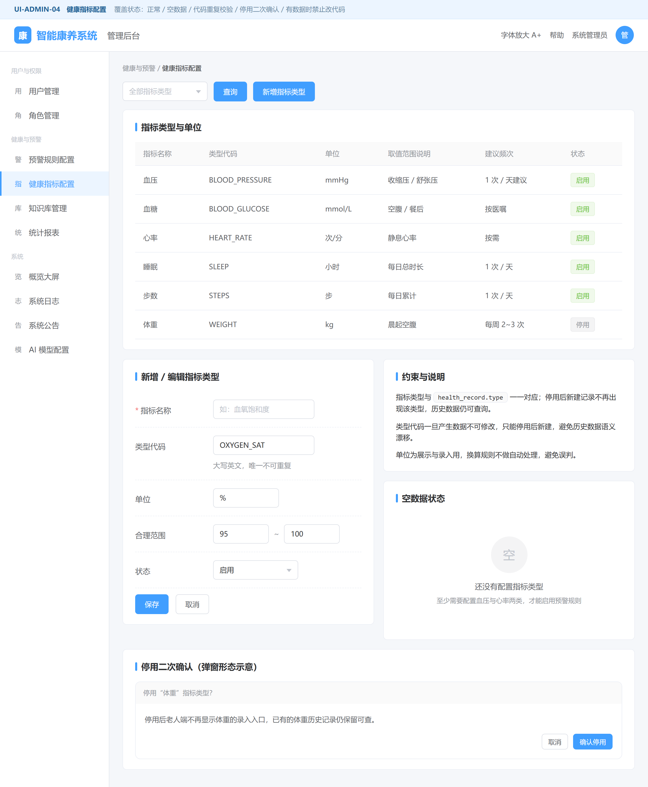{width=6.3in}

设计说明：指标类型与 health_record.type 一一对应。已产生数据的类型代码不可修改，只能停用后新建，防止历史数据语义漂移。


#### 2.5.5 UI-ADMIN-05　知识库管理

| 项 | 内容 |
|---|---|
| 对应 FR | FR-KB-001 / 002 / 004 / 006 / 008、FR-ADMIN-006 |
| 优先级 | 【核心】P2 |
| 关键要素 | 分类维护、条目增删改、索引重建；文档上传解析为【选配】本期不实现 |
| 覆盖状态 | 正常 / 空分类 / 索引重建中 / 上传解析（选配未实现）/ 删除二次确认 |
| 源文件 | `界面原型/pages/UI-ADMIN-05_知识库管理.html` |

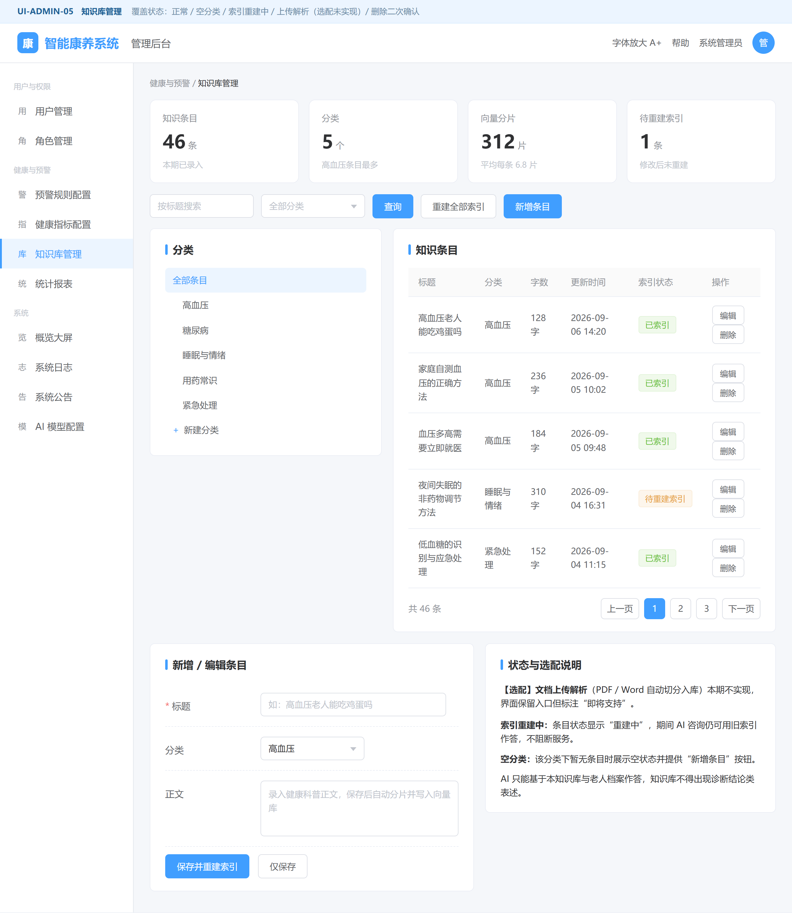{width=6.3in}

设计说明：知识库决定 AI 回答的边界与可信度，因此条目必须带分类并可查看索引状态。文档上传解析为【选配】，本期保留入口并标注未实现，不作为承诺项。


#### 2.5.6 UI-ADMIN-06　统计报表

| 项 | 内容 |
|---|---|
| 对应 FR | FR-REPORT-001~008 |
| 优先级 | 【核心】P2 |
| 关键要素 | 用户 / 咨询 / 预警统计、图表、周期筛选 |
| 覆盖状态 | 正常 / 空数据 / 周期切换 / 导出失败重试 / 大数据量分页 |
| 源文件 | `界面原型/pages/UI-ADMIN-06_统计报表.html` |

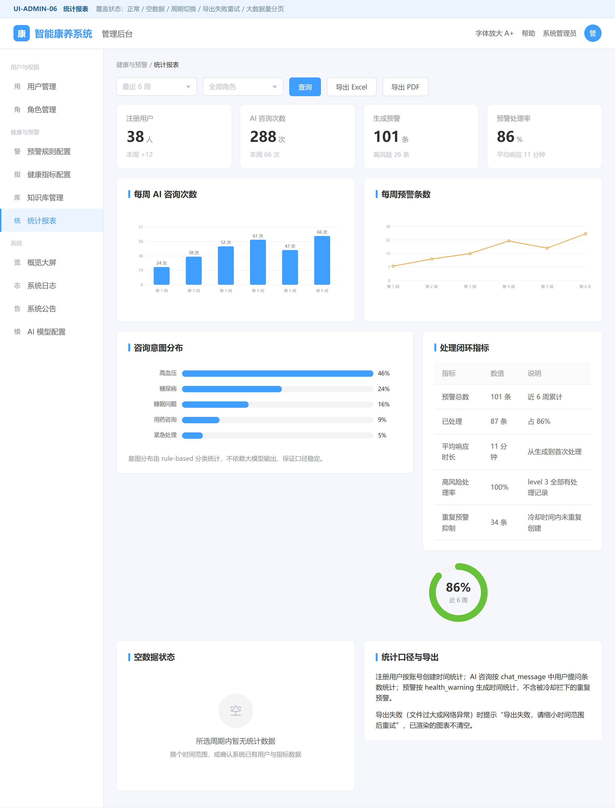{width=6.3in}

设计说明：面向评审与答辩的量化证据页，覆盖用户、咨询、预警、处理率四组指标。意图分布使用规则统计而非模型输出，保证口径稳定、可重复验证。


#### 2.5.7 UI-ADMIN-07　概览大屏

| 项 | 内容 |
|---|---|
| 对应 FR | FR-REPORT-010 |
| 优先级 | 【选配】P2 |
| 关键要素 | 管理员首页关键指标看板 |
| 覆盖状态 | 正常 / 自动刷新 / 待处理告警 / 模型不可用（降级运行）/ 空数据 |
| 源文件 | `界面原型/pages/UI-ADMIN-07_概览大屏.html` |

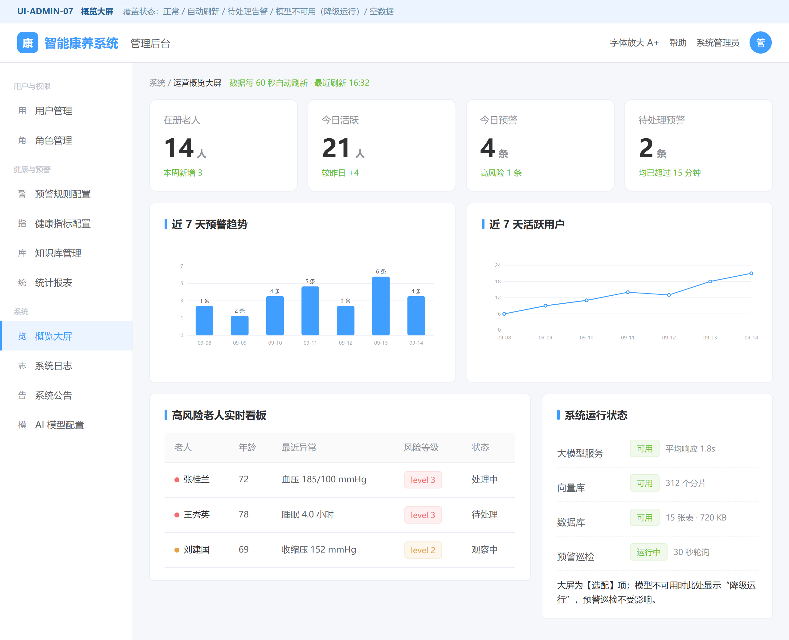{width=6.3in}

设计说明：【选配】用于答辩现场的实时观感。模型不可用时此处显示「降级运行」，预警巡检不受影响。


#### 2.5.8 UI-ADMIN-08　系统日志

| 项 | 内容 |
|---|---|
| 对应 FR | FR-ADMIN-008 |
| 优先级 | 【选配】P2 |
| 关键要素 | 登录 / 操作 / 预警日志 |
| 覆盖状态 | 正常 / 空结果 / 脱敏展示 / 导出 / 只追加不可删 |
| 源文件 | `界面原型/pages/UI-ADMIN-08_系统日志.html` |

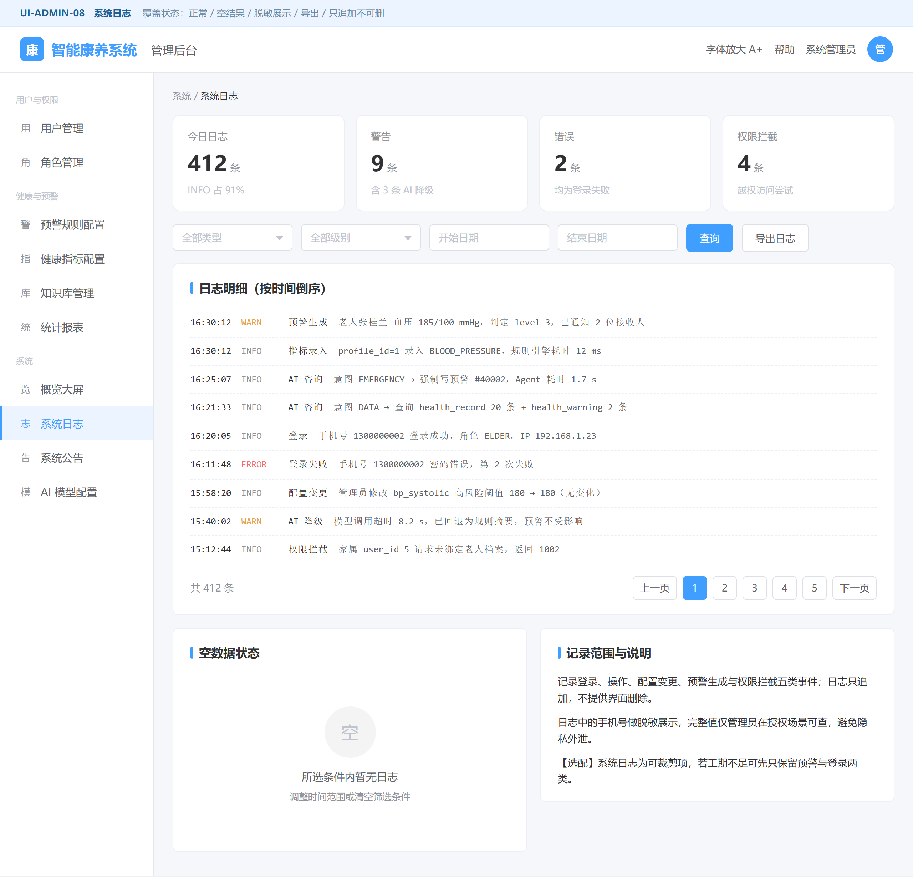{width=6.3in}

设计说明：记录登录、操作、配置变更、预警生成、权限拦截五类事件；日志只追加，不提供界面删除。手机号等敏感字段脱敏展示。


#### 2.5.9 UI-ADMIN-09　系统公告

| 项 | 内容 |
|---|---|
| 对应 FR | FR-ADMIN-011 |
| 优先级 | 【选配】P2 |
| 关键要素 | 发布公告 / 更新说明 |
| 覆盖状态 | 正常 / 空数据 / 草稿与发布 / 下架 / 脚本注入拦截 |
| 源文件 | `界面原型/pages/UI-ADMIN-09_系统公告.html` |

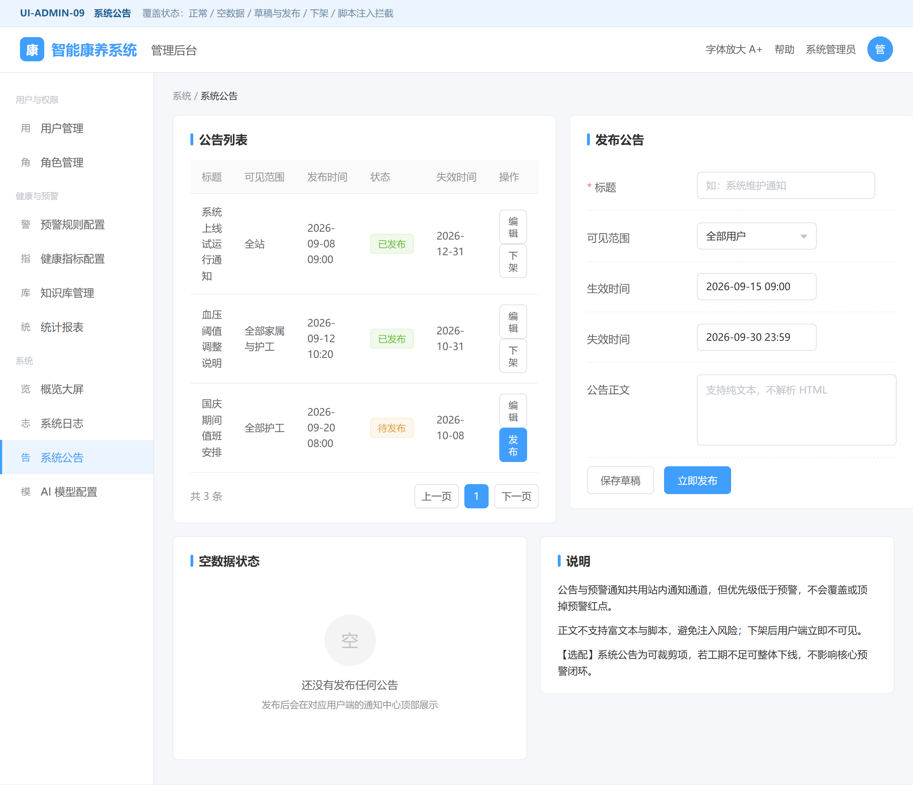{width=6.3in}

设计说明：公告与预警共用站内通道，但优先级低于预警，不会顶掉预警红点。正文不支持富文本与脚本，规避注入风险。


#### 2.5.10 UI-ADMIN-10　AI 模型配置

| 项 | 内容 |
|---|---|
| 对应 FR | FR-ADMIN-007 |
| 优先级 | 【选配】P2 |
| 关键要素 | 切换 / 配置大模型（Qwen / DeepSeek / GLM） |
| 覆盖状态 | 正常 / Key 未配置 / 测试连接失败 / 切换模型即时生效 / 超时降级 |
| 源文件 | `界面原型/pages/UI-ADMIN-10_AI模型配置.html` |

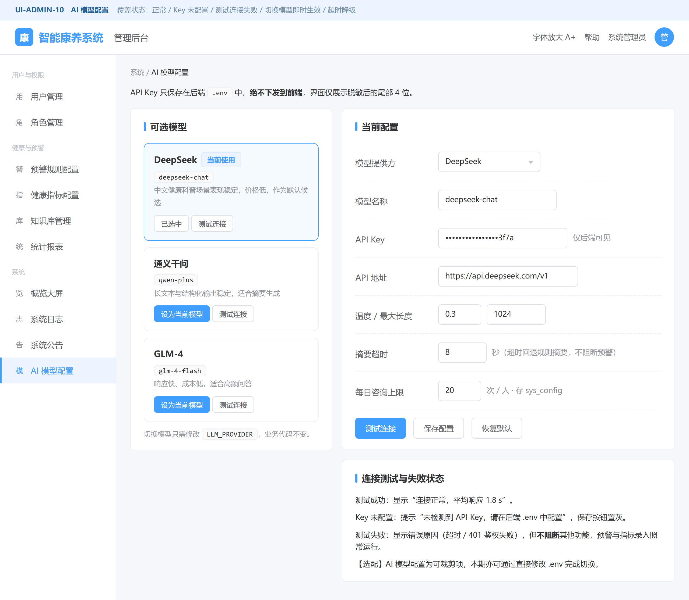{width=6.3in}

设计说明：【选配】界面上可切换模型，但 API Key 只保存在后端 .env、绝不下发前端。摘要超时 8 秒即回退为规则摘要，保证预警链路不被模型响应拖慢。


---

## 3. 全局设计约定

1. **适老化基线（老人端强制）**：正文字号 ≥18px、文字与背景对比度达标、主按钮高度 ≥48px、主要流程 ≤3 步。老人端 13 个界面由同一套外壳渲染，字号与控件尺寸统一。
2. **免责声明**：AI 健康咨询、预警详情、健康趋势、健康日报周报等页面页脚固定"本页健康数据与建议仅供参考，不构成医疗诊断，身体不适请及时就医"。
3. **配置不写死**：预警规则配置页（UI-ADMIN-03）明确标注阈值存于 sys_config，指标录入页（UI-ELDER-04）展示"当前生效阈值 + 来源"，界面本身不硬编码任何业务数值。
4. **权限隔离**：家属仅见已生效绑定老人、护工仅见被分配老人、AI 咨询上下文按档案隔离。无权限场景统一返回 1002 并在界面给出说明，不渲染空数据。
5. **响应式**：本期为 Web 优先，需适配手机浏览器；原型按 1280 宽桌面视口出图，适老化大字号与最小 48px 按钮保证小屏下仍可点击。
6. **标注约定**：`【核心】` 为必做（P0/P1 主线闭环），`【选配】` 为可裁剪的扩展项；文档一律使用文字标注，不使用符号图标。

---

## 4. v1.0 编号映射与归档

v1.0 的 9 张原型以 P1~P9 编号、用于 9/11 原型评审。v2.0 改为与界面清单一致的 UI 编号，映射关系如下：

| v1.0 编号 | 对应界面编号 | 说明 |
|---|---|---|
| P1 老人端首页 | UI-ELDER-01 | 一比一 |
| P2 AI 健康咨询 | UI-ELDER-07 | 一比一 |
| P3 预警通知中心 | UI-ELDER-09、UI-FAMILY-04 | v2.0 按角色拆为两张 |
| P4 护工端老人列表 | UI-CARE-02 | 一比一 |
| P5 管理员预警规则配置 | UI-ADMIN-03 | 一比一 |
| P6 登录 / 注册 | UI-AUTH-01、UI-AUTH-02 | v2.0 按界面清单拆为两张 |
| P7 指标录入 | UI-ELDER-04 | 一比一 |
| P8 预警详情与处理 | UI-ELDER-10、UI-CARE-04 | v2.0 按角色拆为两张 |
| P9 绑定确认 | UI-ELDER-13 | 一比一 |

> 因此 v1.0 的 9 个文件覆盖了 12 个界面编号；v2.0 补齐其余 26 个，达到 38 个编号全覆盖。
> 原 P1~P9 的 HTML 与效果图连同当时的 prototype.css 快照，已归档至 `界面原型/_v1_评审版/`，保证 9/11 评审材料的可追溯性。

---

## 5. 状态覆盖总表

下表由生成脚本从页面定义直接导出，与各效果图顶部标注条内容完全一致。

| 序号 | 界面编号 | 界面名称 | 优先级 | 覆盖状态 |
|---|---|---|---|---|

| 1 | UI-AUTH-01 | 登录页 | 【核心】P0 | 正常 / 登录失败提示 / 会话过期 / 账号锁定风险提示 |
| 2 | UI-AUTH-02 | 注册页 | 【核心】P0 | 正常 / 格式校验失败 / 角色白名单限制 / 隐私授权未勾选 |
| 3 | UI-AUTH-03 | 个人中心 | 【核心】P2 | 正常 / 修改密码成功 / 手机号已被占用 / 未登录跳转 |
| 4 | UI-AUTH-04 | 忘记密码 | 【选配】P1 | 正常 / 验证码错误 / 手机号未注册（不区分提示）/ 次数超限 |
| 5 | UI-ELDER-01 | 老人首页 | 【核心】P0 | 正常 / 空数据（今日未测量）/ 未读预警红点 / 数据不足时趋势占位 |
| 6 | UI-ELDER-02 | 健康档案 | 【核心】P0 | 正常 / 空档案（引导完善）/ 未确认家属无权限 / 慢病标签空 |
| 7 | UI-ELDER-03 | 档案编辑 | 【核心】P0 | 正常 / 字段越界校验 / 保存成功提示 / 删除二次确认 / 未登录 |
| 8 | UI-ELDER-04 | 指标录入 | 【核心】P0 | 正常 / 范围校验拦截 / 保存失败重试 / 录入即触发判定 |
| 9 | UI-ELDER-05 | 指标历史 | 【核心】P1 | 正常 / 空数据 / 筛选无结果 / 无权限 |
| 10 | UI-ELDER-06 | 健康趋势图 | 【核心】P1 | 正常 / 数据不足（<2 条占位）/ 异常点高亮 / AI 解读降级 |
| 11 | UI-ELDER-07 | AI 健康咨询 | 【核心】P0 | 正常（多意图路由）/ 紧急症状升级并落预警 / 模型不可用降级 / 超频限流 / 敏感词兜底 |
| 12 | UI-ELDER-08 | 咨询历史 | 【核心】P1 | 正常 / 空数据 / 按档案筛选 / 权限隔离（仅本人与已绑定家属） |
| 13 | UI-ELDER-09 | 通知中心 | 【核心】P0 | 正常 / 未读红点 / 全部已读（空态）/ 已读与已处理状态正交 |
| 14 | UI-ELDER-10 | 预警详情 | 【核心】P1 | 正常（含 AI 摘要）/ AI 摘要失败降级不阻断 / 已被他人处理 / 已读未读独立 |
| 15 | UI-ELDER-11 | 健康打卡 | 【选配】P2 | 正常 / 部分未打卡 / 全部完成 / 重复打卡覆盖提示 |
| 16 | UI-ELDER-12 | 用药信息 | 【选配】P2 | 正常 / 空数据 / 新增校验失败 / 停用药品 |
| 17 | UI-ELDER-13 | 绑定确认 | 【核心】P0 | 正常 / 无待确认申请（空态）/ 拒绝后不可见数据 / 解绑二次确认 |
| 18 | UI-FAMILY-01 | 家属首页 | 【核心】P0 | 正常 / 多老人切换 / 无绑定老人（空态）/ 未读红点 |
| 19 | UI-FAMILY-02 | 绑定老人 | 【核心】P0 | 正常 / 待确认（数据不可见）/ 已被拒绝 / 解绑二次确认 / 超出绑定上限 |
| 20 | UI-FAMILY-03 | 老人健康概况 | 【核心】P0 | 正常 / 无权限（未绑定）/ 空数据（无指标）/ 代录数据 |
| 21 | UI-FAMILY-04 | 通知中心 | 【核心】P0 | 正常 / 未读红点 / 已被他人处理 / 提交失败重试 / 已读与处理状态正交 |
| 22 | UI-FAMILY-05 | 健康日报周报 | 【选配】P2 | 正常 / 数据不足（<3 条）/ 导出失败 / AI 不可用时回退表格 |
| 23 | UI-CARE-01 | 护工工作台 | 【核心】P1 | 正常 / 待办清零（空态）/ 高风险置顶 / 无负责老人 |
| 24 | UI-CARE-02 | 负责老人列表 | 【核心】P0 | 正常 / 状态分色 / 高风险置顶 / 筛选无结果 / 未分配老人（空态） |
| 25 | UI-CARE-03 | 老人档案查看 | 【核心】P1 | 正常（只读）/ 无权限（非负责老人）/ 空数据 / 字段脱敏 |
| 26 | UI-CARE-04 | 预警处理 | 【核心】P0 | 正常 / 已被他人处理（并发）/ 提交失败重试 / 必填校验 / 无待处理（空态） |
| 27 | UI-CARE-05 | 处理记录 | 【核心】P1 | 正常 / 空数据 / 按时间与老人筛选 / 导出 |
| 28 | UI-CARE-06 | 管理交接 | 【选配】P2 | 正常 / 空数据 / 交接后权限立即切换 / 未处理预警转移 |
| 29 | UI-ADMIN-01 | 用户管理 | 【核心】P2 | 正常 / 筛选无结果 / 禁用后不可登录 / 新增校验失败 / 不允许禁用自己 |
| 30 | UI-ADMIN-02 | 角色管理 | 【核心】P2 | 正常 / 权限只读（业务规则锁定项）/ 保存失败 / 恢复默认 |
| 31 | UI-ADMIN-03 | 预警规则配置 | 【核心】P0 | 正常 / 阈值区间冲突校验 / 保存失败回退保护 / 恢复默认 / 冷却时间生效 |
| 32 | UI-ADMIN-04 | 健康指标配置 | 【核心】P1 | 正常 / 空数据 / 代码重复校验 / 停用二次确认 / 有数据时禁止改代码 |
| 33 | UI-ADMIN-05 | 知识库管理 | 【核心】P2 | 正常 / 空分类 / 索引重建中 / 上传解析（选配未实现）/ 删除二次确认 |
| 34 | UI-ADMIN-06 | 统计报表 | 【核心】P2 | 正常 / 空数据 / 周期切换 / 导出失败重试 / 大数据量分页 |
| 35 | UI-ADMIN-07 | 概览大屏 | 【选配】P2 | 正常 / 自动刷新 / 待处理告警 / 模型不可用（降级运行）/ 空数据 |
| 36 | UI-ADMIN-08 | 系统日志 | 【选配】P2 | 正常 / 空结果 / 脱敏展示 / 导出 / 只追加不可删 |
| 37 | UI-ADMIN-09 | 系统公告 | 【选配】P2 | 正常 / 空数据 / 草稿与发布 / 下架 / 脚本注入拦截 |
| 38 | UI-ADMIN-10 | AI 模型配置 | 【选配】P2 | 正常 / Key 未配置 / 测试连接失败 / 切换模型即时生效 / 超时降级 |

---

## 6. 待确认事项

1. 登录页与注册页是否合并为单页 Tab 切换（可减少 1 个界面）？当前按界面清单保持两个独立页面。
2. 健康趋势图是否内嵌到指标历史页（可减少 1 个界面）？当前独立成页，便于演示 ECharts 与异常点高亮。
3. 预警详情用独立页还是抽屉组件？当前独立成页，家属端与护工端各有一张。
4. 选配界面（9 个）在本期是否全部实现，还是仅保留设计不实现？建议按剩余工期决定，答辩时以文字标注说明。
5. 原型工具选型（Axure / 墨刀 / Figma）：本项目最终采用 HTML + CSS 自建原型，优点是可版本管理、可批量重跑、与开发同一套视觉规范。

---

> 本说明书中的界面原型为静态高保真效果图，用于确认信息架构、交互状态与视觉方向；实际开发以需求分析与概要设计文档为准。
> 原型源文件位于 `02.需求分析/界面原型/pages/`，38 个页面均可直接在浏览器打开；修改后重跑 `_gen/_gen.py` 与 `_shot.js` 即可同步更新本文档。
