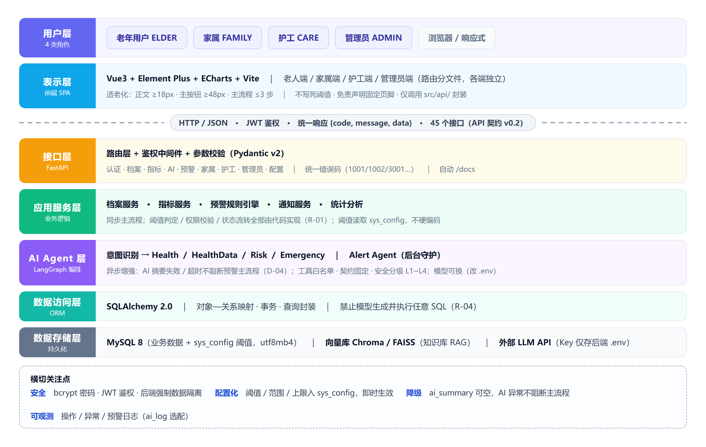

<!-- ============================================================
     基于 AI 智能体的康养系统 · 概要设计说明书 v1.1
     用途：9/24 概要设计 + 数据库设计评审交付物
     上游：需求分析说明书 v1.0（125 FR）、界面清单 v1.0（38 界面）、
           设计决策记录 v1.0（D-01~D-06 / E-01~E-08 / R-01~R-05）、API 接口契约 v0.2（45 接口）
     责任人：丘宇乾（架构 / 后端 / 数据库）
     标注约定：【核心】= 必做；【选配】= 可裁剪（正文用文字标注，不使用 emoji）
     ============================================================ -->

# 基于 AI 智能体的康养系统 · 概要设计说明书

> 版本：v1.1（待评审）　编写日期：2026-09-12
> 用途：2026-09-24 概要设计 + 数据库设计评审交付物
> 责任人：丘宇乾（架构 / 后端 / 数据库）｜指导教师：吴剑光
> 上游文档：需求分析说明书 v1.0、界面清单 v1.0、设计决策记录 v1.0、API 接口契约 v0.2

---

## 目录

1. 文档信息
2. 引言
3. 系统总体架构
4. 模块划分与职责
5. 数据库设计简介
6. 根据用例规约识别 E-R 图的方法
7. 常用数据库设计工具
8. 接口设计概要
9. 安全设计
10. 需求 界面 接口 数据四向对照
11. 变更记录

---

## 0. 文档信息

| 项 | 内容 |
|---|---|
| 项目名称 | 基于 AI 智能体的智能康养系统 |
| 文档版本 | v1.1（待评审） |
| 编写日期 | 2026-09-12 |
| 编写人 | 丘宇乾 |
| 评审日期 | 2026-09-24 |
| 上游输入 | 需求分析说明书 v1.0（125 条 FR：核心 101 + 选配 24）、界面清单 v1.0（38 个界面：核心 29 + 选配 9）、设计决策记录 v1.0、API 接口契约 v0.2（45 个接口） |
| 本文档回答 | 系统"怎么搭"——总体架构、模块划分、数据库结构与建模方法 |
| 下游产物 | `04.编码/数据库/schema.sql`、`04.编码/后端`、`04.编码/前端` |

### 修订记录

- **v1.0（2026-09-12，丘宇乾）**：首次建立总体架构、模块划分、数据库设计简介、E-R 识别方法与数据库工具选型。
- **v1.1（2026-09-12，丘宇乾）**：统一界面总数为 38（核心 29 + 选配 9），接口总数为 45；关闭 E-06 至 E-08；补齐数据库脚本并按 MySQL 8 实测结果校正外键、索引和初始化数据说明。

---

## 1. 引言

### 1.1 编写目的

本文档承接《需求分析说明书 v1.0》，回答**"系统怎么搭"**的问题，作为 9/24 概要设计 + 数据库设计评审的交付物，并作为编码阶段（9/28 起）的直接依据。

具体目标：

1. 给出系统总体架构与技术分层，说明各层职责与技术选型；
2. 给出模块划分，并把"模块 → 接口 → 界面"三者对齐；
3. 给出数据库设计的完整简介：E-R 概念模型、逻辑模型（表结构）、约束与索引、配置化设计；
4. 沉淀**根据用例规约识别 E-R 图的方法**，说明本项目的表是怎么从需求推导出来的；
5. 给出常用数据库设计工具的对比与**本项目选型建议**。

### 1.2 适用范围

适用于本项目组全体成员（丘宇乾 / 梁霁鸣 / 周彦龙）与指导教师评阅。文档中所有结论与《设计决策记录 v1.0》冲突时，**以《设计决策记录 v1.0》为准**。

### 1.3 术语与缩略语

| 术语 | 说明 |
|---|---|
| FR | Functional Requirement，功能需求，编号 `FR-<前缀>-nnn` |
| E-R 图 | Entity-Relationship Diagram，实体—联系图 |
| 用例规约 | Use Case Specification，用例的完整描述（前置条件、主事件流、备选流、后置条件） |
| Agent | 智能体，本项目中指由 LangGraph 编排的、承担特定意图处理职责的 AI 处理单元 |
| RAG | Retrieval-Augmented Generation，检索增强生成 |
| RTM | Requirements Traceability Matrix，需求跟踪矩阵 |
| SPA | Single Page Application，单页应用 |
| ADR | Architecture Decision Record，架构决策记录（本项目为《设计决策记录》） |

### 1.4 参考文档

| 文档 | 路径 |
|---|---|
| 项目企划书 v2.0 | `01.需求定义/项目企划书_康养系统_v2.0.md` |
| 需求分析说明书 v1.0 | `02.需求分析/需求分析说明书_康养系统_v1.0.md` |
| 界面清单 v1.0 | `02.需求分析/界面清单_康养系统_v1.0.md` |
| 设计决策记录 v1.0 | `03.概要设计/设计决策记录_康养系统_v1.0.md` |
| API 接口契约 v0.2 | `03.概要设计/API接口契约_康养系统_v0.2.md` |
| 主闭环追溯表 v1.0 | `05.集成测试/主闭环追溯表_康养系统_v1.0.md` |

### 1.5 设计原则（与项目铁律一一对应）

| 编号 | 原则 | 落地位置 |
|---|---|---|
| P1 | API Key 绝不进前端，统一后端 `.env` 管理 | 后端 `core/config`；前端不出现任何密钥 |
| P2 | 一切阈值 / 权限 / 范围配置化入表，不硬编码 | `sys_config` 表 + 后端 `services` 读取 |
| P3 | AI 只做语言理解与解释，确定性逻辑交给代码 | 《设计决策记录》R-01~R-04 |
| P4 | 预警主流程不依赖模型可用性 | 同步主流程 + 异步 AI 摘要（D-04） |
| P5 | 数据权限在后端强制隔离，不依赖前端传参 | 查询层强制带关系表过滤 |
| P6 | 功能分层【核心】/【选配】，选配不拖累主闭环 | 需求说明书与本文档统一标注 |

---

## 2. 系统总体架构（应用项目架构讲解）

### 2.1 架构风格与总体视图

本项目是 **B/S 架构的应用项目**（Web 优先、响应式适配手机），采用：

- **前后端分离**：前端 Vue3 SPA 与后端 FastAPI 通过 HTTP/JSON 解耦，以 `API 接口契约 v0.2` 为对齐基准（前端可用 mock 先行开发）；
- **分层架构**：表示层 → 接口层 → 应用服务层 → AI Agent 层 → 数据访问层 → 数据存储层；
- **同步主流程 + 异步增强**：核心闭环（录入 → 判定 → 预警 → 通知）同步完成，AI 摘要等非确定性操作异步执行；
- **配置驱动**：阈值、范围、上限等运行期可变项全部落表 `sys_config`。

系统总体架构见图 1。

{width=6.3in}

### 2.2 分层职责（自上而下）

| 层 | 技术组件 | 职责 | 关键约束 |
|---|---|---|---|
| ① 用户层 | 浏览器（Chrome / Edge） | 四类角色：老年用户 / 家属 / 护工 / 管理员 | 老人端强制适老化：字号 ≥18px、主按钮 ≥48px、主流程 ≤3 步 |
| ② 表示层 | Vue3 + Element Plus + ECharts + Vite | 页面渲染、交互、趋势图、状态展示 | 不写死阈值；免责声明固定页脚；只调用 `src/api/` 暴露的函数 |
| ③ 接口层 | FastAPI 路由 + JWT 中间件 | 路由、鉴权、参数校验（Pydantic v2）、统一响应与错误码 | 越权返回 1002；统一响应 `{code,message,data}` |
| ④ 应用服务层 | Python `services` | 档案、指标、预警规则引擎、通知、统计等业务逻辑 | 阈值判定、权限校验、状态流转**全部在此层用代码实现**（R-01） |
| ⑤ AI Agent 层 | LangGraph / LangChain | 意图路由 + 4 个业务 Agent + Alert 守护 Agent | 工具白名单、契约固定、超时降级（R-02/R-03） |
| ⑥ 数据访问层 | SQLAlchemy 2.0 ORM | 对象—关系映射、事务、查询封装 | 禁止模型生成并执行任意 SQL（R-04） |
| ⑦ 数据存储层 | MySQL 8（业务数据）+ 向量库 Chroma/FAISS（知识库） | 持久化 | 字符集 utf8mb4；配置入表 |

### 2.3 前端架构（表示层）

- **形态**：Vue3 单页应用，按角色划分路由与视图（`views/elder`、`views/family`、`views/care`、`views/admin`）；
- **路由分文件**：`router/index.js` 只做 import，各端路由写在 `router/elder.js` 等独立文件，避免多人协同时反复冲突（见 `04.编码/OWNERS.md`）；
- **接口层收口**：所有请求经 `src/api/` 统一封装，页面内不手写 axios；
- **可视化**：ECharts 画近 30 天趋势并高亮异常点；
- **适老化**：统一字号 / 按钮 / 对比度基线（E-02：正文 ≥18px、主按钮 ≥48px）；
- **语音（【选配】）**：浏览器 Web Speech API 做 STT/TTS，零成本，主闭环跑通后再做。

### 2.4 后端架构（接口层 + 应用服务层）

后端采用 FastAPI 分层组织：

```
app/
├── main.py          应用入口（注册路由、中间件、异常处理）
├── core/            配置(.env 读取)、安全(bcrypt/JWT)、数据库连接
├── api/             路由层（对应 API 契约各章）
├── models/          数据模型（SQLAlchemy ORM，对应第 4 章各表）
├── services/        业务逻辑（档案、指标、预警规则引擎、通知、统计）
├── schemas/         Pydantic v2 请求/响应模型
└── agent/           LangGraph Agent 编排（见 2.5）
```

关键设计：

1. **统一响应与错误码**：`{code, message, data}`，错误码见 API 契约 1.4 节（1001/1002/1003/2001/2002/3001/3002/4001~4004/5001）；
2. **鉴权**：登录签发 JWT，`Authorization: Bearer <token>`；被禁用账号 Token 立即失效；
3. **数据权限在后端强制实现**：老人返回本人档案、家属返回已绑定（`APPROVED`）老人档案、护工返回负责老人档案、管理员返回全部——由查询层强制过滤，前端不传过滤参数；
4. **预警规则引擎**：录入后同步读取 `sys_config` 阈值，纯代码判定 level 0~3，**不调用模型**；
5. **模型可换**：LLM 通过统一封装调用，切换模型只改 `.env` 的 `LLM_PROVIDER`，不改代码（大模型三选一：DeepSeek / 通义千问 / GLM-4）。

### 2.5 AI Agent 编排架构（答辩核心）

```
START
 → 意图识别 Agent（路由）
    ├─ NORMAL（日常咨询）      → Health Agent      （只走知识库 RAG）
    ├─ DATA（询问我的数据）    → HealthData Agent  （必查该老人历史指标）
    ├─ ABNORMAL（异常/预警）   → Risk Agent        （必查预警记录 + 指标趋势）
    └─ EMERGENCY（紧急症状）   → Emergency Agent   （强制写预警 + 立即通知 + 引导就医）

Alert Agent（后台守护）：新数据 → 合法性校验 → 阈值检测 → 风险分级 → 异步 AI 摘要 → 通知家属/护工
```

**多 Agent 的验收标准（R-05）**：看的是**数据路径是否不同**，不是界面上是否显示 Agent 名称。四条路径的判据见《设计决策记录 v1.0》R-05 与《主闭环追溯表》第 3 节。

**AI 责任边界（R-01~R-04）**：

- 业务代码负责：权限校验、指标统计、阈值判断、预警写入、状态流转、安全分级兜底；
- AI 只负责：意图识别、RAG 回答组织、趋势解释、预警摘要；
- 编排层负责：工具白名单、返回字段契约、超时与失败处理、`intent/agent/safety_level/sources` 记录；
- 禁止：模型生成并执行任意 SQL、模型判断权限、模型直接写库、模型输出当诊断结论、预警主流程同步等待模型。

**AI 摘要降级（D-04）**：预警主流程与 AI 摘要解耦——

```
录入指标（同步，必须成功）
 → 规则判定（同步，读 sys_config，纯代码）
 → 写 health_warning：status=PENDING，ai_summary=NULL，summary_status=PENDING
 → 按绑定关系写 alert_receiver（UNREAD）
 ─── 以上主流程结束，前端已可查到预警 ───
 → 后台异步生成摘要：成功→SUCCESS；失败/超时(>8s，见《设计决策记录》D-04)/重试 1 次仍失败→FAILED
```

即：**模型不可用时，除摘要外系统全部正常**（验收用例 TC-A-06）。

### 2.6 部署架构

| 环节 | 开发/演示环境 |
|---|---|
| 静态资源 | Vite 构建产物，可用 Nginx 托管 |
| 应用服务 | Uvicorn 运行 FastAPI（`uvicorn app.main:app --reload`），自带 `/docs` 交互文档 |
| 数据库 | MySQL 8（utf8mb4） |
| 向量库 | Chroma / FAISS（本地文件，随服务启动） |
| 外部依赖 | 国内 LLM API（Key 仅存后端 `.env`） |

本项目为课程实训，采用**单机部署**即可满足答辩演示；架构上保留水平扩展能力（无状态 API + 独立数据库）。

### 2.7 关键横切设计

| 关注点 | 设计 |
|---|---|
| 安全 | bcrypt 存密码、JWT 鉴权、后端强制数据隔离、API Key 只存后端 |
| 配置化 | `sys_config` 表存阈值 / 范围 / 上限；改配置即时生效（FR-ADMIN-009/010） |
| 降级 | AI 摘要异步 + 可空；AI 异常返回 3001 但不阻断主流程 |
| 可观测 | 操作/异常/预警日志；【选配】`ai_log` 记录模型调用 |
| 免责声明 | 所有 AI 相关界面页脚固定"内容仅供参考，不构成医疗诊断" |

### 2.8 关于"嵌入式项目架构讲解"的说明

本项目**属于应用（Web）项目**，采用 2.1~2.7 所述的 B/S 分层架构，**不涉及嵌入式系统架构**（无单片机 / RTOS / 传感器固件 / 通信协议栈等）。若评审模板按"应用项目 / 嵌入式项目"二选一，本项目按**应用项目**作答，嵌入式架构部分标注为**不适用（N/A）**，不做无依据的套用。

---

## 3. 模块划分与职责

### 3.1 模块总览

**后端功能模块（9 个，对应 API 契约各章）**

| 编号 | 模块 | 主要职责 | 对应接口章 |
|---|---|---|---|
| M1 | AUTH 认证与权限 | 注册（角色白名单）、登录、登出、当前用户、JWT、越权拦截 | 契约第 2 章 |
| M2 | PROFILE 健康档案 | 档案增删改查、软删除、数据隔离 | 契约第 3 章 |
| M3 | HEALTH 健康指标 | 指标录入、列表、删除、趋势数据 | 契约第 4 章 |
| M4 | AI 健康咨询 | 意图路由、RAG 检索、历史会话 | 契约第 5 章 |
| M5 | ALERT 主动预警 | 规则引擎、预警列表/详情、处理、已读、摘要重试、统计、未读数 | 契约第 6 章 |
| M6 | FAMILY 家属绑定 | 申请—确认—生效三段式、待确认列表、解绑 | 契约第 7 章 |
| M7 | CARE 护工端 | 负责老人列表、老人详情、处理记录 | 契约第 8 章 |
| M8 | ADMIN 后台管理 | 用户/角色、阈值配置、指标配置、知识库、统计 | 契约第 9 章 |
| M9 | CONFIG 系统配置 | 指标类型、生效阈值（供前端展示） | 契约第 10 章 |

**前端视图模块（按端划分）**

| 端 | 界面数 | 担当 |
|---|---|---|
| 公共 / 认证 | 4（核心 3 + 选配 1） | 梁霁鸣（界面）+ 丘宇乾（后端） |
| 老人端 | 13（核心 11 + 选配 2） | 梁霁鸣 |
| 家属端 | 5（核心 4 + 选配 1） | 梁霁鸣 |
| 护工端 | 6（核心 5 + 选配 1） | 周彦龙 |
| 管理员端 | 10（核心 6 + 选配 4） | 周彦龙 |
| **合计** | **38（核心 29 + 选配 9）** | |

> 注：AI 健康咨询界面已计入老人端 13 个；技术难度归属后端 Agent（丘宇乾），界面归梁霁鸣。

### 3.2 模块—接口—界面 对照（主闭环关键路径）

| 模块 | 关键接口 | 关键界面 | FR |
|---|---|---|---|
| M1 AUTH | `POST /api/auth/register`、`POST /api/auth/login` | UI-AUTH-01/02 | FR-AUTH-001~004 |
| M6 FAMILY | `POST /api/family/bind`、`PUT /api/family/bind/{id}/confirm` | UI-FAMILY-02、UI-ELDER-13 | FR-FAMILY-001/003/011 |
| M3 HEALTH | `POST /api/health/records` | UI-ELDER-04 | FR-HEALTH-005~009 |
| M5 ALERT | `GET /api/alerts`、`GET /api/notifications/unread`、`POST /api/alerts/{id}/handle` | UI-FAMILY-04、UI-ELDER-09/10、UI-CARE-04/05 | FR-ALERT-001~012 |
| M4 AI | `POST /api/ai/chat` | UI-ELDER-07 | FR-AI-001~011 |
| M8 ADMIN | `PUT /api/admin/thresholds/{id}` | UI-ADMIN-03 | FR-ADMIN-004/009/010 |

### 3.3 代码组织与归属

详见 `04.编码/OWNERS.md`。核心原则：**分支只推迟冲突，文件所有权才避免冲突**。

| 路径 | 归属 |
|---|---|
| 前端 `src/api/` | 丘宇乾（接口定义层，他人只读） |
| 前端 `views/elder`、`views/family` | 梁霁鸣 |
| 前端 `views/care`、`views/admin` | 周彦龙 |
| 后端 `后端/`（全部） | 丘宇乾 |
| 数据库 `数据库/` | 丘宇乾（主，写建表脚本）· 周彦龙（审） |
| 集成测试 `05.集成测试/` | 周彦龙 |

---

## 4. 数据库设计简介

### 4.1 设计目标与原则

| 编号 | 原则 | 说明 |
|---|---|---|
| DB-1 | 配置入表 | 阈值、指标范围、绑定上限等一律存 `sys_config`，代码不硬编码（对应铁律 2） |
| DB-2 | 统一指标表 | 血压 / 血糖 / 心率 / 睡眠 / 步数共用 `health_record`，以 `type` 区分，避免 5 张同构表 |
| DB-3 | 状态不混用 | "预警处理状态"与"接收人已读状态"分两表两字段（D-05） |
| DB-4 | 软删除 | 核心数据（档案、绑定关系）用状态 / 标记位，不做物理删除，便于追溯 |
| DB-5 | 权限隔离落库 | 家属 / 护工的可见范围由关系表（`family_bind` / `care_relation`）在查询层强制过滤 |
| DB-6 | 统一审计字段 | 统一 `create_time` / `update_time`（数据库自动维护） |

### 4.2 数据库环境与命名规范

| 项 | 值 |
|---|---|
| 数据库 | MySQL 8.0 |
| 字符集 / 排序 | utf8mb4 / utf8mb4_general_ci |
| 引擎 | InnoDB |
| 表名 | 小写 + 下划线，单数（如 `health_record`） |
| 字段名 | 小写 + 下划线 |
| 主键 | 统一 `id`（BIGINT，自增） |
| 外键字段 | `xxx_id` |
| 状态字段 | 语义化字符串（如 `status='PENDING'`），阈值等级等用 TINYINT |

> 说明：状态字段统一用**语义化字符串**而非魔法数字，便于评审与排错；`level` 等级等有限枚举用 TINYINT。`04.编码/数据库/README.md` 命名规范需同步修订（当前写"状态字段：统一 `status`（TINYINT）"，与本节冲突，见 E-07）。

### 4.3 概念模型（E-R 图）

系统共 **15 张表**（核心 11 + 选配 4）。核心实体关系见图 2，选配实体关系见图 3。

{width=6.3in}

{width=5.4in}

> 说明：图 2 / 图 3 为**概念模型**，只标注实体、主外键与联系基数；各表完整字段设计见 4.6 节。图示高分辨率原图见 `03.概要设计/图/`（可放大查看）。

### 4.4 实体与关系清单

**核心实体（11）**

| 实体（表） | 说明 |
|---|---|
| `user` | 用户主表（四类角色：ELDER / FAMILY / CARE / ADMIN） |
| `elder_profile` | 老人健康档案 |
| `family_bind` | 家属—老人绑定关系（含申请确认状态机） |
| `care_relation` | 护工—老人分配关系 |
| `health_record` | 健康指标统一记录（type 区分指标） |
| `health_warning` | 预警记录（处理状态 + AI 摘要） |
| `alert_receiver` | 预警接收人（每条预警 × 每个接收人一条，承载已读状态） |
| `warning_handle_record` | 预警处理留痕 |
| `chat_session` | 咨询会话 |
| `chat_message` | 咨询消息（含 intent/agent/safety_level） |
| `sys_config` | 阈值与系统配置（配置化关键表） |

**选配实体（4）**：`medication`（用药）、`knowledge_document`（知识库文档）、`knowledge_chunk`（知识分块向量）、`ai_log`（AI 调用日志）。

**主要关系（基数）**

| 关系 | 基数 | 说明 |
|---|---|---|
| user — elder_profile | 1 : N | 一个账号可建 1~N 份档案（FR-HEALTH-001） |
| user — family_bind — elder_profile | 1:N / 1:N（N:M 关联实体） | 家属申请绑定老人档案，带状态 |
| user — care_relation — elder_profile | 1:N / 1:N（N:M 关联实体） | 护工负责多名老人 |
| elder_profile — health_record | 1 : N | 档案包含多条指标记录 |
| elder_profile — health_warning | 1 : N | 档案产生多条预警 |
| health_record — health_warning | 1 : 0..1 | 一条记录最多触发一条预警（按记录触发） |
| health_warning — alert_receiver | 1 : N | 一条预警推送给多名接收人 |
| user — alert_receiver | 1 : N | 一名用户接收多条预警 |
| health_warning — warning_handle_record | 1 : N | 一条预警可多次处理留痕 |
| user — chat_session / elder_profile — chat_session | 1 : N | 咨询会话归属发起人与档案 |
| chat_session — chat_message | 1 : N | 会话包含多条消息 |

### 4.5 逻辑模型（表清单）

| # | 表名 | 用途 | 分层 | 预估规模 |
|---|---|---|---|---|
| 1 | `user` | 用户主表 | 核心 | 小 |
| 2 | `elder_profile` | 老人档案 | 核心 | 小 |
| 3 | `family_bind` | 家属绑定（状态机） | 核心 | 小 |
| 4 | `care_relation` | 护工分配 | 核心 | 小 |
| 5 | `health_record` | 健康指标统一表 | 核心 | 大（增长最快） |
| 6 | `health_warning` | 预警记录 | 核心 | 中 |
| 7 | `alert_receiver` | 预警接收人（每人一条，独立已读状态） | 核心 | 中 |
| 8 | `warning_handle_record` | 处理留痕 | 核心 | 小 |
| 9 | `chat_session` | 咨询会话 | 核心 | 小 |
| 10 | `chat_message` | 咨询消息 | 核心 | 中 |
| 11 | `sys_config` | 系统配置 / 阈值 | 核心 | 极小 |
| 12 | `medication` | 用药信息 | 选配 | 小 |
| 13 | `knowledge_document` | 知识库文档 | 选配 | 小 |
| 14 | `knowledge_chunk` | 知识分块向量 | 选配 | 中 |
| 15 | `ai_log` | AI 调用日志 | 选配 | 中 |

### 4.6 关键表结构设计

> 下列为核心表的字段设计。`create_time` / `update_time` 为每个表的通用审计字段，下文不再逐条重复。

#### 4.6.1 user（用户主表）

| 字段 | 类型 | 约束 | 说明 |
|---|---|---|---|
| id | BIGINT | PK, AUTO_INCREMENT | 主键 |
| phone | VARCHAR(20) | UNIQUE, NOT NULL | 手机号（登录名） |
| password_hash | VARCHAR(100) | NOT NULL | bcrypt 加密，禁明文 |
| name | VARCHAR(50) | NOT NULL | 姓名 |
| role | VARCHAR(10) | NOT NULL | ELDER / FAMILY / CARE / ADMIN |
| status | TINYINT | DEFAULT 1 | 1 启用 / 0 禁用（禁用后 Token 失效） |
| avatar | VARCHAR(255) | NULL | 头像（本期不做上传） |
| last_login_time | DATETIME | NULL | 最近登录时间 |

> 初始管理员由 `init_data.sql` 预置（D-01），不依赖注册接口。

#### 4.6.2 elder_profile（老人档案）

| 字段 | 类型 | 约束 | 说明 |
|---|---|---|---|
| id | BIGINT | PK | 主键 |
| user_id | BIGINT | FK→user.id | 档案归属账号（老人本人） |
| name | VARCHAR(50) | NOT NULL | 姓名 |
| gender | CHAR(1) | NULL | M / F |
| birthday | DATE | NULL | 出生日期 |
| height | DECIMAL(5,1) | NULL | 身高 cm |
| weight | DECIMAL(5,1) | NULL | 体重 kg |
| blood_type | VARCHAR(5) | NULL | 血型 |
| allergy | VARCHAR(255) | NULL | 过敏史 |
| medical_history | VARCHAR(500) | NULL | 既往病史 |
| chronic_tags | VARCHAR(255) | NULL | 慢病标签（JSON 数组） |
| emergency_contact | VARCHAR(50) | NULL | 紧急联系人 |
| emergency_phone | VARCHAR(20) | NULL | 紧急联系人电话（仅展示 / 人工联系依据，D-03） |
| deleted | TINYINT | DEFAULT 0 | 软删除标记 |

#### 4.6.3 family_bind（家属绑定，D-02）

| 字段 | 类型 | 约束 | 说明 |
|---|---|---|---|
| id | BIGINT | PK | bind_id |
| family_user_id | BIGINT | FK→user.id | 家属账号 |
| profile_id | BIGINT | FK→elder_profile.id | 老人档案 |
| relation | VARCHAR(20) | NULL | 亲属关系（儿子 / 女儿…） |
| note | VARCHAR(255) | NULL | 申请备注 |
| status | VARCHAR(10) | NOT NULL | PENDING / APPROVED / REJECTED / REVOKED |
| approved_by | BIGINT | NULL | 确认人（代确认 / 本人） |
| approve_note | VARCHAR(255) | NULL | 代确认原因（留痕） |
| approve_time | DATETIME | NULL | 确认时间 |

> 唯一性：同一对"家属—老人"不得存在两条 `PENDING` 或 `APPROVED` 记录（业务层校验，MySQL 无部分唯一索引）；绑定上限 `family_bind_max`（默认 5）入 `sys_config`。

#### 4.6.4 care_relation（护工分配）

| 字段 | 类型 | 约束 | 说明 |
|---|---|---|---|
| id | BIGINT | PK | 主键 |
| care_user_id | BIGINT | FK→user.id | 护工账号 |
| profile_id | BIGINT | FK→elder_profile.id | 老人档案 |
| status | TINYINT | DEFAULT 1 | 1 在管 / 0 已交接 |

#### 4.6.5 health_record（健康指标统一表，DB-2）

| 字段 | 类型 | 约束 | 说明 |
|---|---|---|---|
| id | BIGINT | PK | 主键 |
| profile_id | BIGINT | FK→elder_profile.id | 归属档案 |
| type | VARCHAR(20) | NOT NULL | BLOOD_PRESSURE / BLOOD_SUGAR / HEART_RATE / SLEEP / STEP |
| val1 | DECIMAL(10,2) | NULL | 主值（收缩压 / 血糖 / 心率 / 睡眠时长 / 步数） |
| val2 | DECIMAL(10,2) | NULL | 次值（舒张压 / 睡眠质量） |
| measured_at | DATETIME | NOT NULL | 测量时间 |
| is_abnormal | TINYINT | DEFAULT 0 | 是否触发异常 |
| remark | VARCHAR(255) | NULL | 备注 |
| recorder_id | BIGINT | FK→user.id | 录入人（本人 / 家属代录 / 护工） |

> `type` 与 `val1/val2` 的对应：血压=`{收缩压, 舒张压}`；血糖=`{值}`；心率=`{值}`；睡眠=`{时长, 质量}`；步数=`{数量}`。该设计用一个表承载 5 类指标，趋势查询以 `(profile_id, type, measured_at)` 走索引。

#### 4.6.6 health_warning（预警记录，D-04/D-05）

| 字段 | 类型 | 约束 | 说明 |
|---|---|---|---|
| id | BIGINT | PK | 主键 |
| profile_id | BIGINT | FK→elder_profile.id | 归属档案 |
| record_id | BIGINT | FK→health_record.id | 触发记录 |
| type | VARCHAR(20) | NOT NULL | 指标类型 |
| value_text | VARCHAR(50) | NULL | 展示值（如 "178/102"） |
| level | TINYINT | NOT NULL | 0 正常 / 1 轻度 / 2 较高 / 3 高风险 |
| status | VARCHAR(15) | NOT NULL | PENDING / PROCESSING / RESOLVED / IGNORED（处理状态，全局唯一） |
| trigger_source | VARCHAR(20) | NULL | DATA_INPUT / AI_CHAT / MANUAL |
| ai_summary | TEXT | **NULL 允许** | AI 摘要（异步生成，可为空，D-04） |
| summary_status | VARCHAR(10) | DEFAULT 'PENDING' | PENDING / SUCCESS / FAILED / SKIPPED |

#### 4.6.7 alert_receiver（预警接收人，D-05 新增）

| 字段 | 类型 | 约束 | 说明 |
|---|---|---|---|
| id | BIGINT | PK | 主键 |
| warning_id | BIGINT | FK→health_warning.id | 预警 |
| user_id | BIGINT | FK→user.id | 接收人（家属 / 护工 / 老人） |
| read_status | VARCHAR(10) | DEFAULT 'UNREAD' | UNREAD / READ（**每人独立**） |
| read_time | DATETIME | NULL | 阅读时间 |

> 唯一约束 `UNIQUE(warning_id, user_id)`。已读状态与预警处理状态**正交**（D-05）：任一人点开只更新自己那条，不影响他人。

#### 4.6.8 warning_handle_record（处理留痕）

| 字段 | 类型 | 约束 | 说明 |
|---|---|---|---|
| id | BIGINT | PK | 主键 |
| warning_id | BIGINT | FK→health_warning.id | 预警 |
| handler_id | BIGINT | FK→user.id | 处理人 |
| action | VARCHAR(20) | NOT NULL | CONTACTED / ARRANGED_VISIT / SENT_HOSPITAL / OBSERVE |
| result | VARCHAR(500) | NULL | 处理说明 |

#### 4.6.9 chat_session / chat_message（咨询）

**chat_session**

| 字段 | 类型 | 约束 | 说明 |
|---|---|---|---|
| id | BIGINT | PK | session_id |
| user_id | BIGINT | FK→user.id | 发起人 |
| profile_id | BIGINT | FK→elder_profile.id | 针对档案 |
| title | VARCHAR(100) | NULL | 会话标题（可由首问生成） |

**chat_message**

| 字段 | 类型 | 约束 | 说明 |
|---|---|---|---|
| id | BIGINT | PK | message_id |
| session_id | BIGINT | FK→chat_session.id | 所属会话 |
| role | VARCHAR(10) | NOT NULL | user / assistant |
| content | TEXT | NOT NULL | 内容 |
| intent | VARCHAR(20) | NULL | NORMAL / DATA / ABNORMAL / EMERGENCY |
| agent | VARCHAR(20) | NULL | HEALTH / HEALTH_DATA / RISK / EMERGENCY |
| safety_level | VARCHAR(5) | NULL | L1~L4 |
| sources | TEXT | NULL | RAG 命中来源（JSON） |
| warning_id | BIGINT | NULL | 触发预警时关联 |

#### 4.6.10 sys_config（系统配置 / 阈值，DB-1）

| 字段 | 类型 | 约束 | 说明 |
|---|---|---|---|
| id | BIGINT | PK | config_id |
| config_key | VARCHAR(50) | UNIQUE, NOT NULL | 配置键 |
| config_value | VARCHAR(500) | NOT NULL | 配置值（阈值存 JSON） |
| config_type | VARCHAR(20) | NULL | threshold / number / string / json |
| group_name | VARCHAR(50) | NULL | 分组（threshold / system / notify…） |
| description | VARCHAR(255) | NULL | 说明 |
| enabled | TINYINT | DEFAULT 1 | 是否启用 |

> 阈值示例（`config_type='threshold'`）：`config_key='BLOOD_PRESSURE_SYSTOLIC'`，`config_value='{"level0":"90~139","level1":"140~159","level2":"160~179","level3":">=180"}'`。系统参数示例：`family_bind_max=5`。**改配置即时生效**（FR-ADMIN-009），后端每次判定读表。

### 4.7 索引与约束

| 表 | 索引 / 约束 | 用途 |
|---|---|---|
| user | UNIQUE(phone) | 登录名唯一 |
| elder_profile | INDEX(user_id) | 按账号查档案 |
| family_bind | INDEX(family_user_id), INDEX(profile_id) | 绑定查询 |
| care_relation | INDEX(care_user_id), INDEX(profile_id) | 护工范围隔离 |
| health_record | INDEX(profile_id, type, measured_at), INDEX(recorder_id) | 趋势 / 列表查询与录入人关联 |
| health_warning | INDEX(profile_id, status), INDEX(level) | 预警列表与筛选 |
| alert_receiver | UNIQUE(warning_id, user_id), INDEX(user_id, read_status) | 未读数统计 |
| chat_message | INDEX(session_id) | 会话消息拉取 |

### 4.8 交付物

| 交付物 | 说明 | 责任 | 状态 |
|---|---|---|---|
| `schema.sql` | 建表脚本（15 张表 + 索引 + 外键） | 丘宇乾 | 已完成（2026-09-12） |
| `init_data.sql` | 初始化数据（预置管理员、阈值配置、指标配置、演示数据） | 丘宇乾 | 已完成（2026-09-12） |
| E-R 图 | 随本文档提交评审 | 丘宇乾 | 已完成（`03.概要设计/图/`） |

> 脚本位置：`04.编码/数据库/schema.sql`、`04.编码/数据库/init_data.sql`。
> 执行顺序：先 `schema.sql` 建库建表，再 `init_data.sql` 灌入初始数据。
> 已校验：脚本已在 MySQL 8.0.42 临时干净库顺序执行成功；15 张表、18 个外键和 30 个非主键索引均已生效；预置密码哈希经 bcrypt 实测可登录（演示密码 `Abc123456`，cost=12）。

### 4.9 一致性问题勘误（评审需确认）

#### E-06 家属绑定表名统一

- **状态**：已修订（2026-09-12）。
- **涉及位置**：`04.编码/数据库/README.md` 表清单；`02.需求分析/需求分析说明书_康养系统_v1.0.md` 数据需求概要。
- **修订结果**：旧名 `family_relation` 统一为 `family_bind`。该表承载 PENDING、APPROVED、REJECTED、REVOKED 状态和授权留痕，与 D-02 及 API 契约 v0.2 第 12 章一致。

#### E-07 数据库表数与命名规范统一

- **状态**：已修订（2026-09-12）。
- **涉及位置**：`04.编码/数据库/README.md` 表清单与命名规范。
- **修订结果**：补入 `alert_receiver`；表数统一为 15 张（核心 11 + 选配 4）；状态字段采用语义化字符串，风险等级 `level` 等有限枚举使用 TINYINT。

#### E-08 界面总数重复计数修正

- **状态**：已修订（2026-09-12）。
- **涉及位置**：界面清单规模总览及其引用文件。
- **修订结果**：AI 健康咨询 UI-ELDER-07 已计入老人端 13 个，不再单列重复统计；总数统一为 38（核心 29 + 选配 9）。已同步界面清单、原型设计说明书、概要设计、设计决策记录、AGENTS.md、CLAUDE.md、README.md 共 7 个文件。

> 建议：本次评审同步修订 `04.编码/数据库/README.md` 的表清单与命名规范，与本文档 4.2 / 4.5 节对齐（见 E-06、E-07）；界面总数口径按 E-08 校正为 38（核心 29 + 选配 9）。

---

## 5. 根据用例规约识别 E-R 图的方法

本节回答"**表是怎么从需求推导出来的**"，是数据库设计的方法论说明，也是评审关注点。

### 5.1 方法总览（七步法）

```
① 收集用例规约（前置条件/主事件流/备选流/后置条件）
        ↓
② 从用例规约中提取「名词/名词短语」→ 候选实体
        ↓
③ 从「动词/动词短语」→ 候选联系；从「数据项」→ 候选属性
        ↓
④ 过滤与归一：去掉同义词、行为词、外部系统、纯属性词
        ↓
⑤ 确定实体属性与主键（候选键）
        ↓
⑥ 确定联系的类型与基数（1:1 / 1:N / M:N）与参与约束
        ↓
⑦ M:N 拆关联实体 → 规范化（到 3NF）→ 画 E-R 图 → 转关系模式
        ↓
验证：逐个用例回查，确认每个用例都有实体/联系承载，无孤立表
（说明：AI 摘要异步任务的失败/超时阈值（>8s）以《设计决策记录》D-04 为准）
```

### 5.2 步骤详解

1. **收集用例规约**：本项目以需求说明书的 125 条 FR 与其所属功能域为用例来源；对主闭环两条链路（主动预警、个性化咨询）写出完整用例规约（含备选流与异常流）。
2. **提取名词 → 候选实体**：通读用例文本，把所有名词/名词短语登记为候选实体。例："家属提交绑定申请"中，*家属*、*老人*、*绑定申请* 均为候选。
3. **提取动词 → 候选联系**："家属绑定老人"是联系；"老人录入指标"中 *录入* 是联系，"指标"是实体。
4. **过滤归一**：
   - 去同义词：*老年用户* = *老人* = `elder`；*家属* = `family`；
   - 去行为词：*绑定* / *录入* / *处理* 是动作，不是实体；
   - 去外部系统：*大模型 API*、*短信通道* 不是本系统实体；
   - 去纯属性：*手机号*、*血压值* 是属性，不单列实体。
5. **确定属性与主键**：为每个实体补属性，并指定主键（统一 `id` 自增）。属性来自用例中的"数据项"与界面字段。
6. **确定联系类型与基数**：
   - 一个家属可绑定多名老人、一名老人可被多名家属绑定 → **M:N**；
   - 一份档案有多条指标记录 → **1:N**；
   - 一条记录最多触发一条预警 → **1:0..1**。
7. **M:N 拆关联实体 + 规范化**：M:N 联系一律拆为**关联实体**（如 `family_bind`、`care_relation`），并承载联系自身的属性（状态、关系、确认人）；随后做函数依赖分析，确保到 3NF。

### 5.3 实例演练

#### 例 1：用例「家属绑定老人」（FR-FAMILY-001，D-02）

| 用例规约要素 | 提取结果 |
|---|---|
| 参与者 | 家属、老人 |
| 主事件流 | 1) 家属提交"老人手机号 + 关系 + 备注"；2) 老人确认；3) 绑定生效 |
| 备选流 | 老人拒绝 → 状态置 REJECTED；任一方解绑 → REVOKED |
| 后置条件 | 生效后可访问该老人档案、指标、预警、咨询记录 |

推导：

- 名词候选：*家属*、*老人*、*绑定申请* → 实体 `user`（家属）、`elder_profile`（老人档案）、**关联实体** `family_bind`（绑定申请本身是一个实体，因为它是 M:N 联系且带状态）；
- 属性：*关系* → `relation`；*备注* → `note`；*状态* → `status`；*确认人/原因* → `approved_by` / `approve_note`；
- 基数：`user` 1:N `family_bind`，`elder_profile` 1:N `family_bind`，即 user 与 elder_profile 之间为 M:N（经关联实体拆解）；
- 关键结论：**"绑定"不是一行记录就完事，它自带生命周期**，因此必须是独立实体，而不是把 `family_id` 塞进 `elder_profile`。这正是 D-02 的设计依据。

#### 例 2：用例「录入健康指标触发预警」（FR-HEALTH-005、FR-ALERT-001）

| 用例规约要素 | 提取结果 |
|---|---|
| 主事件流 | 1) 老人/家属录入血压值；2) 系统读阈值判定等级；3) 命中则生成预警；4) 通知家属/护工 |
| 备选流 | AI 摘要失败 → 预警仍可见，摘要为空（D-04） |
| 后置条件 | 预警记录 + 接收人未读记录 +（异步）摘要 |

推导：

- 名词候选：*健康指标记录* → `health_record`；*预警* → `health_warning`；*通知/接收人* → `alert_receiver`；*阈值* → `sys_config`；
- 联系："指标记录触发预警" → `health_record` 1:0..1 `health_warning`；
- 联系："预警推送给多名接收人" → `health_warning` 1:N `alert_receiver`（接收人是**每个用户一条**，因此承载 `read_status`）；
- 关键结论：**"处理状态"属于预警本身，"已读状态"属于每个接收人**，两者正交 → 拆两张表（D-05）。若只用一个 `status` 字段，就会出现"家属 A 看过 → 家属 B 也显示已读"的缺陷。

### 5.4 功能域 → 用例 → 实体 映射表

| FR 前缀（功能域） | 主要用例 | 识别出的实体 / 表 |
|---|---|---|
| AUTH | 注册、登录、鉴权 | `user` |
| ELDER | 老人端首页、适老化 | （无独立实体，作用于界面层） |
| HEALTH | 建档、录入指标、看趋势 | `elder_profile`、`health_record` |
| AI | 发起咨询、意图路由 | `chat_session`、`chat_message`（+ 选配 `ai_log`） |
| ALERT | 阈值判定、预警、处理 | `health_warning`、`alert_receiver`、`warning_handle_record`、`sys_config` |
| FAMILY | 绑定老人、代管、接预警 | `family_bind` |
| CARE | 负责老人、处理预警 | `care_relation`、`warning_handle_record` |
| REPORT | 统计报表 | （读其他表，无独立实体） |
| KB | 知识库维护、RAG 检索 | `knowledge_document`、`knowledge_chunk`（选配） |
| ADMIN | 用户/阈值/指标配置 | `sys_config`、`user` |

### 5.5 常见陷阱（本项目的对照）

| 陷阱 | 表现 | 本项目对策 |
|---|---|---|
| 把动作当实体 | 建 `bind` 表只存"已绑定"，丢掉状态 | `family_bind` 带完整状态机（D-02） |
| 把属性当实体 | 为每种指标建一张表 | 统一 `health_record` + `type`（DB-2） |
| 状态混用 | 一个 `status` 同时表达处理与已读 | 拆 `health_warning.status` 与 `alert_receiver.read_status`（D-05） |
| 阈值硬编码 | 阈值写进代码，改需重发 | 入 `sys_config`，运行期可改（DB-1） |
| 缺弱实体 | 预警处理记录无处存 | 独立 `warning_handle_record` |

---

## 6. 常用数据库设计工具

### 6.1 工具对比

**建模与工程能力**

| 工具 | 类型 | 建模 / E-R | 正向工程（生成 DDL） |
|---|---|---|---|
| **MySQL Workbench** | 桌面 | 强（E-R 图） | 支持（生成 MySQL DDL） |
| **drawDB** | 在线 | 强（拖拽即画） | 支持（导出 SQL） |
| **dbdiagram.io** | 在线 | 强（DBML 代码化建模） | 支持（导出 SQL） |
| **DBeaver** | 桌面 | 中（含 ER 图） | 支持 |
| **Navicat Data Modeler** | 桌面 | 强 | 支持 |
| **PowerDesigner** | 桌面 | 很强（含业务流程、数据血缘） | 支持（多数据库） |
| **ER/Studio** | 桌面 | 很强 | 支持 |
| **draw.io / Visio** | 通用绘图 | 弱（手绘） | 无 |
| **Vertabelo** | 在线 | 强 | 支持 |

**成本与适用场景**

| 工具 | 反向工程 | 成本 | 适用场景 |
|---|---|---|---|
| **MySQL Workbench** | 支持 | 免费（官方） | 与 MySQL 8 原生配套，个人和小组首选 |
| **drawDB** | 支持 | 免费、开源 | 快速出评审用 E-R 图，零安装 |
| **dbdiagram.io** | 支持 | 免费额度 | 文本化描述表结构，便于共同审阅 |
| **DBeaver** | 支持（连库出图） | 免费社区版 | 通用数据库客户端，开发期查库 |
| **Navicat Data Modeler** | 支持 | 商用收费 | 图形化建模体验好 |
| **PowerDesigner** | 支持 | 商用收费 | 企业级数据建模，功能重、学习成本高 |
| **ER/Studio** | 支持 | 商用收费 | 大型企业数据治理 |
| **draw.io / Visio** | 无 | 免费 / 商用 | 仅出静态图，不维护数据结构 |
| **Vertabelo** | 支持 | 商用 | 在线协作建模 |

### 6.2 本项目选型建议

**推荐组合（零成本、贴合技术栈）：**

1. **MySQL Workbench**——作为**权威建模工具**：画 E-R 图并**正向工程**生成 `schema.sql`，与 MySQL 8 原生匹配，保证"图—脚本"一致；
2. **drawDB 或 dbdiagram.io**——作为**评审出图工具**：快速产出清晰的 E-R 图供 9/24 评审与文档引用（本文档图 2 即据此思路绘制）。

**理由：**

- 本项目数据库为 MySQL 8，Workbench 官方原生，DDL 生成零误差；
- 三人零基础，Workbench / drawDB 学习成本低，在线工具免安装、协作方便；
- PowerDesigner / ER/Studio 功能虽强但对本项目属性能过剩，且为收费工具，**不建议引入**。

**建模约定：**

- 以 **`03.概要设计/概要设计说明书_康养系统_v1.0.md` 第 4 章**为唯一事实来源（Single Source of Truth），工具产出的图与 `schema.sql` 必须与其一致；
- 表结构变更 → 先改本文档 → 再改 `schema.sql` → 同步更新 E-R 图。

---

## 7. 接口设计概要

接口的完整定义见 `03.概要设计/API接口契约_康养系统_v0.2.md`（共 **45 个接口**，其中 1 个【选配】本期不实现）。概要层面：

| 项 | 说明 |
|---|---|
| Base URL | `/api` |
| 请求 / 响应 | JSON（UTF-8），统一 `{code, message, data}` |
| 鉴权 | 除注册、登录外均需 `Authorization: Bearer <token>` |
| 分页 | `data` 内 `list / total / page / page_size` |
| 错误码 | 见契约 1.4 节；`3001`（AI 异常）**不得阻断主流程** |
| 文档 | FastAPI 自动生成 `/docs`，联调可直接对照 |

接口按模块分布：认证 4、档案 5、指标 4、AI 4、预警 8、家属 5、护工 3、管理员 10、配置 2，合计 **45** 个（其中管理员章含 1 个【选配】知识库上传，本期不实现，见契约第 9 章）。

---

## 8. 安全设计

| 维度 | 措施 |
|---|---|
| 身份认证 | 手机号 + 密码登录；密码 bcrypt 加密；JWT 会话；被禁用账号 Token 立即失效 |
| 授权 | 四角色权限；公开注册仅限 ELDER/FAMILY（D-01）；护工/管理员由管理员创建 |
| 数据隔离 | 家属仅见 `APPROVED` 绑定老人；护工仅见负责老人；查询层强制过滤（FR-AUTH-005） |
| 密钥 | API Key 仅存后端 `.env`，`.env` 在 `.gitignore`，前端零密钥 |
| AI 安全 | 安全分级 L1~L4；紧急关键词由代码强制升 L4（R-01）；敏感词兜底；固定免责声明 |
| 数据合规 | 不接医院数据、不做诊断；健康建议不构成医疗诊断（与需求说明书一致） |

---

## 9. 附录：需求—界面—接口—数据 四向对照（RTM 摘要）

完整四向追溯见 `05.集成测试/主闭环追溯表_康养系统_v1.0.md`。摘要如下：

| 步骤 | FR | 界面 | 接口 | 数据表 |
|---|---|---|---|---|
| 1. 注册 / 登录 | FR-AUTH-001~004 | UI-AUTH-01/02 | `POST /api/auth/register`、`/api/auth/login` | `user` |
| 2. 家属绑定（须确认） | FR-FAMILY-001/003/011 | UI-FAMILY-02、UI-ELDER-13 | `POST /api/family/bind`、`PUT /api/family/bind/{id}/confirm` | `family_bind` |
| 3. 录入指标 | FR-HEALTH-005~009 | UI-ELDER-04 | `POST /api/health/records` | `health_record` |
| 4. 规则判定生成预警 | FR-ALERT-001~003 | 无（后端） | 内部逻辑读 `sys_config` | `health_warning`、`sys_config` |
| 5. 异步补 AI 摘要 | FR-ALERT-004 | 无（后端） | 内部异步任务 | `health_warning.ai_summary` |
| 6. 家属收到通知 | FR-ALERT-005/006/011 | UI-FAMILY-04、UI-ELDER-09 | `GET /api/alerts`、`/api/notifications/unread` | `alert_receiver` |
| 7. 查看详情 | FR-ALERT-012 | UI-ELDER-10 | `GET /api/alerts/{id}` | `health_warning`、`health_record` |
| 8. 登记处理结果 | FR-ALERT-009/010、FR-CARE-005 | UI-CARE-04 | `POST /api/alerts/{id}/handle` | `warning_handle_record` |
| 9. 护工查处理记录 | FR-CARE-004/006 | UI-CARE-05 | `GET /api/care/handles` | `warning_handle_record` |
| 10. AI 个性化咨询 | FR-AI-001~011 | UI-ELDER-07 | `POST /api/ai/chat` | `chat_session`、`chat_message` |

---

## 10. 变更记录

- **v1.0，2026-09-12**：首次建立总体架构、Agent 编排、部署、模块划分、15 张表的数据库设计、E-R 识别七步法与数据库工具选型，并提出 E-06。
- **v1.1，2026-09-12**：关闭 E-06 至 E-08；界面总数修正为 38（核心 29 + 选配 9）；接口总数修正为 45；完成 `schema.sql` 与 `init_data.sql`，并按 MySQL 8.0.42 实测结果校正为 18 个外键、30 个非主键索引。

---

> 本文档是 9/24 概要设计 + 数据库设计评审的核心交付物。结论与《设计决策记录 v1.0》冲突时，以决策记录为准；数据库结构以此处第 4 章为准，`schema.sql` 与 E-R 图必须与之一致。
