# 基于 AI 智能体的智能康养系统

## 概 要 设 计

| 项目 | 内容 |
|---|---|
| 密级 | 秘密 |
| 文档编号 | D0000-PPC-XXXX-2026-PPD-2026 |
| 项目名称 | 基于 AI 智能体的智能康养系统 |
| 项目编号 | 待学校 / 指导老师统一给定 |
| 文档名称 | 概要设计说明书 |
| 版本 | 0.8.0-0.0.0 |
| 编制日期 | 2026-09-24 |
| 编制单位 | 大连理工大学创新实践基地 |
| 总页数 | 见页脚域统计 |
| 正文页数 | 见页脚域统计 |
| 附录页数 | 见页脚域统计 |
| 生效日期 | 2026-09-24 |
| 编制 | 丘宇乾 |
| 批准 | 吴剑光 |

版权所有，翻版必究。

### 文件修改控制

| 修改编号 | 版本 | 修改条款及内容 | 修改日期 |
|---|---|---|---|
| 1 | 0.8.0-0.0.0 | 创建 | 2026-09-18 |
| 2 | 0.8.0-0.0.0 | 按指导老师下发的《概要设计模板》重构章节结构，补齐模块详细概述、全局变量、模块间接口函数设计与关键数据结构定义 | 2026-09-24 |

## 1 文档概述

### 1.1 文档目的和范围

本文档是**基于 AI 智能体的智能康养系统**的概要设计说明书，用于描述系统总体结构、模块划分、数据库设计与接口约定，为后续详细设计、编码、测试与维护提供基准。

本系统的定位是**面向老年人的 AI 主动式健康管理平台**，而非"带聊天功能的养老系统"。其核心业务闭环为：

> 数据采集 → AI 分析 → 健康咨询 → 异常检测 → 预警 → 家属 / 护工处理 → 记录

**阅读对象**：项目指导老师、项目组全体成员（丘宇乾、梁霁鸣、周彦龙）、后续承接维护的开发与测试人员。

**范围界定**：本文档只覆盖系统的**总体结构、模块职责、数据库与接口设计**，不涉及界面视觉稿（见《原型设计说明书 v2.0》）、不涉及具体代码实现细节（见编码阶段交付物）。功能按【核心】与【选配】两级标注，【选配】功能本期不实现，交付文档中以文字标注，不使用图形符号。

**与其他文档的关系**：需求类问题以《需求分析说明书 v1.0》为准；设计层裁决以《设计决策记录 v1.0》为准；接口字段级细节以《API 接口契约 v0.2》为准；本文档与之冲突时，以《设计决策记录 v1.0》为最终依据。

### 1.2 术语/缩略语

| 序号 | 术语/缩略语 | 说明 |
|---|---|---|
| 1 | API | 应用程序编程接口（Application Programming Interface） |
| 2 | FR | 功能需求（Functional Requirement），编号形如 `FR-<前缀>-nnn` |
| 3 | Agent | 智能体，本项目中指由编排器调度的、承担特定意图处理职责的 AI 处理单元 |
| 4 | RAG | 检索增强生成（Retrieval-Augmented Generation） |
| 5 | LLM | 大语言模型（Large Language Model） |
| 6 | Prompt | 提交给大语言模型的提示词 |
| 7 | Embedding | 文本向量化，用于相似度检索 |
| 8 | 向量库 | 存放文本向量的数据库，本项目采用 Chroma 或 FAISS |
| 9 | E-R 图 | 实体—联系图（Entity-Relationship Diagram） |
| 10 | 三范式 | 关系数据库设计的第一、第二、第三范式（1NF / 2NF / 3NF） |
| 11 | DTO / VO | 数据传输对象 / 视图对象；本项目对应 Pydantic 的入参模型与出参模型 |
| 12 | JWT | JSON Web Token，本项目用于登录态鉴权 |
| 13 | 软删除 | 用标记字段代替物理删除，保留数据可追溯 |
| 14 | 预警接收人 | 一条预警推送到的每一个具体用户，各自持有独立的已读状态 |
| 15 | 风险等级 | 0 正常 / 1 轻度 / 2 较高 / 3 高风险，四级 |

### 1.3 参考文档

| 序号 | 文档名 | 作者 | 时间 | 版本 |
|---|---|---|---|---|
| 1 | 项目企划书（康养系统） | 项目组 | 2026-09-08 | v2.0 |
| 2 | 需求分析说明书（康养系统） | 项目组 | 2026-09-14 | v1.0 |
| 3 | 界面清单（康养系统） | 项目组 | 2026-09-14 | v1.0 |
| 4 | 原型设计说明书（康养系统） | 项目组 | 2026-09-14 | v2.0 |
| 5 | 设计决策记录（康养系统） | 丘宇乾 | 2026-09-12 | v1.0 |
| 6 | API 接口契约（康养系统） | 丘宇乾 | 2026-09-08 | v0.2 |
| 7 | 数据库建表脚本 schema.sql | 丘宇乾 | 2026-09-12 | v1.0 |
| 8 | 概要设计模板（指导教师下发） | 吴剑光 | 2026-09-15 | — |
| 9 | 概要设计样例：苍穹外卖管理系统（指导教师下发） | 徐诺言 | 2025-11-27 | 0.8.0-0.0.0 |

## 2 系统结构图

本系统采用 **B/S 架构、前后端分离**的组织形式。按指导老师要求，模块划分区分 **业务模块** 与 **技术模块** 两类：业务模块直接实现项目业务目标，技术模块是被各业务模块共用、支撑业务实现的基础设施。

系统整体分为两层模块、五个层次：

1. **业务层（业务模块 9 个）**：AUTH 认证与权限、PROFILE 健康档案、HEALTH 健康指标、AI 健康咨询与智能体编排、ALERT 主动预警、FAMILY 家属绑定、CARE 护工端、ADMIN 后台管理、CONFIG 系统配置。它们直接实现对老年人的健康管理业务闭环。
2. **技术层（技术模块 6 个）**：T1 数据访问与事务管理、T2 鉴权与请求上下文、T3 统一响应与异常处理、T4 日志与审计、T5 配置与阈值缓存、T6 文件存储【选配】。它们被业务模块共用，不直接承载业务语义。
3. **界面层**：按角色划分为老人端、家属端、护工端、管理员端与公共认证界面，共 38 个界面（核心 29 + 选配 9）。
4. **数据与外部服务层**：MySQL 8.0 数据库、大语言模型服务、向量库与文件存储。
5. **横切机制**：鉴权、统一响应、异常处理与日志审计由技术模块以中间件或依赖注入的形式贯穿各层。

模块分解关系如图 2-1 所示；五层架构与横切机制的分布如图 2-2 所示。


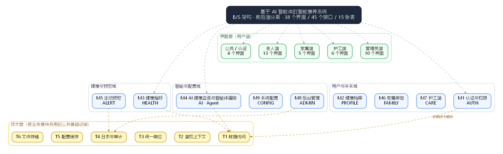


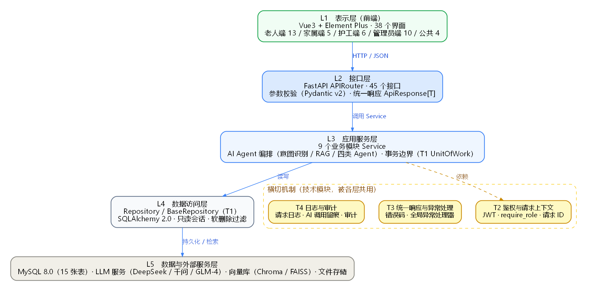


**模块划分依据**：模块按**业务职责**划分而非按技术分层划分，一个模块内部同时包含接口、服务与数据访问三部分，便于组内按模块并行开发与交付。9 个业务模块与《API 接口契约 v0.2》第 2~10 章一一对应，接口总数为 45 个。

**关于"一个文件一个模块"**：指导老师指出工程惯例是"一个文件一个模块"。本项目采取的是**同一惯例的分层落地**——每个模块对应一组同名前缀的文件（接口文件 `api/v1/<模块>.py`、服务文件 `services/<模块>_service.py`、数据访问文件 `repositories/<模块>_repo.py`），模块之间只通过接口调用，不直接引用对方的内部实现。3.0.3 节给出完整的"模块 ↔ 文件"对应表。

**关于 AI 能力的位置**：AI 能力不作为锦上添花的附属功能，而是独立成 **M4 AI 健康咨询与智能体编排模块**，承担意图识别、多 Agent 编排、RAG 检索增强与风险判定；其判定结果通过 M5 主动预警模块进入业务闭环。这一编排关系在 3.4 节展开。

## 3 模块详细概述

### 3.0 模块总体说明

后端共 **15 个模块**（业务模块 9 个 + 技术模块 6 个），对外接口 **45 个**，模块间调用接口 **8 个**。按指导老师要求，模块区分业务与技术两类，下列两张表分别列出；每个模块在 3.1~3.13 节按"功能定义 → 模块结构 → 类图与接口说明"三部分展开。

#### 3.0.1 业务模块清单

业务模块直接实现项目业务目标，共 9 个：

表 3-1　业务模块清单

| 编号 | 模块 | 英文标识 | 主要职责 | 对应契约章 |
|---|---|---|---|---|
| M1 | 认证与权限 | AUTH | 注册（角色白名单）、登录、登出、当前用户、JWT 签发与校验、越权拦截 | 契约第 2 章 |
| M2 | 健康档案 | PROFILE | 档案增删改查、软删除、按角色的数据隔离 | 契约第 3 章 |
| M3 | 健康指标 | HEALTH | 指标录入（五类）、列表、删除、趋势数据、异常同步检测 | 契约第 4 章 |
| M4 | AI 健康咨询与智能体编排 | AI · Agent | 意图识别路由、四类 Agent 编排、RAG 检索增强、安全分级与降级、会话历史 | 契约第 5 章 |
| M5 | 主动预警 | ALERT | 阈值规则引擎、风险四级判定、AI 摘要异步生成、站内通知分发、处理闭环与已读状态 | 契约第 6 章 |
| M6 | 家属绑定 | FAMILY | 申请 → 确认 → 生效三段式、待确认列表、确认/拒绝、解绑、代管老人列表 | 契约第 7 章 |
| M7 | 护工端 | CARE | 负责老人列表（异常优先）、老人详情、处理记录，责任范围强制隔离 | 契约第 8 章 |
| M8 | 后台管理 | ADMIN | 用户管理、创建护工/管理员、阈值与指标配置、知识库维护、统计 | 契约第 9 章 |
| M9 | 系统配置 | CONFIG | 向前端下发指标类型与生效阈值，保证前端不写死正常范围 | 契约第 10 章 |

#### 3.0.2 技术模块清单

技术模块是被各业务模块**共用**的基础设施，只支撑业务实现、不直接承载业务语义。其中 T1 / T2 / T4 承载的公共能力最关键，在本章 3.11~3.13 节按四件套展开；T3 / T5 / T6 的能力已在 5.1 与 5.3 节中说明，此处仅列清单。

表 3-2　技术模块清单

| 编号 | 模块 | 主要职责 | 被谁共用 | 本章展开方式 |
|---|---|---|---|---|
| T1 | 数据访问与事务管理 | 统一数据库会话与连接池、事务边界、Repository 基类与通用查询 | 全部 9 个业务模块 | 技术模块（B 档出四件套） |
| T2 | 鉴权与请求上下文 | JWT 签发与校验、当前用户注入、角色校验、密码学工具与请求级上下文 | 除注册、登录外的全部接口 | 技术模块（B 档出四件套） |
| T3 | 统一响应与异常处理 | 统一响应封装 `ApiResponse[T]`、错误码体系、全局异常处理器 | 全部接口 | 技术模块（B 档仅列清单） |
| T4 | 日志与审计 | 请求日志、异常日志、AI 调用留痕与关键操作审计 | 全部模块；AI 调用与预警处理留痕 | 技术模块（B 档出四件套） |
| T5 | 配置与阈值缓存 | `.env` 与 `sys_config` 的读取、进程内阈值缓存与写后失效 | M3 指标判定、M5 预警规则、M9 配置下发 | 技术模块（B 档仅列清单） |
| T6 | 文件存储 | 文件上传与访问的存储抽象（本地 / OSS） | M4 知识库、头像（本期不做） | 技术模块（B 档仅列清单）【选配】 |

**技术支撑业务的落地方式**：业务模块**只调用技术模块对外暴露的接口**，不自行实现数据库会话、鉴权判定与日志写入。例如 M3 录入指标时通过 T1 的 `UnitOfWork` 开事务、经 M2 的 `resolve_visible_profiles` 校验数据范围、异常时由 T2 统一转成 1002，全过程由 T4 留痕。这样做的收益是：口径唯一（阈值、可见范围、错误码只有一处定义）、便于排查（请求 ID 串联全部日志）、可替换（换数据库或日志方案只改技术模块）。

#### 3.0.3 模块与文件的对应关系

按"一个模块一组同名文件"的落法，模块与代码文件的对应关系如下表。模块之间只通过接口调用，不直接引用对方的内部实现。

表 3-3　模块与文件对应表

| 编号 | 模块 | 接口层 | 服务层 | 数据访问 / 其他 |
|---|---|---|---|---|
| M1 | 认证与权限 | `app/api/v1/auth.py` | `app/services/auth_service.py` | `app/core/security.py`（T2 提供） |
| M2 | 健康档案 | `app/api/v1/profiles.py` | `app/services/profile_service.py` | `app/repositories/profile_repo.py` |
| M3 | 健康指标 | `app/api/v1/health.py` | `app/services/health_service.py` | `app/repositories/health_repo.py` |
| M4 | AI 咨询与智能体编排 | `app/api/v1/ai.py` | `app/services/chat_service.py` | `app/agent/`（agent / orchestrator / retriever / llm） |
| M5 | 主动预警 | `app/api/v1/alerts.py`、`notifications.py` | `app/services/alert_service.py` | `app/repositories/alert_repo.py` |
| M6 | 家属绑定 | `app/api/v1/family.py` | `app/services/family_service.py` | `app/repositories/family_repo.py` |
| M7 | 护工端 | `app/api/v1/care.py` | `app/services/care_service.py` | `app/repositories/care_repo.py` |
| M8 | 后台管理 | `app/api/v1/admin.py` | `app/services/admin_service.py` | `app/repositories/admin_repo.py` |
| M9 | 系统配置 | `app/api/v1/config.py` | `app/services/config_service.py` | `app/repositories/config_repo.py` |
| T1 | 数据访问与事务管理 | （无 HTTP 端点） | `app/repositories/base.py` | `app/core/database.py`（会话与连接池） |
| T2 | 鉴权与请求上下文 | （无 HTTP 端点） | `app/core/deps.py` | `app/core/security.py` |
| T3 | 统一响应与异常处理 | （无 HTTP 端点） | `app/core/exceptions.py` | `app/schemas/common.py`（`ApiResponse[T]`） |
| T4 | 日志与审计 | （中间件与全局处理器） | `app/core/logging.py` | `app/repositories/ai_log_repo.py` |
| T5 | 配置与阈值缓存 | （无 HTTP 端点） | `app/core/config.py` | `app/core/cache.py` |
| T6 | 文件存储【选配】 | （无 HTTP 端点） | `app/core/storage.py` | 本地 / OSS 适配器 |

**统一的技术约定**（后文各模块不再重复说明）：

| 项 | 约定 |
|---|---|
| 接口层 | FastAPI `APIRouter`，位于 `app/api/v1/`，只做参数校验、鉴权注入与统一响应封装，**不写业务逻辑、不直接访问数据库** |
| 应用层 | Service 类，位于 `app/services/`，承载业务规则与事务边界 |
| 数据层 | Repository 类，位于 `app/repositories/`，继承 T1 的 `BaseRepository`，基于 SQLAlchemy 2.0 访问数据库 |
| 实体层 | ORM 模型 `app/models/`；出入参模型 `app/schemas/`（Pydantic v2，分 Create / Update / Out 三类） |
| 鉴权 | 由 T2 提供 `Depends(get_current_user)` 与 `require_role(...)`，替代 Java 方案的 ThreadLocal 上下文 |
| 统一响应 | 全部接口返回 T3 的 `ApiResponse[T]`（`code` / `message` / `data`） |
| 阈值来源 | 一律经 T5 读取 `sys_config` 表并走缓存，代码中不出现硬编码阈值 |
| 接口性质 | 对外接口（HTTP，供前端调用）与模块间内部调用接口分开列出，见 5.2 节 |

### 3.1 认证与权限模块（M1 AUTH）

本模块职责：注册（角色白名单）、登录、登出、当前用户、JWT 签发与校验、越权拦截。对应数据表：`user`。

#### 3.1.1 认证与权限模块功能定义

表 3-4　认证与权限模块功能定义

| 序号 | 功能点 | 功能点详细说明 | 需求编号 |
|---|---|---|---|
| 1 | 注册 | 手机号 + 密码 + 姓名注册；角色白名单仅 ELDER / FAMILY，传入 CARE / ADMIN 返回 4003（D-01） | FR-AUTH-001 |
| 2 | 登录 | 手机号 + 密码登录，校验通过后签发 JWT 并记录最近登录时间 | FR-AUTH-002 |
| 3 | JWT 鉴权与会话保持 | 登录后签发 token，过期或失效返回 1001，前端跳登录页 | FR-AUTH-003 / 008 |
| 4 | 角色授权与越权拦截 | ELDER / FAMILY / CARE / ADMIN 四角色权限区分；跨角色越权访问返回 1002 | FR-AUTH-004 / 005 |
| 5 | 登出 | 主动退出，服务端将 token 加入失效列表 | FR-AUTH-007 |
| 6 | 密码与会话安全 | 密码 bcrypt 加密存储、禁明文、不回显；登录失败限次防暴力破解 | FR-AUTH-012 |

#### 3.1.2 认证与权限模块结构

模块结构如图 3-1 所示：接口层接收请求并完成鉴权与参数校验，应用层实现本模块的业务规则，数据层负责表访问；虚线框为横切依赖与上游触发来源。


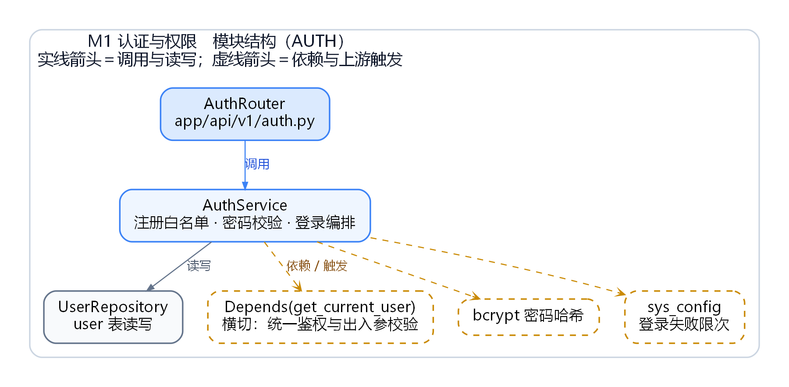


#### 3.1.3 认证与权限模块类图与接口说明

类图如图 3-2 所示。类名与职责对应后文第 5 章的接口函数定义。


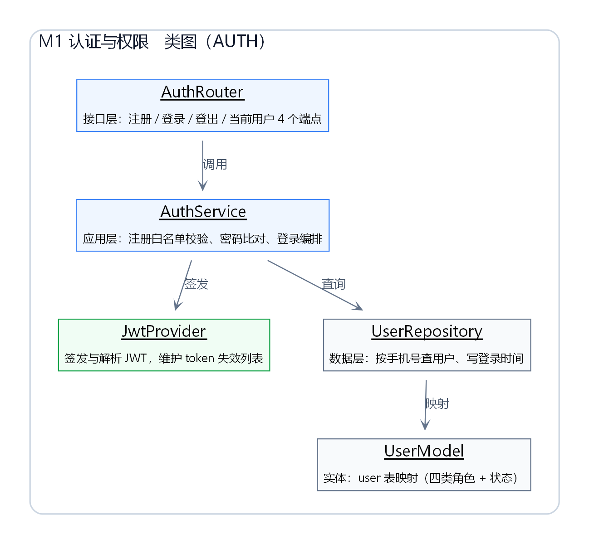


表 3-5　认证与权限模块接口说明

| 序号 | 模块名称 | 接口函数 | 函数说明 |
|---|---|---|---|
| 1 | 认证与权限 | `register` | 用户注册 |
| 2 | 认证与权限 | `login` | 用户登录 |
| 3 | 认证与权限 | `logout` | 退出登录 |
| 4 | 认证与权限 | `get_me` | 获取当前用户信息 |

### 3.2 健康档案模块（M2 PROFILE）

本模块职责：档案增删改查、软删除、按角色的数据隔离。对应数据表：`elder_profile`。

#### 3.2.1 健康档案模块功能定义

表 3-6　健康档案模块功能定义

| 序号 | 功能点 | 功能点详细说明 | 需求编号 |
|---|---|---|---|
| 1 | 档案创建 | 一位账号可建 1~N 份档案（本人 / 代管老人），录入基本信息、病史、慢病标签 | FR-HEALTH-001 |
| 2 | 档案查看 | 返回基本信息、既往病史、过敏史、慢病标签 | FR-HEALTH-002 |
| 3 | 数据隔离 | 老人返回本人、家属返回已绑定、护工返回负责、管理员返回全部；隔离在后端强制实现 | FR-FAMILY-011 |
| 4 | 档案修改 | 基本资料与慢病标签增删改 | FR-HEALTH-003 |
| 5 | 档案删除 | 二次确认后软删除（deleted 标记），保留历史数据可追溯 | FR-HEALTH-004 |
| 6 | 多档案归属 | 同一账号可归属多份档案，供家属/护工快速切换 | FR-HEALTH-014 |

#### 3.2.2 健康档案模块结构

模块结构如图 3-3 所示：接口层接收请求并完成鉴权与参数校验，应用层实现本模块的业务规则，数据层负责表访问；虚线框为横切依赖与上游触发来源。


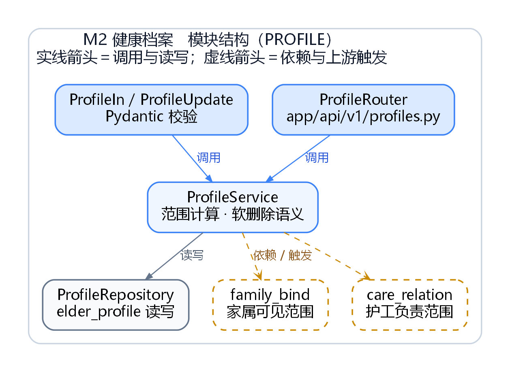


#### 3.2.3 健康档案模块类图与接口说明

类图如图 3-4 所示。类名与职责对应后文第 5 章的接口函数定义。


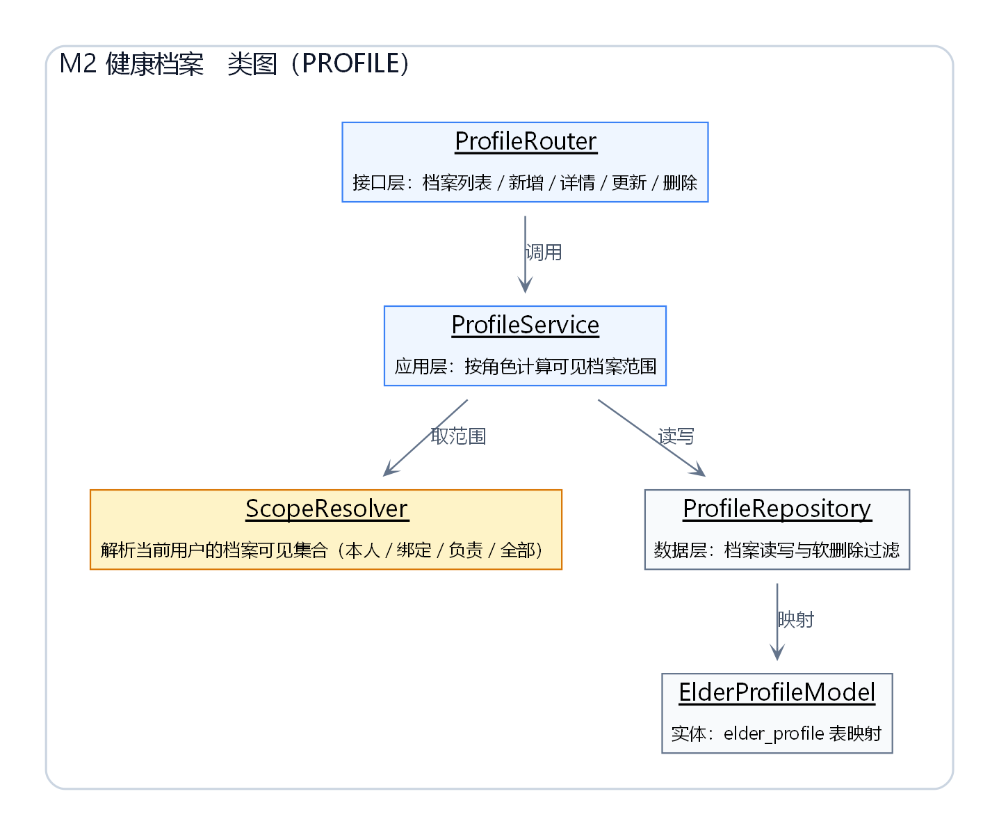


表 3-7　健康档案模块接口说明

| 序号 | 模块名称 | 接口函数 | 函数说明 |
|---|---|---|---|
| 1 | 健康档案 | `list_profiles` | 档案列表（按角色隔离） |
| 2 | 健康档案 | `create_profile` | 创建档案 |
| 3 | 健康档案 | `get_profile` | 档案详情 |
| 4 | 健康档案 | `update_profile` | 更新档案 |
| 5 | 健康档案 | `delete_profile` | 删除档案（软删除） |

### 3.3 健康指标模块（M3 HEALTH）

本模块职责：指标录入（五类）、列表、删除、趋势数据、异常同步检测。对应数据表：`health_record`。

#### 3.3.1 健康指标模块功能定义

表 3-8　健康指标模块功能定义

| 序号 | 功能点 | 功能点详细说明 | 需求编号 |
|---|---|---|---|
| 1 | 指标录入 | 血压 / 血糖 / 心率 / 睡眠 / 步数 五类，录入前做范围与类型校验 | FR-HEALTH-005~009 |
| 2 | 统一指标存储 | 统一表 + type 字段区分指标类型，避免五张表结构重复（DB-2） | FR-HEALTH-010 |
| 3 | 指标历史列表 | 按档案 + 类型分页查询，按测量时间倒序 | FR-HEALTH-011 |
| 4 | 异常同步检测 | 录入成功后同步执行阈值检测，命中即返回 risk_level 与 warning_id | FR-ALERT-001 |
| 5 | 趋势数据 | 输出 ECharts 可直接渲染的 dates / series 结构，正常范围来自 sys_config | FR-HEALTH-012 |
| 6 | 异常点标注 | 趋势数据附带 abnormal_points，供前端高亮超阈值点 | FR-HEALTH-013 |

#### 3.3.2 健康指标模块结构

模块结构如图 3-5 所示：接口层接收请求并完成鉴权与参数校验，应用层实现本模块的业务规则，数据层负责表访问；虚线框为横切依赖与上游触发来源。


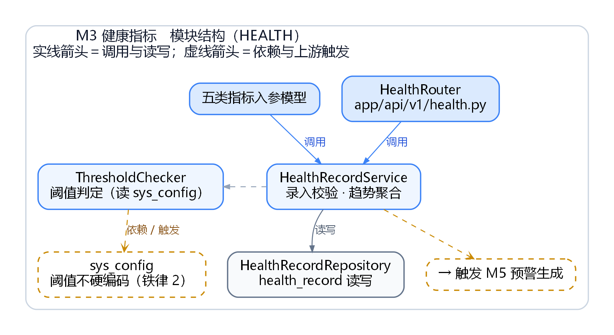


#### 3.3.3 健康指标模块类图与接口说明

类图如图 3-6 所示。类名与职责对应后文第 5 章的接口函数定义。


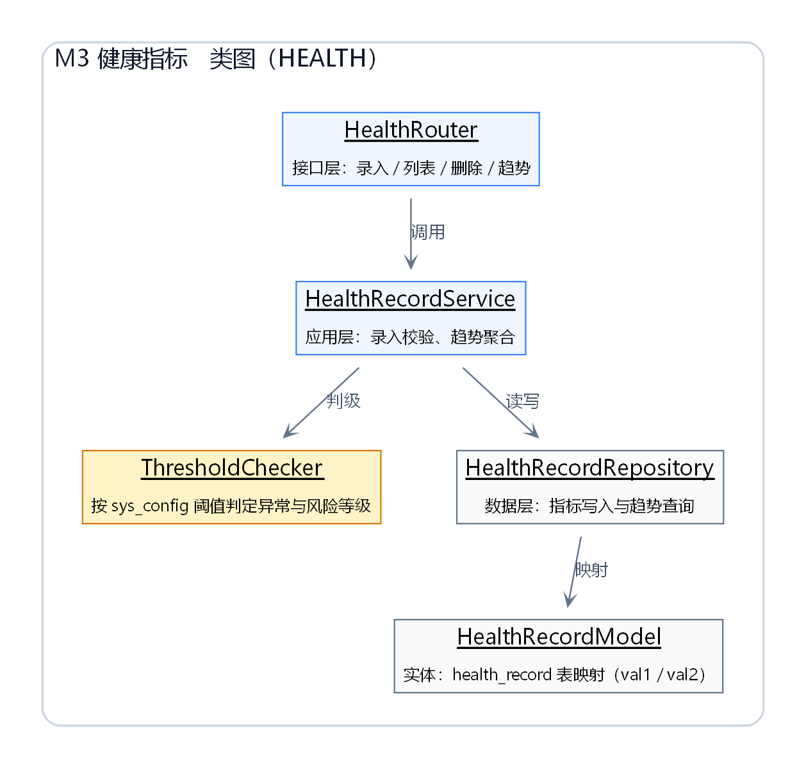


表 3-9　健康指标模块接口说明

| 序号 | 模块名称 | 接口函数 | 函数说明 |
|---|---|---|---|
| 1 | 健康指标 | `create_record` | 录入健康指标并同步检测异常 |
| 2 | 健康指标 | `list_records` | 指标历史列表 |
| 3 | 健康指标 | `delete_record` | 删除指标记录 |
| 4 | 健康指标 | `get_trend` | 指标趋势数据（供 ECharts） |

### 3.4 AI 健康咨询与智能体编排模块（M4 AI · Agent）

本模块职责：意图识别路由、四类 Agent 编排、RAG 检索增强、安全分级与降级、会话历史。对应数据表：`chat_session`、`chat_message`、`knowledge_document`、`knowledge_chunk`、`ai_log`。

#### 3.4.1 AI 健康咨询与智能体编排模块功能定义

表 3-10　AI 健康咨询与智能体编排模块功能定义

| 序号 | 功能点 | 功能点详细说明 | 需求编号 |
|---|---|---|---|
| 1 | 发起咨询 | 选择档案 + 输入问题（或点预设问题按钮），session_id 为空时自动建会话 | FR-AI-001 |
| 2 | 意图识别路由 | 四类意图 NORMAL / DATA / ABNORMAL / EMERGENCY，由 IntentRouter 判定 | FR-AI-003 |
| 3 | 多 Agent 编排 | HealthAgent 普通咨询 / HealthDataAgent 数据类 / RiskAgent 异常 / EmergencyAgent 紧急 | FR-AI-004~007 |
| 4 | RAG 检索增强 | 问题向量化 → 向量库 Top-K 召回 → 注入 Prompt，回答附 sources 来源 | FR-AI-008 / KB-003 |
| 5 | 档案个性化 | 组装档案摘要（慢病标签、过敏史）+ 近 7 天指标一起送入模型 | FR-AI-002 |
| 6 | Risk Agent 联动预警 | 异常意图判定风险等级并生成预警，返回 warning_id | FR-AI-006 |
| 7 | 回答适老化与免责 | 长文分段、要点化输出；每次响应固定返回免责声明 | FR-AI-009 / 011 |
| 8 | 安全分级与降级 | L1~L4 安全分级 + 敏感词兜底；模型不可用返回 3001 但业务主流程仍可运行（D-04） | FR-AI-014 |
| 9 | 限流与费用控制 | 单次限字数、按用户控制调用频率，超出返回 3002 | FR-AI-015 |
| 10 | 历史咨询记录 | 按档案查看会话与消息列表，可删除会话 | FR-AI-010 |

#### 3.4.2 AI 健康咨询与智能体编排模块结构

模块结构如图 3-7 所示：接口层接收请求并完成鉴权与参数校验，应用层实现本模块的业务规则，数据层负责表访问；虚线框为横切依赖与上游触发来源。


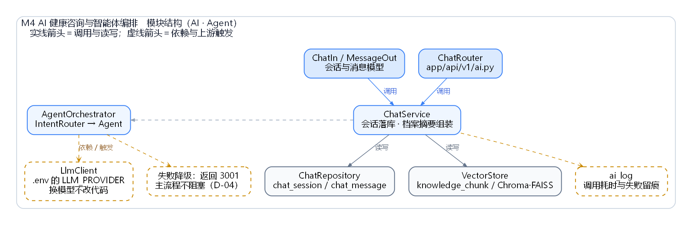


#### 3.4.3 AI 健康咨询与智能体编排模块类图与接口说明

类图如图 3-8 所示。类名与职责对应后文第 5 章的接口函数定义。


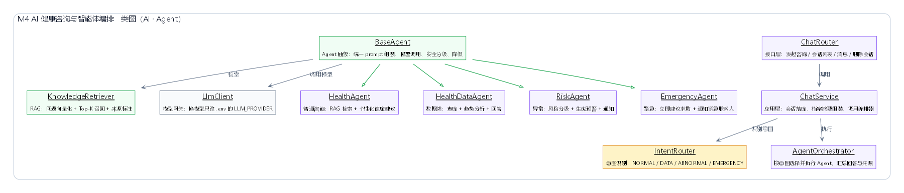


四类 Agent 的分工：
- `HealthAgent`：普通咨询：RAG 检索 + 个性化健康建议
- `HealthDataAgent`：数据类：查库 + 趋势分析 + 回答
- `RiskAgent`：异常：风险分级 + 生成预警 + 通知
- `EmergencyAgent`：紧急：立即建议求助 + 通知紧急联系人

表 3-11　AI 健康咨询与智能体编排模块接口说明

| 序号 | 模块名称 | 接口函数 | 函数说明 |
|---|---|---|---|
| 1 | AI 健康咨询与智能体编排 | `chat` | 发起健康咨询（多 Agent 编排） |
| 2 | AI 健康咨询与智能体编排 | `list_sessions` | 会话列表 |
| 3 | AI 健康咨询与智能体编排 | `list_messages` | 会话内消息列表 |
| 4 | AI 健康咨询与智能体编排 | `delete_session` | 删除会话 |

### 3.5 主动预警模块（M5 ALERT）

本模块职责：阈值规则引擎、风险四级判定、AI 摘要异步生成、站内通知分发、处理闭环与已读状态。对应数据表：`health_warning`、`alert_receiver`、`warning_handle_record`。

#### 3.5.1 主动预警模块功能定义

表 3-12　主动预警模块功能定义

| 序号 | 功能点 | 功能点详细说明 | 需求编号 |
|---|---|---|---|
| 1 | 阈值规则引擎 | 阈值全部来自 sys_config，改阈值即时生效，代码不写死（铁律 2） | FR-ALERT-002 / ADMIN-009 |
| 2 | 风险四级判定 | 0 正常 / 1 轻度 / 2 较高 / 3 高风险，参考档案慢病标签做个体微调 | FR-ALERT-003 |
| 3 | AI 摘要异步生成 | 预警先生成后异步补摘要；summary_status 覆盖 PENDING / SUCCESS / FAILED / SKIPPED | FR-ALERT-004 |
| 4 | 站内通知分发 | 按接收人写入 alert_receiver；老人端、家属端、护工端按角色可见（D-03） | FR-ALERT-005~007 |
| 5 | 紧急升级 | L3 高风险标记后不等待 AI 摘要立即通知，保证时效（D-04） | FR-ALERT-008 |
| 6 | 处理闭环 | 处理状态 PENDING → PROCESSING → RESOLVED / IGNORED，与已读状态相互独立（D-05） | FR-ALERT-009 |
| 7 | 处理留痕 | 登记处理方式（已联系 / 安排上门 / 送医 / 继续观察）与说明，写入留痕表 | FR-ALERT-010 |
| 8 | 已读状态与未读数 | 点开详情只更新本人那条接收记录；未读数为当前用户口径 | FR-ALERT-011 |
| 9 | 预警详情 | 展示指标值、阈值、近 7 天历史趋势与全部处理记录 | FR-ALERT-012 |
| 10 | 摘要重试 | 摘要失败可由用户或管理员手动重试，AI 不可用不影响预警本身 | FR-ALERT-004 |

#### 3.5.2 主动预警模块结构

模块结构如图 3-9 所示：接口层接收请求并完成鉴权与参数校验，应用层实现本模块的业务规则，数据层负责表访问；虚线框为横切依赖与上游触发来源。


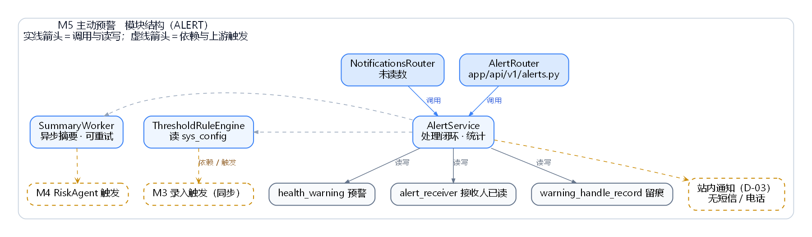


#### 3.5.3 主动预警模块类图与接口说明

类图如图 3-10 所示。类名与职责对应后文第 5 章的接口函数定义。


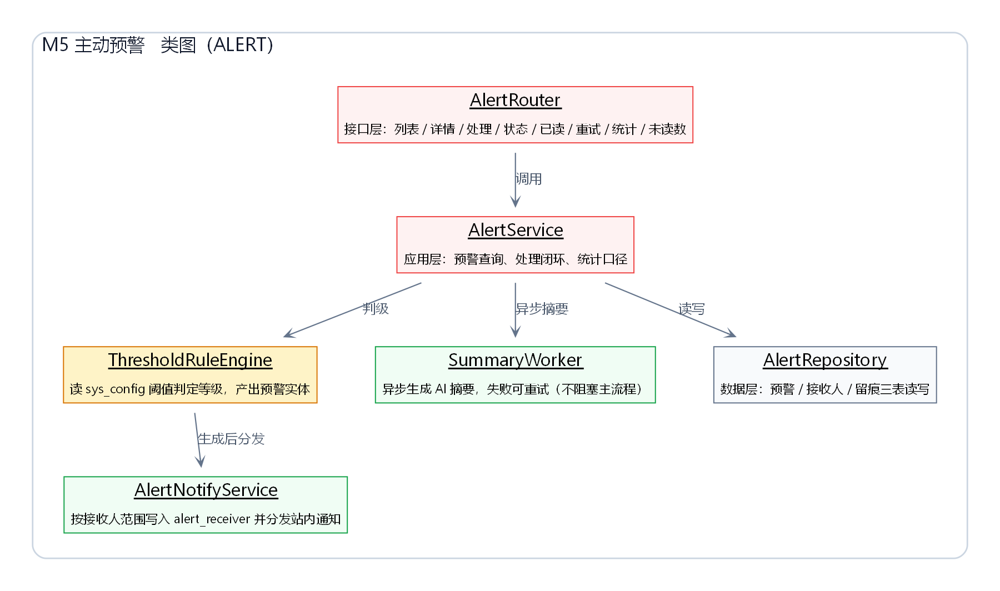


表 3-13　主动预警模块接口说明

| 序号 | 模块名称 | 接口函数 | 函数说明 |
|---|---|---|---|
| 1 | 主动预警 | `list_alerts` | 预警列表（含每人已读状态） |
| 2 | 主动预警 | `get_alert` | 预警详情 |
| 3 | 主动预警 | `handle_alert` | 提交处理结果（闭环） |
| 4 | 主动预警 | `update_alert_status` | 更新中间态（处理中 / 已忽略） |
| 5 | 主动预警 | `mark_alert_read` | 标记已读（仅当前用户） |
| 6 | 主动预警 | `retry_summary` | AI 摘要重试（D-04） |
| 7 | 主动预警 | `alert_statistics` | 预警统计 |
| 8 | 主动预警 | `unread_count` | 通知未读数（前端红点） |

### 3.6 家属绑定模块（M6 FAMILY）

本模块职责：申请 → 确认 → 生效三段式、待确认列表、确认/拒绝、解绑、代管老人列表。对应数据表：`family_bind`。

#### 3.6.1 家属绑定模块功能定义

表 3-14　家属绑定模块功能定义

| 序号 | 功能点 | 功能点详细说明 | 需求编号 |
|---|---|---|---|
| 1 | 提交绑定申请 | 家属按老人手机号发起申请，校验手机号存在性（不存在返回 2002） | FR-FAMILY-001 |
| 2 | 重复申请拦截 | 同一对家属—老人已存在 PENDING / APPROVED 时返回 4001 | FR-FAMILY-001 |
| 3 | 绑定上限控制 | 老人已绑定家属数达上限（默认 5，入 sys_config 的 family_bind_max）返回 4002 | FR-FAMILY-001 |
| 4 | 确认 / 拒绝 | 老人端或管理员端确认；代确认时写入操作人 approved_by 与原因 approve_note 留痕 | FR-FAMILY-001 |
| 5 | 权限生效控制 | 未确认（PENDING）不产生任何数据访问权限，确认后家属才可见档案、指标、预警 | FR-FAMILY-005 / 011 |
| 6 | 解绑 | 任一方发起即时生效，状态置 REVOKED，历史处理记录保留用于追溯 | FR-FAMILY-003 |
| 7 | 代管多老人 | 一个家属可绑定多位老人，提供已生效老人列表供切换 | FR-FAMILY-002 |
| 8 | 代录与代咨询 | 绑定生效后家属可代老人录入指标、发起 AI 咨询 | FR-FAMILY-004 / 009 |

#### 3.6.2 家属绑定模块结构

模块结构如图 3-11 所示：接口层接收请求并完成鉴权与参数校验，应用层实现本模块的业务规则，数据层负责表访问；虚线框为横切依赖与上游触发来源。


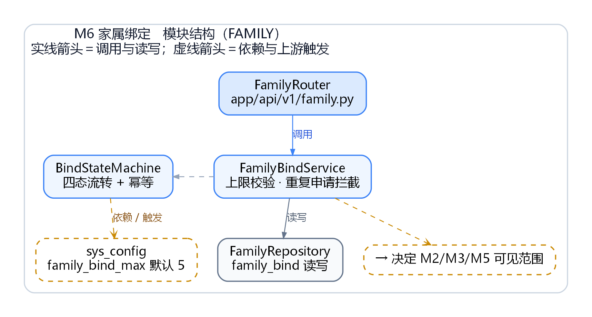


#### 3.6.3 家属绑定模块类图与接口说明

类图如图 3-12 所示。类名与职责对应后文第 5 章的接口函数定义。


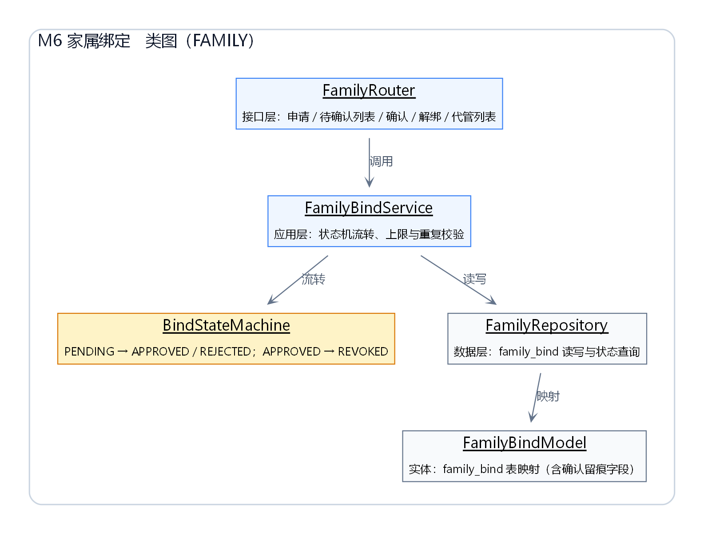


表 3-15　家属绑定模块接口说明

| 序号 | 模块名称 | 接口函数 | 函数说明 |
|---|---|---|---|
| 1 | 家属绑定 | `create_bind` | 提交绑定申请 |
| 2 | 家属绑定 | `list_bind_requests` | 待我确认的绑定申请 |
| 3 | 家属绑定 | `confirm_bind` | 确认或拒绝绑定申请 |
| 4 | 家属绑定 | `list_bound_elders` | 已生效的代管老人列表 |
| 5 | 家属绑定 | `unbind` | 解绑 |

### 3.7 护工端模块（M7 CARE）

本模块职责：负责老人列表（异常优先）、老人详情、处理记录，责任范围强制隔离。对应数据表：`care_relation`、`health_record`、`health_warning`。

#### 3.7.1 护工端模块功能定义

表 3-16　护工端模块功能定义

| 序号 | 功能点 | 功能点详细说明 | 需求编号 |
|---|---|---|---|
| 1 | 负责老人列表 | 按 care_relation 返回在管老人，一屏看到最新血压、血糖、睡眠与待处理预警数 | FR-CARE-001 |
| 2 | 状态分色标识 | 老人状态按 正常 NORMAL / 关注 WATCH / 异常 ABNORMAL 标识 | FR-CARE-002 |
| 3 | 异常优先排序 | 高风险老人置顶，便于护工优先处理 | FR-CARE-010 |
| 4 | 老人详情 | 档案 + 最近指标 + 预警三合一视图 | FR-CARE-003 / 004 |
| 5 | 处理预警 | 登记处理结果，复用 M5 的处理闭环并写入留痕 | FR-CARE-005 |
| 6 | 处理记录 | 查看本人历史处理记录，供交接与追溯 | FR-CARE-006 |
| 7 | 责任范围隔离 | 护工仅可见分配给自己的老人，隔离在后端强制实现 | FR-CARE-007 |
| 8 | 老人筛选 | 按状态或时段筛选负责老人 | FR-CARE-009 |

#### 3.7.2 护工端模块结构

模块结构如图 3-13 所示：接口层接收请求并完成鉴权与参数校验，应用层实现本模块的业务规则，数据层负责表访问；虚线框为横切依赖与上游触发来源。


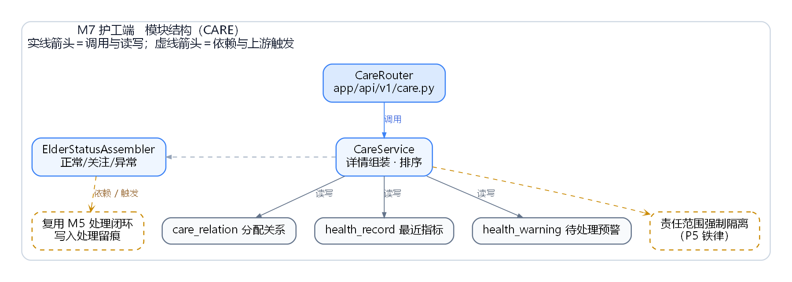


#### 3.7.3 护工端模块类图与接口说明

类图如图 3-14 所示。类名与职责对应后文第 5 章的接口函数定义。


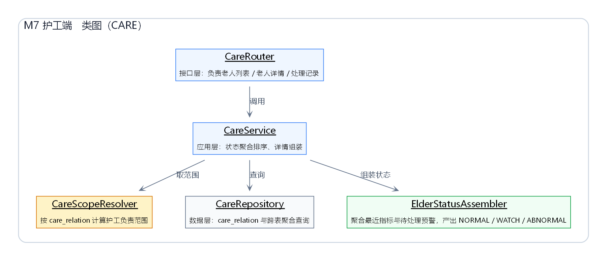


表 3-17　护工端模块接口说明

| 序号 | 模块名称 | 接口函数 | 函数说明 |
|---|---|---|---|
| 1 | 护工端 | `list_care_elders` | 负责老人列表（异常优先） |
| 2 | 护工端 | `get_care_elder` | 老人详情（档案 + 指标 + 预警） |
| 3 | 护工端 | `list_handles` | 本人处理记录 |

### 3.8 后台管理模块（M8 ADMIN）

本模块职责：用户管理、创建护工/管理员、阈值与指标配置、知识库维护、统计。对应数据表：`user`、`sys_config`、`knowledge_document`。

#### 3.8.1 后台管理模块功能定义

表 3-18　后台管理模块功能定义

| 序号 | 功能点 | 功能点详细说明 | 需求编号 |
|---|---|---|---|
| 1 | 用户管理 | 按角色与关键词查询用户；禁用后该用户不可登录（token 立即失效） | FR-ADMIN-001 / 002 |
| 2 | 创建护工 / 管理员 | 仅管理员可建号，role 仅允许 CARE / ADMIN；密码 bcrypt 存储不回显（D-01） | FR-ADMIN-001 |
| 3 | 阈值配置 | 配置各指标四档阈值区间，保存后即时生效，无需重启 | FR-ADMIN-004 / 009 |
| 4 | 配置入表 | 阈值与系统参数全部存 sys_config，禁止写死在代码里（铁律 2） | FR-ADMIN-010 |
| 5 | 健康指标配置 | 配置可录入的指标类型、单位与正常范围 | FR-ADMIN-005 |
| 6 | 知识库维护 | 知识条目增删改；上传文档自动解析建索引为【选配】本期不实现 | FR-ADMIN-006 |
| 7 | 统计概览 | 用户数、咨询数、预警数按周期统计，口径与明细一致 | FR-REPORT-001~003 |

#### 3.8.2 后台管理模块结构

模块结构如图 3-15 所示：接口层接收请求并完成鉴权与参数校验，应用层实现本模块的业务规则，数据层负责表访问；虚线框为横切依赖与上游触发来源。


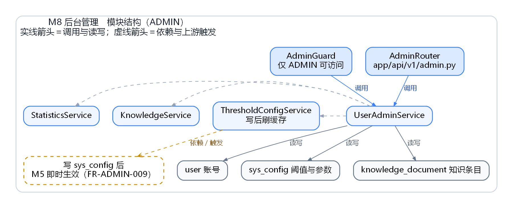


#### 3.8.3 后台管理模块类图与接口说明

类图如图 3-16 所示。类名与职责对应后文第 5 章的接口函数定义。


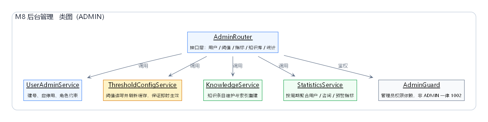


表 3-19　后台管理模块接口说明

| 序号 | 模块名称 | 接口函数 | 函数说明 |
|---|---|---|---|
| 1 | 后台管理 | `list_users` | 用户列表 |
| 2 | 后台管理 | `create_user` | 创建护工 / 管理员账号（D-01） |
| 3 | 后台管理 | `set_user_status` | 禁用 / 启用用户 |
| 4 | 后台管理 | `list_thresholds` | 阈值配置列表 |
| 5 | 后台管理 | `update_threshold` | 更新阈值（即时生效） |
| 6 | 后台管理 | `list_indicators` | 健康指标配置 |
| 7 | 后台管理 | `list_knowledge` | 知识库条目列表 |
| 8 | 后台管理 | `create_knowledge` | 新增知识条目 |
| 9 | 后台管理 | `upload_knowledge` | 上传文档自动解析建索引【选配·本期不实现】 |
| 10 | 后台管理 | `get_statistics` | 统计概览 |

### 3.9 系统配置模块（M9 CONFIG）

本模块职责：向前端下发指标类型与生效阈值，保证前端不写死正常范围。对应数据表：`sys_config`。

#### 3.9.1 系统配置模块功能定义

表 3-20　系统配置模块功能定义

| 序号 | 功能点 | 功能点详细说明 | 需求编号 |
|---|---|---|---|
| 1 | 指标类型下发 | 返回可录入的指标类型、单位与取值范围，供前端表单渲染 | FR-ADMIN-005 |
| 2 | 生效阈值下发 | 返回当前生效的四档阈值，供前端展示正常范围与高亮判断 | FR-ADMIN-004 |
| 3 | 前端零硬编码 | 正常范围一律取自本模块接口，前端不得写死（铁律 2） | FR-ADMIN-010 |
| 4 | 配置读取加速 | 阈值读取走进程内缓存，管理端写入后立即失效重建 | FR-HEALTH-012 |

#### 3.9.2 系统配置模块结构

模块结构如图 3-17 所示：接口层接收请求并完成鉴权与参数校验，应用层实现本模块的业务规则，数据层负责表访问；虚线框为横切依赖与上游触发来源。


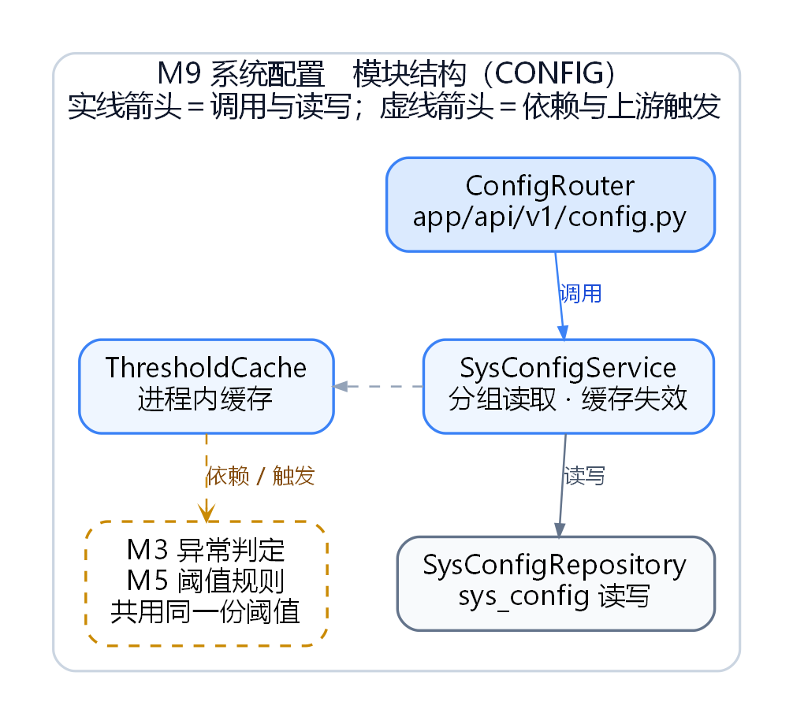


#### 3.9.3 系统配置模块类图与接口说明

类图如图 3-18 所示。类名与职责对应后文第 5 章的接口函数定义。


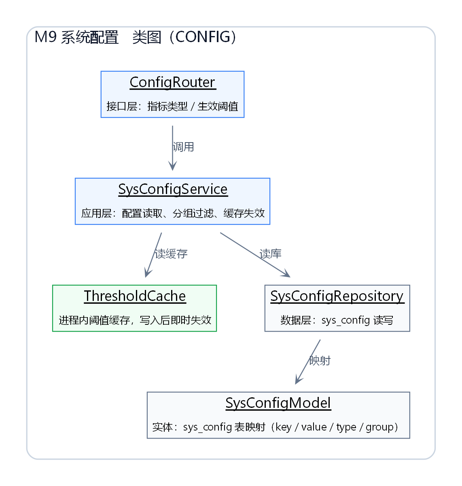


表 3-21　系统配置模块接口说明

| 序号 | 模块名称 | 接口函数 | 函数说明 |
|---|---|---|---|
| 1 | 系统配置 | `list_config_indicators` | 可录入指标类型下发 |
| 2 | 系统配置 | `list_effective_thresholds` | 当前生效阈值下发 |

### 3.10 技术模块详细说明

技术模块不出现在接口层的 HTTP 端点里，它们的能力由业务模块在服务层直接调用。因此下列各节的接口说明表列出的是**供其他模块调用的函数**（按指导老师口径即「外部接口」），各模块内部不对外公开的私有方法属「内部接口」，已在类图中以 `_` 前缀体现，不逐个列出。

### 3.11 数据访问与事务管理模块（T1 TECH · DATA ACCESS，技术模块）

本模块职责：统一数据库会话与连接池、事务边界、Repository 基类与通用查询。被谁共用：全部 9 个业务模块。对应数据对象：`全部 15 张表`。

#### 3.11.1 数据访问与事务管理模块功能定义

表 3-22　数据访问与事务管理模块功能定义

| 序号 | 功能点 | 功能点详细说明 | 需求编号 |
|---|---|---|---|
| 1 | 会话管理 | 按请求创建与释放 SQLAlchemy Session，请求结束自动归还连接池，杜绝连接泄漏 | 技术支撑 |
| 2 | 事务边界 | Service 层用 `with uow:` 显式提交或回滚，禁止在接口层直接写库 | 技术支撑 |
| 3 | Repository 基类 | 封装通用增删改查、分页查询与软删除过滤，各业务模块的 Repository 继承它 | 技术支撑 |
| 4 | 连接池配置 | 池大小、获取超时、回收时间由 `.env` 下发，不写死在代码 | 技术支撑 |
| 5 | 只读查询优化 | 趋势与统计类查询走只读会话，不开启写事务 | 技术支撑 |
| 6 | 一致性兜底 | 外键约束 + 应用层唯一性校验（如家属重复申请、绑定上限）双层保障 | 技术支撑 |

#### 3.11.2 数据访问与事务管理模块结构

模块结构如图 3-19 所示：本模块不暴露 HTTP 端点，以中间件或依赖注入的形式被业务模块引用。


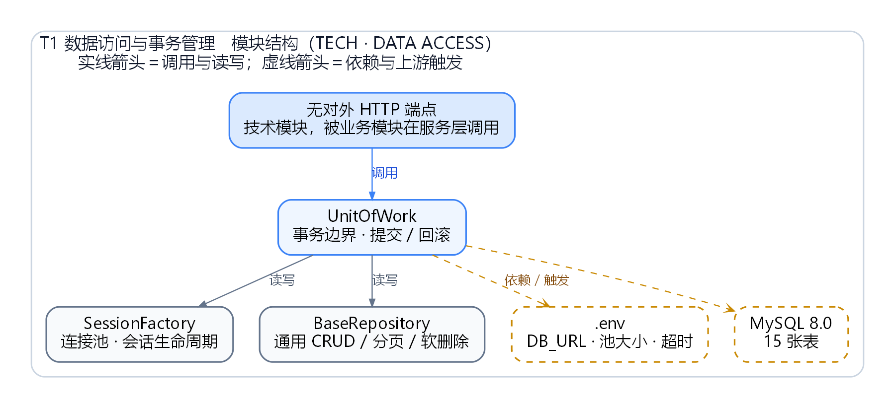


#### 3.11.3 数据访问与事务管理模块类图与接口说明

类图如图 3-20 所示。


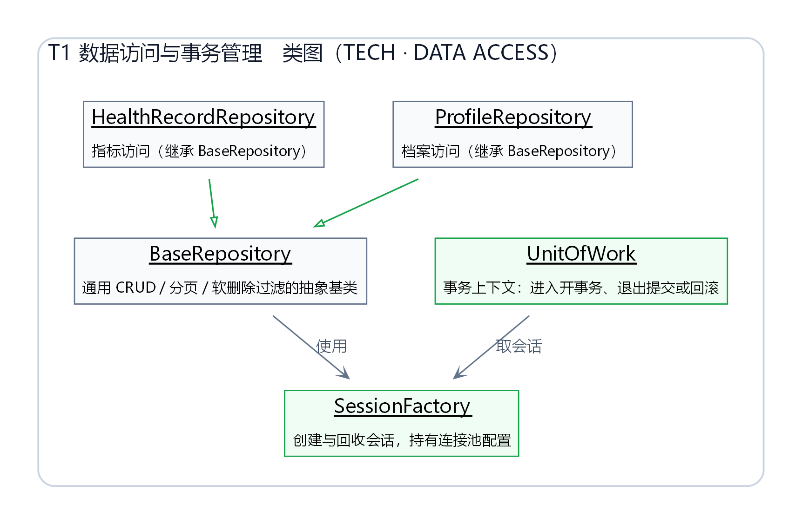


表 3-23　数据访问与事务管理模块对外提供的函数

| 序号 | 模块名称 | 调用函数 | 函数说明 |
|---|---|---|---|
| 1 | 数据访问与事务管理 | `get_session()` | 获取当前请求的数据库会话（依赖注入） |
| 2 | 数据访问与事务管理 | `unit_of_work()` | 开启事务上下文，退出时提交或回滚 |
| 3 | 数据访问与事务管理 | `BaseRepository.page()` | 通用分页查询，支持过滤与排序 |
| 4 | 数据访问与事务管理 | `BaseRepository.get_by_id()` | 按主键取实体，自动过滤软删除记录 |
| 5 | 数据访问与事务管理 | `BaseRepository.save()` | 新增或更新实体并刷新审计字段 |

### 3.12 鉴权与请求上下文模块（T2 TECH · AUTH CONTEXT，技术模块）

本模块职责：JWT 签发与校验、当前用户注入、角色校验、密码学工具与请求级上下文。被谁共用：除注册、登录外的全部接口。对应数据对象：`user（读取账号与状态）`。

#### 3.12.1 鉴权与请求上下文模块功能定义

表 3-24　鉴权与请求上下文模块功能定义

| 序号 | 功能点 | 功能点详细说明 | 需求编号 |
|---|---|---|---|
| 1 | JWT 签发与校验 | HMAC 签名，过期或失效返回 1001，前端跳登录页 | FR-AUTH-003 |
| 2 | 当前用户注入 | 以 `Depends(get_current_user)` 提供当前用户，替代 Java 方案的 ThreadLocal 上下文 | FR-AUTH-003 |
| 3 | 角色校验 | `require_role(...)` 依赖声明允许的角色，越权访问返回 1002 | FR-AUTH-004 / 005 |
| 4 | 账号状态校验 | 禁用账号的 Token 立即失效，配合后台的启用 / 禁用 | FR-AUTH-012 |
| 5 | 密码学工具 | bcrypt 哈希与校验，全系统禁止明文与 MD5 | FR-AUTH-012 |
| 6 | 请求级上下文 | 生成请求 ID、记录客户端 IP 与当前用户，供日志模块使用 | 技术支撑 |

#### 3.12.2 鉴权与请求上下文模块结构

模块结构如图 3-21 所示：本模块不暴露 HTTP 端点，以中间件或依赖注入的形式被业务模块引用。


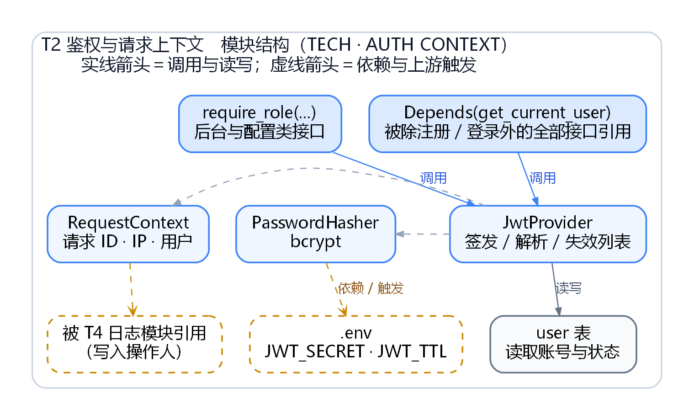


#### 3.12.3 鉴权与请求上下文模块类图与接口说明

类图如图 3-22 所示。


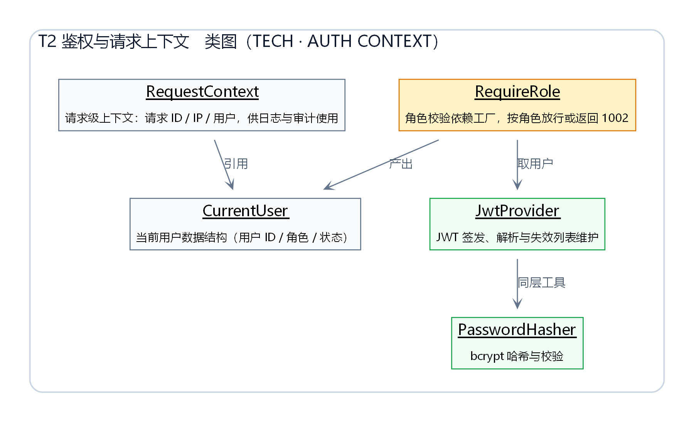


表 3-25　鉴权与请求上下文模块对外提供的函数

| 序号 | 模块名称 | 调用函数 | 函数说明 |
|---|---|---|---|
| 1 | 鉴权与请求上下文 | `get_current_user()` | 解析请求头 token，返回当前用户（依赖注入） |
| 2 | 鉴权与请求上下文 | `require_role(*roles)` | 角色校验依赖工厂，角色不符返回 1002 |
| 3 | 鉴权与请求上下文 | `create_token(user)` | 签发 JWT，返回 token 与有效期 |
| 4 | 鉴权与请求上下文 | `hash_password(raw)` | bcrypt 哈希，禁明文与 MD5 |
| 5 | 鉴权与请求上下文 | `verify_password(raw, hashed)` | bcrypt 校验，失败累计次数由 sys_config 控制 |

### 3.13 日志与审计模块（T4 TECH · LOGGING，技术模块）

本模块职责：请求日志、异常日志、AI 调用留痕与关键操作审计。被谁共用：全部模块；AI 调用与预警处理留痕。对应数据对象：`ai_log`。

#### 3.13.1 日志与审计模块功能定义

表 3-26　日志与审计模块功能定义

| 序号 | 功能点 | 功能点详细说明 | 需求编号 |
|---|---|---|---|
| 1 | 请求日志 | 记录方法、路径、耗时、状态码与操作人，由中间件统一完成 | FR-ADMIN-008 |
| 2 | 异常日志 | 全局异常处理器记录堆栈并统一返回 5001，不向客户端泄露内部信息 | FR-ADMIN-008 |
| 3 | AI 调用留痕 | 模型标识、输入输出 token 数、耗时、成功与否写入 `ai_log` | 技术支撑 |
| 4 | 关键操作审计 | 登录、阈值修改、账号启停用等关键动作留痕，可追溯到人 | FR-ADMIN-008 |
| 5 | 日志分级 | DEBUG / INFO / WARNING / ERROR 四级，生产默认 INFO | 技术支撑 |
| 6 | 与主流程解耦 | 日志写入失败不影响业务返回，避免日志成为故障放大器 | 技术支撑 |

#### 3.13.2 日志与审计模块结构

模块结构如图 3-23 所示：本模块不暴露 HTTP 端点，以中间件或依赖注入的形式被业务模块引用。


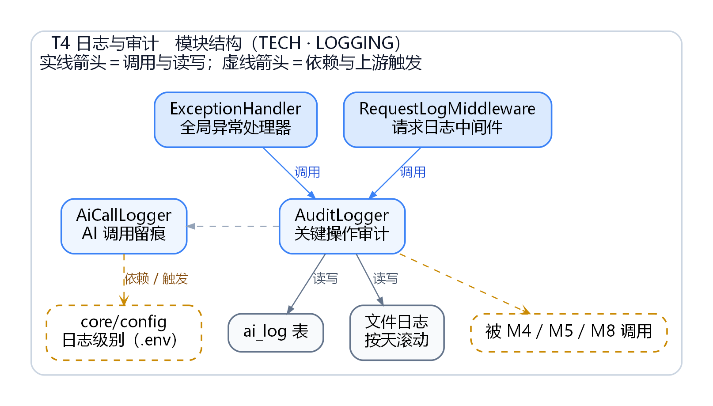


#### 3.13.3 日志与审计模块类图与接口说明

类图如图 3-24 所示。


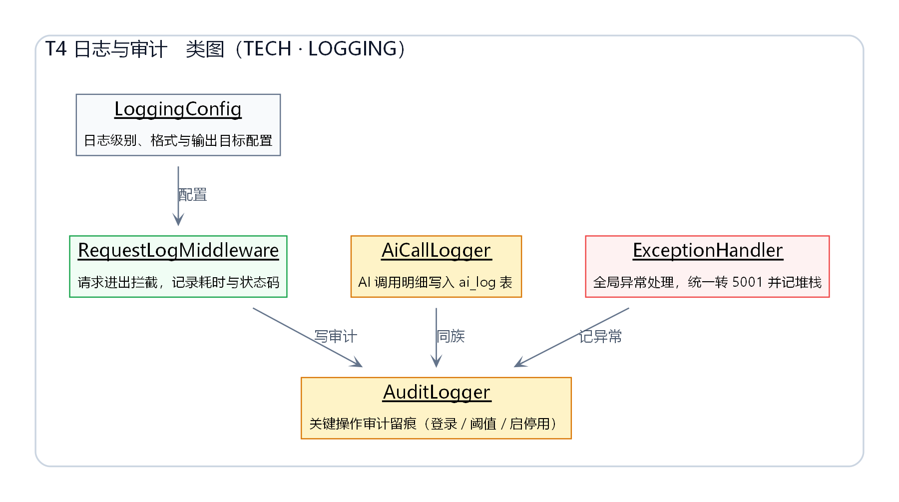


表 3-27　日志与审计模块对外提供的函数

| 序号 | 模块名称 | 调用函数 | 函数说明 |
|---|---|---|---|
| 1 | 日志与审计 | `request_id()` | 取当前请求 ID，用于串联一次请求的全部日志 |
| 2 | 日志与审计 | `write_audit_log(user, action, payload)` | 写关键操作审计日志，失败不影响业务 |
| 3 | 日志与审计 | `log_ai_call(agent, model, tokens, latency, success)` | 写 AI 调用明细到 ai_log 表 |
| 4 | 日志与审计 | `to_api_error(exc)` | 把内部异常统一转成 5001 与对外提示文案 |

## 4 数据库设计

### 4.1 数据库引擎概述

| 项 | 选型与配置 |
|---|---|
| 数据库 | MySQL 8.0 |
| 存储引擎 | InnoDB（支持事务、行级锁与外键） |
| 字符集 / 排序规则 | `utf8mb4` / `utf8mb4_general_ci`（支持完整中文与特殊符号） |
| 事务隔离级别 | REPEATABLE READ（MySQL 默认；预警生成与处理走显式事务保证一致性） |
| 主键策略 | `BIGINT AUTO_INCREMENT` 代理主键，业务编号不参与主键 |
| 时间字段 | `DATETIME`，通用审计字段 `create_time` / `update_time` 全表统一 |
| 连接与池化 | SQLAlchemy 2.0 连接池，慢查询阈值由 `sys_config` 下发 |
| 备份策略 | 交付演示环境为单实例，采用"每日全量 `mysqldump` + 关键表脚本化重建"；正式部署建议追加 binlog 增量备份，RPO ≤ 5 分钟 |
| 高可用 | **本期为单机单实例**，不做读写分离与主从切换；正式部署规划为一主一从、从库承担报表读，切换目标 30 秒内 |

> 说明：备份与高可用部分按实际情况描述，未实现的能力明确标注为"规划"，不做虚假陈述。

### 4.2 数据库概要设计

#### 4.2.1 数据库表清单

本系统共设计 **15 张表 = 核心表 11 张 + 选配表 4 张**，覆盖用户与角色、健康档案、指标与预警、家属绑定、护工分配、AI 咨询与知识库等实体。表清单如下。

表 4-1　数据库表清单

| 序号 | 表名 | 用途 | 分层 | 分层依据 | 预估规模 |
|---|---|---|---|---|---|
| 1 | `user` |  | 基础表 | 主体与关系，被业务表引用 | 小 |
| 2 | `elder_profile` |  | 基础表 | 主体与关系，被业务表引用 | 小 |
| 3 | `family_bind` |  | 基础表 | 主体与关系，被业务表引用 | 小 |
| 4 | `care_relation` |  | 基础表 | 主体与关系，被业务表引用 | 小 |
| 5 | `health_record` |  | 业务表 | 随业务过程产生，随主体增长 | 大（增长最快） |
| 6 | `health_warning` |  | 业务表 | 随业务过程产生，随主体增长 | 中 |
| 7 | `alert_receiver` |  | 业务表 | 随业务过程产生，随主体增长 | 中 |
| 8 | `warning_handle_record` |  | 业务表 | 随业务过程产生，随主体增长 | 小 |
| 9 | `chat_session` |  | 业务表 | 随业务过程产生，随主体增长 | 小 |
| 10 | `chat_message` |  | 业务表 | 随业务过程产生，随主体增长 | 中 |
| 11 | `sys_config` |  | 配置表 | 系统级参数，全局唯一来源 | 极小 |
| 12 | `medication` |  | 选配表 | 【选配】本期不实现 | 小 |
| 13 | `knowledge_document` |  | 选配表 | 【选配】本期不实现 | 小 |
| 14 | `knowledge_chunk` |  | 选配表 | 【选配】本期不实现 | 中 |
| 15 | `ai_log` |  | 选配表 | 【选配】本期不实现 | 中 |

#### 4.2.2 基础表与业务表的划分

按照"**先确定基础表，再确定业务表**"的原则，15 张表分为四层，建表顺序与依赖方向一致：

| 层次 | 表 | 说明 |
|---|---|---|
| 基础表（4） | `user`、`elder_profile`、`family_bind`、`care_relation` | 描述"人"与"人与人的关系"，不随业务过程增长，被上层表通过外键引用 |
| 配置表（1） | `sys_config` | 系统级参数与健康阈值，全局唯一来源，**阈值不写死在代码里** |
| 业务表（6） | `health_record`、`health_warning`、`alert_receiver`、`warning_handle_record`、`chat_session`、`chat_message` | 随业务过程产生，数据量随基础表规模增长，是系统的主要写入对象 |
| 选配表（4） | `medication`、`knowledge_document`、`knowledge_chunk`、`ai_log` | 标注【选配】，本期不实现，表结构先行设计以保证扩展性 |

**主表与从表的划分**：以"被引用者为主表、引用者为从表"判定。例如 `elder_profile` 为主表，`health_record`、`health_warning`、`family_bind`、`care_relation` 均为其从表；`health_warning` 为主表，`alert_receiver` 与 `warning_handle_record` 为其从表。全部主外键关系共 **12 个**，均在建表语句之后以 `ALTER TABLE` 统一补充，避免建表时的依赖顺序问题。

#### 4.2.3 实体关系要点

- `user` 与 `elder_profile` 为 **1 : N**（一个账号可管理本人及代管的多份档案）；
- `user`（家属）与 `elder_profile`（老人）通过 `family_bind` 形成 **M : N**，绑定本身带状态机：`PENDING → APPROVED → REVOKED`；
- `user`（护工）与 `elder_profile`（老人）通过 `care_relation` 形成 **M : N**，`status` 区分在管与已交接；
- `elder_profile` 与 `health_record` 为 **1 : N**，指标通过 `type` 字段在同一张表内区分五类，避免五张同构表；
- `health_record` 与 `health_warning` 为 **1 : 0..1**（异常记录触发预警，正常记录不触发）；
- `health_warning` 与 `user` 通过 `alert_receiver` 形成 **M : N**，每人一条记录、各自持有独立的 `read_status`，这是"处理状态与已读状态分离"（决策 D-05）的落地方式；
- `health_warning` 与 `warning_handle_record` 为 **1 : N**，记录每一次处理动作以形成留痕；
- `chat_session` 与 `chat_message` 为 **1 : N**；消息上冗余保存 `intent`、`agent`、`safety_level` 与 `sources`，用于还原一次多 Agent 编排的完整决策过程。

#### 4.2.4 三范式与反规范化说明

**总体结论：本设计满足第三范式。** 各表均已满足第一范式（字段原子性）、第二范式（非主属性完全依赖主键，本系统统一使用 `BIGINT` 代理主键，不存在部分依赖）、第三范式（非主属性不传递依赖于主键）。

出于工程原因，存在三处**有意的反规范化**，均不影响上述结论，现逐条说明：

| 序号 | 位置 | 做法 | 理由 |
|---|---|---|---|
| 1 | `elder_profile.chronic_tags` | 以 JSON 数组文本存储慢病标签，未拆独立子表 | 慢病标签为低频变更、低基数（每档案通常 1~3 个）、且不参与关联查询与统计；拆表会引入一次额外的连接，收益小于成本。若后续需要按标签做人群统计，再迁移为 `elder_chronic_tag` 子表 |
| 2 | `chat_message.intent` / `agent` / `safety_level` / `sources` | 将一次编排的判定结果随消息落库 | 这些字段是**历史事实的快照**而非可推导的派生值：知识库与意图模型都会更新，事后重算无法还原当时的判定结果 |
| 3 | `health_warning.value_text` | 冗余保存触发时的展示值（如 `178/102`） | 触发记录可能被删除（`health_record` 允许删除），若不冗余则预警将失去触发依据；此为审计需求而非查询优化 |

> 上述反规范化均在文档与建表脚本注释中显式标注，避免后续维护者误判为设计疏漏。

#### 4.2.5 索引与约束策略

| 类别 | 内容 |
|---|---|
| 主键索引 | 全部 15 张表均使用 `BIGINT AUTO_INCREMENT` 代理主键 |
| 唯一约束 | `user.phone`（登录名唯一）、`sys_config.config_key`（配置键唯一）、`alert_receiver(warning_id, user_id)`（同一预警对同一人仅一条接收记录） |
| 高频查询索引 | `health_record(profile_id, type, measured_at)` 支撑趋势查询；`health_warning(profile_id, status)` 支撑预警列表；`alert_receiver(user_id, read_status)` 支撑未读数统计；`family_bind` 与 `care_relation` 按关系双方各建索引 |
| 时间索引 | `health_record.measured_at`、`health_warning.create_time`，支撑按周期统计 |
| 外键约束 | 12 个，统一在 `ALTER TABLE` 阶段补充；删除规则按语义选择：档案删除级联清理指标（`CASCADE`），录入人删除置空（`SET NULL`），处理人存在则禁止删除（`RESTRICT`） |
| 一致性兜底 | "同一对家属—老人不得存在两条 PENDING / APPROVED 记录"因 MySQL 无部分唯一索引，改由应用层校验实现，已在脚本注释中注明 |

#### 4.2.6 表间关系图

核心表（11 张）之间的实体关系如图 4-1 所示；【选配】表（4 张）的扩展关系如图 4-2 所示。


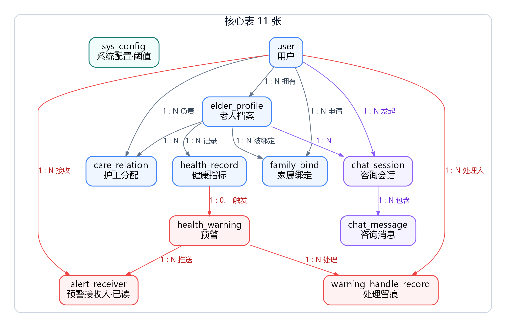


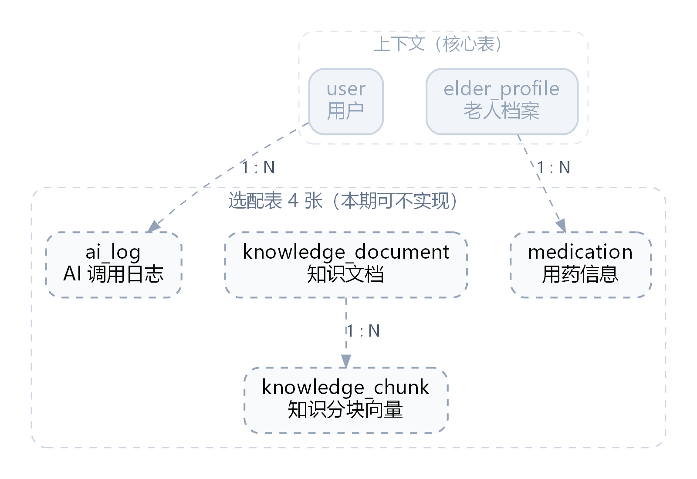


#### 4.2.7 数据字典

逐表数据字典以 Excel 形式单独交付，文件为 `04.编码/数据库/数据字典_康养系统_v1.0.xlsx`，**每张表一个工作表（共 15 个）**，列结构与指导老师下发的样例一致：

| 列 | 含义 |
|---|---|
| 类型 / 大小 | MySQL 字段类型与长度 |
| 名称 | 字段名 |
| 非空 | Y 表示 NOT NULL |
| 默认值 | 建表语句中的默认值 |
| 补充 / 描述 | 字段中文含义与补充说明 |
| 扩展 | 前端表单控件类型 |
| 左 / 右 | 外键关系：左表（子表）字段 ← 右表（父表）字段 |
| List显示 | 是否在列表页展示 |
| 特殊取值描述 | 枚举字段的取值含义 |
| 追加日期 / 追加原因 | 需求追加时的留痕列，本期无追加 |

> 数据字典由 `schema.sql` 解析生成，**与建表脚本同源**，任何字段改动只需改脚本并重新生成，避免文档与代码不一致。

## 5 接口设计

### 5.1 全局变量

#### 5.1.1 状态与枚举常量

本系统的状态取值集中定义在 `app/core/constants.py`（`IntEnum` / `StrEnum`），供接口层、服务层与数据库共用，**不允许在业务代码中散落字面量**。

表 5-1　全局状态与枚举常量

| 枚举 | 取值 | 含义 | 主要使用位置 |
|---|---|---|---|
| 角色 `Role` | `ELDER` / `FAMILY` / `CARE` / `ADMIN` | 老年用户 / 家属 / 护工 / 管理员 | `user.role`、鉴权、数据范围计算 |
| 账号状态 | `1` / `0` | 启用 / 禁用（禁用后 Token 立即失效） | `user.status` |
| 家属绑定状态 `BindStatus` | `PENDING` / `APPROVED` / `REJECTED` / `REVOKED` | 待确认 / 已生效 / 已拒绝 / 已解绑 | `family_bind.status` |
| 护工分配状态 | `1` / `0` | 在管 / 已交接 | `care_relation.status` |
| 指标类型 `IndicatorType` | `BLOOD_PRESSURE` / `BLOOD_SUGAR` / `HEART_RATE` / `SLEEP` / `STEP` | 血压 / 血糖 / 心率 / 睡眠 / 步数 | `health_record.type` |
| 预警处理状态 `WarningStatus` | `PENDING` / `PROCESSING` / `RESOLVED` / `IGNORED` | 待处理 / 处理中 / 已处理 / 已忽略（全局唯一） | `health_warning.status` |
| 接收人已读状态 `ReadStatus` | `UNREAD` / `READ` | 未读 / 已读（每人独立） | `alert_receiver.read_status` |
| AI 摘要状态 `SummaryStatus` | `PENDING` / `SUCCESS` / `FAILED` / `SKIPPED` | 生成中 / 成功 / 失败 / 低级别不生成 | `health_warning.summary_status` |
| 风险等级 `RiskLevel` | `0` / `1` / `2` / `3` | 正常 / 轻度 / 较高 / 高风险 | 预警判定与展示 |
| 咨询意图 `Intent` | `NORMAL` / `DATA` / `ABNORMAL` / `EMERGENCY` | 普通咨询 / 数据类 / 异常 / 紧急 | 咨询请求路由 |
| 执行 Agent `AgentType` | `HEALTH` / `HEALTH_DATA` / `RISK` / `EMERGENCY` | 四类智能体 | 咨询编排与消息留痕 |
| 安全分级 `SafetyLevel` | `L1` / `L2` / `L3` / `L4` | 安全等级，L3 以上必须附带就医引导 | 回答安全兜底 |
| 处理方式 `HandleAction` | `CONTACTED` / `ARRANGED_VISIT` / `SENT_HOSPITAL` / `OBSERVE` | 已联系 / 安排上门 / 送医 / 继续观察 | 预警处理留痕 |
| 触发来源 `TriggerSource` | `DATA_INPUT` / `AI_CHAT` / `MANUAL` | 指标录入触发 / 咨询识别触发 / 人工创建 | `health_warning.trigger_source` |
| 护工端老人状态 `ElderStatus` | `NORMAL` / `WATCH` / `ABNORMAL` | 正常 / 关注 / 异常 | 护工工作台分色标识 |
| 错误码 `ErrorCode` | `0` / `1001`~`1003` / `2001`~`2002` / `3001`~`3002` / `4001`~`4004` / `5001` | 成功 / 鉴权类 / 参数类 / AI 类 / 业务类 / 系统类 | 统一响应 `code`，详见契约 1.4 节 |

> 错误码 `3001`（AI 服务异常）出现时，健康数据录入、预警生成与预警处理等主流程必须仍然可用，前端不得因此阻断用户操作（决策 D-04）。


#### 5.1.2 全局配置项

固定不变的运行参数通过 `.env` 与 `app/core/config.py`（pydantic-settings）管理，**API Key 只存在于后端 `.env`，绝不进入前端代码**。

表 5-2　全局配置项

| 配置项 | 取值 / 默认值 | 说明 |
|---|---|---|
| `LLM_PROVIDER` | `deepseek` / `qwen` / `glm` | 大模型选型开关，**换模型只改此配置，不改代码** |
| `LLM_API_KEY` | 后端 `.env` 注入 | 模型密钥，禁止写入前端与代码仓库 |
| `JWT_SECRET` | 后端 `.env` 注入 | JWT 签名密钥 |
| `JWT_TTL` | 86400（秒） | Token 有效期，与登录响应的 `expires_in` 一致 |
| `DB_URL` | `mysql+pymysql://...` | 数据库连接串 |
| `VECTOR_STORE` | `chroma` / `faiss` | 向量库实现选择 |
| `AI_TIMEOUT_SECONDS` | 8 | 模型调用超时阈值，超时即降级，不阻塞业务主流程 |

#### 5.1.3 配置化声明（重要）

**本系统不存在硬编码的健康阈值。** 预警阈值（各指标的四档区间）与业务参数（家属绑定上限 `family_bind_max`、登录失败限次等）全部存放于 `sys_config` 表，由 M8 后台管理模块维护、M3 指标模块与 M5 预警模块实时读取，前端通过 M9 系统配置模块获取展示用的正常范围。

这样设计的目的是：调整阈值无需改代码、无需重启，保存后即时生效（对应需求 `FR-ADMIN-009` 与 `FR-ADMIN-010`）。

### 5.2 模块间接口函数设计

本节按模块列出**全部 45 个对外接口函数**的详细信息，编号与《API 接口契约 v0.2》一一对应。

按指导老师对接口的两分口径，本系统的接口分三类，本章分别处理：

| 类别 | 定义 | 数量 | 本章位置 |
|---|---|---|---|
| 对外接口 | 面向系统外部（前端与其他端）提供的 HTTP 端点 | 45 | 5.2.1 ~ 5.2.9 |
| 模块间调用接口 | 一个模块在进程内调用另一模块的函数；相对调用方模块而言亦属对外公开 | 8 | 5.2.10 |
| 内部接口 | 模块或类内部使用、不对外暴露的私有方法（Python 以 `_` 前缀命名） | — | 不逐个列出，见各模块类图 |

函数表格式遵循模板要求：**函数名、文件名、功能概要、参数、返回值、详细说明、使用注意事项**；并额外增加「接口性质」一项以体现上述分类。

#### 5.2.1 认证与权限模块（M1 AUTH，4 个函数）

**函数 1／45　`register`**　（POST /api/auth/register）

| 项 | 内容 |
|---|---|
| 函数名 | `register` |
| 文件名 | `app/api/v1/auth.py` |
| 接口性质 | 对外接口（HTTP，供前端调用） |
| 功能概要 | 用户注册 |
| 参数 | 见下表 |
| 返回值 | 类型 `ApiResponse[UserOut]`；data 为新用户基本信息；角色越界返回 4003 |
| 详细说明 | 校验手机号格式与唯一性，密码经 bcrypt 哈希后落库，返回新用户摘要信息。 |
| 使用注意事项 | role 仅接受 ELDER / FAMILY；传入 CARE / ADMIN 直接返回 4003，不做静默降级（D-01）。 |

| 参数类型 | 变量名 | I/O | 说明 |
|---|---|---|---|
| `RegisterIn` | `payload` | IN | 手机号 / 密码 / 姓名 / 角色 |

**函数 2／45　`login`**　（POST /api/auth/login）

| 项 | 内容 |
|---|---|
| 函数名 | `login` |
| 文件名 | `app/api/v1/auth.py` |
| 接口性质 | 对外接口（HTTP，供前端调用） |
| 功能概要 | 用户登录 |
| 参数 | 见下表 |
| 返回值 | 类型 `ApiResponse[LoginOut]`；data 含 token、expires_in 与用户信息 |
| 详细说明 | 按手机号取用户，bcrypt 校验密码，通过后签发 JWT 并更新最近登录时间。 |
| 使用注意事项 | 账号被禁用返回 1003；密码错误累计次数超限由 sys_config 控制并记录。 |

| 参数类型 | 变量名 | I/O | 说明 |
|---|---|---|---|
| `LoginIn` | `payload` | IN | 手机号 + 密码 |
| `UserRepository` | `repo` | IN | 用户查询依赖（注入） |

**函数 3／45　`logout`**　（POST /api/auth/logout）

| 项 | 内容 |
|---|---|
| 函数名 | `logout` |
| 文件名 | `app/api/v1/auth.py` |
| 接口性质 | 对外接口（HTTP，供前端调用） |
| 功能概要 | 退出登录 |
| 参数 | 见下表 |
| 返回值 | 类型 `ApiResponse[None]`；data 为 null，code 0 表示登出成功 |
| 详细说明 | 将当前 token 写入失效列表，后续携带该 token 的请求返回 1001。 |
| 使用注意事项 | 幂等：重复登出仍返回成功，不报错。 |

| 参数类型 | 变量名 | I/O | 说明 |
|---|---|---|---|
| `str` | `token` | IN | 当前请求携带的 token |

**函数 4／45　`get_me`**　（GET /api/auth/me）

| 项 | 内容 |
|---|---|
| 函数名 | `get_me` |
| 文件名 | `app/api/v1/auth.py` |
| 接口性质 | 对外接口（HTTP）；同时供 T2 鉴权依赖在每次请求中复用 |
| 功能概要 | 获取当前用户信息 |
| 参数 | 见下表 |
| 返回值 | 类型 `ApiResponse[UserOut]`；data 为当前用户基本信息与角色 |
| 详细说明 | 从 token 解析出的用户上下文中读取资料，供前端刷新页面时恢复登录态。 |
| 使用注意事项 | 前端不得据此自行判断角色含义，跳转目标页以后端返回的 role 为准。 |

| 参数类型 | 变量名 | I/O | 说明 |
|---|---|---|---|
| `CurrentUser` | `user` | IN | 由鉴权依赖注入的当前登录用户 |

#### 5.2.2 健康档案模块（M2 PROFILE，5 个函数）

**函数 5／45　`list_profiles`**　（GET /api/profiles）

| 项 | 内容 |
|---|---|
| 函数名 | `list_profiles` |
| 文件名 | `app/api/v1/profiles.py` |
| 接口性质 | 对外接口（HTTP）；其可见范围计算被 M3 / M5 / M7 复用 |
| 功能概要 | 档案列表（按角色隔离） |
| 参数 | 见下表 |
| 返回值 | 类型 `ApiResponse[list[ProfileOut]]`；当前用户有权查看的档案集合 |
| 详细说明 | 由 ScopeResolver 计算可见集合：老人本人 / 家属已绑定 / 护工负责 / 管理员全部。 |
| 使用注意事项 | 数据隔离在后端强制实现，前端不传过滤参数，传了也不生效（P5 原则）。 |

| 参数类型 | 变量名 | I/O | 说明 |
|---|---|---|---|
| `CurrentUser` | `user` | IN | 当前登录用户，决定可见范围 |

**函数 6／45　`create_profile`**　（POST /api/profiles）

| 项 | 内容 |
|---|---|
| 函数名 | `create_profile` |
| 文件名 | `app/api/v1/profiles.py` |
| 接口性质 | 对外接口（HTTP，供前端调用） |
| 功能概要 | 创建档案 |
| 参数 | 见下表 |
| 返回值 | 类型 `ApiResponse[ProfileOut]`；新建档案的完整信息 |
| 详细说明 | 校验必填项与取值范围，慢病标签序列化为 JSON 数组存储，档案归属当前用户。 |
| 使用注意事项 | 一位账号可建多份档案（本人 / 代管老人），供后续多档案切换。 |

| 参数类型 | 变量名 | I/O | 说明 |
|---|---|---|---|
| `ProfileIn` | `payload` | IN | 姓名 / 性别 / 出生日期 / 身高体重 / 病史 / 慢病标签 |
| `CurrentUser` | `user` | IN | 档案归属账号 |

**函数 7／45　`get_profile`**　（GET /api/profiles/{id}）

| 项 | 内容 |
|---|---|
| 函数名 | `get_profile` |
| 文件名 | `app/api/v1/profiles.py` |
| 接口性质 | 对外接口（HTTP，供前端调用） |
| 功能概要 | 档案详情 |
| 参数 | 见下表 |
| 返回值 | 类型 `ApiResponse[ProfileOut]`；档案完整字段 |
| 详细说明 | 按 ID 读取档案，先做可见性校验再返回，已软删除的档案返回 2002。 |
| 使用注意事项 | 越权访问他人档案返回 1002，不得泄露记录是否存在之外的信息。 |

| 参数类型 | 变量名 | I/O | 说明 |
|---|---|---|---|
| `int` | `profile_id` | IN | 档案 ID（路径参数） |

**函数 8／45　`update_profile`**　（PUT /api/profiles/{id}）

| 项 | 内容 |
|---|---|
| 函数名 | `update_profile` |
| 文件名 | `app/api/v1/profiles.py` |
| 接口性质 | 对外接口（HTTP，供前端调用） |
| 功能概要 | 更新档案 |
| 参数 | 见下表 |
| 返回值 | 类型 `ApiResponse[ProfileOut]`；更新后的档案信息 |
| 详细说明 | 先校验可见性与可写权限，再按字段更新并刷新更新时间。 |
| 使用注意事项 | 慢病标签整体覆盖式更新，前端需提交完整标签数组。 |

| 参数类型 | 变量名 | I/O | 说明 |
|---|---|---|---|
| `int` | `profile_id` | IN | 档案 ID |
| `ProfileUpdate` | `payload` | IN | 同创建的字段集合，允许部分更新 |

**函数 9／45　`delete_profile`**　（DELETE /api/profiles/{id}）

| 项 | 内容 |
|---|---|
| 函数名 | `delete_profile` |
| 文件名 | `app/api/v1/profiles.py` |
| 接口性质 | 对外接口（HTTP，供前端调用） |
| 功能概要 | 删除档案（软删除） |
| 参数 | 见下表 |
| 返回值 | 类型 `ApiResponse[None]`；code 0 表示删除成功 |
| 详细说明 | 将 deleted 置 1 而非物理删除，关联指标与预警记录保留以便追溯。 |
| 使用注意事项 | 前端须二次确认；软删除后档案不出现在任何列表与统计中。 |

| 参数类型 | 变量名 | I/O | 说明 |
|---|---|---|---|
| `int` | `profile_id` | IN | 档案 ID |

#### 5.2.3 健康指标模块（M3 HEALTH，4 个函数）

**函数 10／45　`create_record`**　（POST /api/health/records）

| 项 | 内容 |
|---|---|
| 函数名 | `create_record` |
| 文件名 | `app/api/v1/health.py` |
| 接口性质 | 对外接口（HTTP）；内部同步触发 M5 生成预警 |
| 功能概要 | 录入健康指标并同步检测异常 |
| 参数 | 见下表 |
| 返回值 | 类型 `ApiResponse[RecordOut]`；data 含 record_id、is_abnormal、risk_level、warning_id |
| 详细说明 | 校验类型与取值范围后落库，随即同步调用阈值检测；命中异常时联动 M5 生成预警并返回 warning_id。 |
| 使用注意事项 | 五类指标的 values 结构不同（血压需 systolic / diastolic），由 Pydantic 判别联合类型校验。 |

| 参数类型 | 变量名 | I/O | 说明 |
|---|---|---|---|
| `RecordIn` | `payload` | IN | 档案 ID / 指标类型 / 数值 / 测量时间 / 备注 |
| `CurrentUser` | `user` | IN | 录入人（本人 / 家属代录 / 护工） |

**函数 11／45　`list_records`**　（GET /api/health/records）

| 项 | 内容 |
|---|---|
| 函数名 | `list_records` |
| 文件名 | `app/api/v1/health.py` |
| 接口性质 | 对外接口（HTTP，供前端调用） |
| 功能概要 | 指标历史列表 |
| 参数 | 见下表 |
| 返回值 | 类型 `ApiResponse[PageResult[RecordOut]]`；list / total / page / page_size |
| 详细说明 | 按档案与类型过滤，按测量时间倒序分页返回。 |
| 使用注意事项 | 查询前先做档案可见性校验，避免越权读取他人指标。 |

| 参数类型 | 变量名 | I/O | 说明 |
|---|---|---|---|
| `int` | `profile_id` | IN | 档案 ID |
| `str` | `type` | IN | 指标类型，可空表示全部 |
| `int` | `page / page_size` | IN | 分页参数，默认 1 / 20 |

**函数 12／45　`delete_record`**　（DELETE /api/health/records/{id}）

| 项 | 内容 |
|---|---|
| 函数名 | `delete_record` |
| 文件名 | `app/api/v1/health.py` |
| 接口性质 | 对外接口（HTTP，供前端调用） |
| 功能概要 | 删除指标记录 |
| 参数 | 见下表 |
| 返回值 | 类型 `ApiResponse[None]`；code 0 表示删除成功 |
| 详细说明 | 物理删除该条指标记录；已由该记录触发的预警不被删除，保留历史。 |
| 使用注意事项 | 仅录入人、档案归属人或管理员可删除，其余返回 1002。 |

| 参数类型 | 变量名 | I/O | 说明 |
|---|---|---|---|
| `int` | `record_id` | IN | 记录 ID |

**函数 13／45　`get_trend`**　（GET /api/health/trend）

| 项 | 内容 |
|---|---|
| 函数名 | `get_trend` |
| 文件名 | `app/api/v1/health.py` |
| 接口性质 | 对外接口（HTTP，供前端调用） |
| 功能概要 | 指标趋势数据（供 ECharts） |
| 参数 | 见下表 |
| 返回值 | 类型 `ApiResponse[TrendOut]`；dates / series / normal_range / abnormal_points |
| 详细说明 | 按天聚合指标值，normal_range 取自 sys_config，abnormal_points 标注超阈值点及等级。 |
| 使用注意事项 | 正常范围必须由后端下发，前端禁止写死（铁律 2）。 |

| 参数类型 | 变量名 | I/O | 说明 |
|---|---|---|---|
| `int` | `profile_id` | IN | 档案 ID |
| `str` | `type` | IN | 指标类型 |
| `int` | `days` | IN | 统计天数，默认 30 |

#### 5.2.4 AI 健康咨询与智能体编排模块（M4 AI · Agent，4 个函数）

**函数 14／45　`chat`**　（POST /api/ai/chat）

| 项 | 内容 |
|---|---|
| 函数名 | `chat` |
| 文件名 | `app/api/v1/ai.py` |
| 接口性质 | 对外接口（HTTP，供前端调用） |
| 功能概要 | 发起健康咨询（多 Agent 编排） |
| 参数 | 见下表 |
| 返回值 | 类型 `ApiResponse[ChatOut]`；answer / intent / agent / safety_level / sources / warning_id / disclaimer |
| 详细说明 | 会话不存在则新建；组装档案摘要与近 7 天指标 → 意图识别 → 选择 Agent 执行 → RAG 检索注入 → 调模型生成 → 落库并返回，异常意图联动生成预警。 |
| 使用注意事项 | 模型不可用返回 3001 但不得阻断录入与预警主流程（D-04）；单次限字数、按用户限频，超限返回 3002。 |

| 参数类型 | 变量名 | I/O | 说明 |
|---|---|---|---|
| `ChatIn` | `payload` | IN | 档案 ID / 问题 / session_id（可空） |
| `CurrentUser` | `user` | IN | 提问人（老人本人或家属代问） |

**函数 15／45　`list_sessions`**　（GET /api/ai/sessions）

| 项 | 内容 |
|---|---|
| 函数名 | `list_sessions` |
| 文件名 | `app/api/v1/ai.py` |
| 接口性质 | 对外接口（HTTP，供前端调用） |
| 功能概要 | 会话列表 |
| 参数 | 见下表 |
| 返回值 | 类型 `ApiResponse[list[SessionOut]]`；会话 ID、标题与最后消息时间 |
| 详细说明 | 按档案与当前用户过滤会话，按更新时间倒序返回。 |
| 使用注意事项 | 家属仅可见自己发起的会话，不可见老人与其他家属的咨询记录。 |

| 参数类型 | 变量名 | I/O | 说明 |
|---|---|---|---|
| `int` | `profile_id` | IN | 档案 ID，可空表示本人全部会话 |

**函数 16／45　`list_messages`**　（GET /api/ai/sessions/{id}/messages）

| 项 | 内容 |
|---|---|
| 函数名 | `list_messages` |
| 文件名 | `app/api/v1/ai.py` |
| 接口性质 | 对外接口（HTTP，供前端调用） |
| 功能概要 | 会话内消息列表 |
| 参数 | 见下表 |
| 返回值 | 类型 `ApiResponse[list[MessageOut]]`；消息内容及 intent / agent / sources 等元信息 |
| 详细说明 | 按时间正序返回会话内全部问答，供前端恢复上下文展示。 |
| 使用注意事项 | 前端需展示 intent 与 agent 字段，这是多 Agent 编排的直观体现。 |

| 参数类型 | 变量名 | I/O | 说明 |
|---|---|---|---|
| `int` | `session_id` | IN | 会话 ID |

**函数 17／45　`delete_session`**　（DELETE /api/ai/sessions/{id}）

| 项 | 内容 |
|---|---|
| 函数名 | `delete_session` |
| 文件名 | `app/api/v1/ai.py` |
| 接口性质 | 对外接口（HTTP，供前端调用） |
| 功能概要 | 删除会话 |
| 参数 | 见下表 |
| 返回值 | 类型 `ApiResponse[None]`；code 0 表示删除成功 |
| 详细说明 | 级联删除会话下的消息记录，已触发的预警不受影响。 |
| 使用注意事项 | 仅会话发起人可删除，管理员不可代删。 |

| 参数类型 | 变量名 | I/O | 说明 |
|---|---|---|---|
| `int` | `session_id` | IN | 会话 ID |

#### 5.2.5 主动预警模块（M5 ALERT，8 个函数）

**函数 18／45　`list_alerts`**　（GET /api/alerts）

| 项 | 内容 |
|---|---|
| 函数名 | `list_alerts` |
| 文件名 | `app/api/v1/alerts.py` |
| 接口性质 | 对外接口（HTTP，供前端调用） |
| 功能概要 | 预警列表（含每人已读状态） |
| 参数 | 见下表 |
| 返回值 | 类型 `ApiResponse[PageResult[AlertOut]]`；含 ai_summary、summary_status、my_read_status、trigger_source |
| 详细说明 | 按当前用户可见范围查询预警，外联 alert_receiver 取当前用户已读状态，统计口径与详情一致。 |
| 使用注意事项 | ai_summary 可为 null，前端须显示“摘要生成中 / 失败可查看原始数据”，不得隐藏整条预警（D-04）。 |

| 参数类型 | 变量名 | I/O | 说明 |
|---|---|---|---|
| `str` | `status / level` | IN | 处理状态与风险等级筛选，均可空 |
| `int` | `page / page_size` | IN | 分页参数 |

**函数 19／45　`get_alert`**　（GET /api/alerts/{id}）

| 项 | 内容 |
|---|---|
| 函数名 | `get_alert` |
| 文件名 | `app/api/v1/alerts.py` |
| 接口性质 | 对外接口（HTTP）；M7 护工端详情复用同一查询 |
| 功能概要 | 预警详情 |
| 参数 | 见下表 |
| 返回值 | 类型 `ApiResponse[AlertDetailOut]`；列表字段 + history_trend + handles |
| 详细说明 | 返回指标值、阈值、近 7 天趋势与全部处理记录；访问详情时把当前用户的接收记录置为已读。 |
| 使用注意事项 | 置已读只影响当前用户那条 alert_receiver，不得改动他人状态（D-05）。 |

| 参数类型 | 变量名 | I/O | 说明 |
|---|---|---|---|
| `int` | `warning_id` | IN | 预警 ID |

**函数 20／45　`handle_alert`**　（POST /api/alerts/{id}/handle）

| 项 | 内容 |
|---|---|
| 函数名 | `handle_alert` |
| 文件名 | `app/api/v1/alerts.py` |
| 接口性质 | 对外接口（HTTP）；M7 护工端复用，保证处理闭环口径唯一 |
| 功能概要 | 提交处理结果（闭环） |
| 参数 | 见下表 |
| 返回值 | 类型 `ApiResponse[AlertOut]`；更新后的预警信息 |
| 详细说明 | 写入 warning_handle_record（处理人 / 方式 / 说明 / 时间），并将处理状态置为 RESOLVED。 |
| 使用注意事项 | 处理后其余接收人界面显示“已由 XXX 于 XX 时间处理”；已处理不等于已读（D-05）。 |

| 参数类型 | 变量名 | I/O | 说明 |
|---|---|---|---|
| `int` | `warning_id` | IN | 预警 ID |
| `HandleIn` | `payload` | IN | 处理方式 action + 说明 result |

**函数 21／45　`update_alert_status`**　（PUT /api/alerts/{id}/status）

| 项 | 内容 |
|---|---|
| 函数名 | `update_alert_status` |
| 文件名 | `app/api/v1/alerts.py` |
| 接口性质 | 对外接口（HTTP，供前端调用） |
| 功能概要 | 更新中间态（处理中 / 已忽略） |
| 参数 | 见下表 |
| 返回值 | 类型 `ApiResponse[AlertOut]`；更新后的预警信息 |
| 详细说明 | 用于护工已接单但尚未完成的中间态流转，仅允许在合法状态之间迁移。 |
| 使用注意事项 | 不允许把 RESOLVED 回退为 PROCESSING；非法迁移返回 2001。 |

| 参数类型 | 变量名 | I/O | 说明 |
|---|---|---|---|
| `int` | `warning_id` | IN | 预警 ID |
| `StatusIn` | `payload` | IN | status，取值 PROCESSING 或 IGNORED |

**函数 22／45　`mark_alert_read`**　（POST /api/alerts/{id}/read）

| 项 | 内容 |
|---|---|
| 函数名 | `mark_alert_read` |
| 文件名 | `app/api/v1/alerts.py` |
| 接口性质 | 对外接口（HTTP，供前端调用） |
| 功能概要 | 标记已读（仅当前用户） |
| 参数 | 见下表 |
| 返回值 | 类型 `ApiResponse[None]`；code 0 表示标记成功 |
| 详细说明 | 仅更新当前用户在 alert_receiver 中的 read_status 与阅读时间。 |
| 使用注意事项 | 不影响其他接收人，也不改变预警的处理状态；重复调用幂等。 |

| 参数类型 | 变量名 | I/O | 说明 |
|---|---|---|---|
| `int` | `warning_id` | IN | 预警 ID |
| `CurrentUser` | `user` | IN | 当前登录用户 |

**函数 23／45　`retry_summary`**　（POST /api/alerts/{id}/summary/retry）

| 项 | 内容 |
|---|---|
| 函数名 | `retry_summary` |
| 文件名 | `app/api/v1/alerts.py` |
| 接口性质 | 对外接口（HTTP，供前端调用） |
| 功能概要 | AI 摘要重试（D-04） |
| 参数 | 见下表 |
| 返回值 | 类型 `ApiResponse[AlertOut]`；重试后的摘要与 summary_status |
| 详细说明 | 仅在 summary_status 为 FAILED 时允许手动触发，重新异步生成个性化摘要。 |
| 使用注意事项 | 模型仍不可用返回 3001，预警本身保持可见可用，不影响主流程。 |

| 参数类型 | 变量名 | I/O | 说明 |
|---|---|---|---|
| `int` | `warning_id` | IN | 预警 ID |

**函数 24／45　`alert_statistics`**　（GET /api/alerts/statistics）

| 项 | 内容 |
|---|---|
| 函数名 | `alert_statistics` |
| 文件名 | `app/api/v1/alerts.py` |
| 接口性质 | 对外接口（HTTP，供前端调用） |
| 功能概要 | 预警统计 |
| 参数 | 见下表 |
| 返回值 | 类型 `ApiResponse[AlertStatsOut]`；pending / high_risk / today_new / handled / unread |
| 详细说明 | 聚合待处理、高风险、今日新增、已处理与未读五项指标。 |
| 使用注意事项 | pending 为全局未处理条数，unread 为当前用户未读条数，两者口径不同（D-05）。 |

| 参数类型 | 变量名 | I/O | 说明 |
|---|---|---|---|
| `CurrentUser` | `user` | IN | 当前用户，决定 unread 口径 |

**函数 25／45　`unread_count`**　（GET /api/notifications/unread）

| 项 | 内容 |
|---|---|
| 函数名 | `unread_count` |
| 文件名 | `app/api/v1/notifications.py` |
| 接口性质 | 对外接口（HTTP，供前端调用） |
| 功能概要 | 通知未读数（前端红点） |
| 参数 | 见下表 |
| 返回值 | 类型 `ApiResponse[UnreadOut]`；unread 未读条数与 latest_level 最高等级 |
| 详细说明 | 读取当前用户未读接收记录数量与其中最高风险等级，数据量极小。 |
| 使用注意事项 | 前端以 30 秒周期轮询；本期通知范围仅站内，无短信与电话外呼（D-03）。 |

| 参数类型 | 变量名 | I/O | 说明 |
|---|---|---|---|
| `CurrentUser` | `user` | IN | 当前登录用户 |

#### 5.2.6 家属绑定模块（M6 FAMILY，5 个函数）

**函数 26／45　`create_bind`**　（POST /api/family/bind）

| 项 | 内容 |
|---|---|
| 函数名 | `create_bind` |
| 文件名 | `app/api/v1/family.py` |
| 接口性质 | 对外接口（HTTP，供前端调用） |
| 功能概要 | 提交绑定申请 |
| 参数 | 见下表 |
| 返回值 | 类型 `ApiResponse[BindOut]`；申请单信息，status 为 PENDING |
| 详细说明 | 按手机号定位老人档案，校验是否存在、是否重复申请、是否超出绑定上限，通过后写入 PENDING 申请单。 |
| 使用注意事项 | 老人不存在返回 2002；重复申请返回 4001；超出上限（sys_config 的 family_bind_max，默认 5）返回 4002。 |

| 参数类型 | 变量名 | I/O | 说明 |
|---|---|---|---|
| `BindIn` | `payload` | IN | 老人手机号 / 亲属关系 / 申请备注 |
| `CurrentUser` | `user` | IN | 申请人家属账号 |

**函数 27／45　`list_bind_requests`**　（GET /api/family/bind-requests）

| 项 | 内容 |
|---|---|
| 函数名 | `list_bind_requests` |
| 文件名 | `app/api/v1/family.py` |
| 接口性质 | 对外接口（HTTP，供前端调用） |
| 功能概要 | 待我确认的绑定申请 |
| 参数 | 见下表 |
| 返回值 | 类型 `ApiResponse[list[BindRequestOut]]`；待确认申请列表，含申请人姓名与关系 |
| 详细说明 | 返回指向当前用户名下档案的 PENDING 申请，供老人或管理员确认。 |
| 使用注意事项 | 申请单中的老人手机号需脱敏展示（138****8000）。 |

| 参数类型 | 变量名 | I/O | 说明 |
|---|---|---|---|
| `CurrentUser` | `user` | IN | 老人本人或管理员 |

**函数 28／45　`confirm_bind`**　（PUT /api/family/bind/{id}/confirm）

| 项 | 内容 |
|---|---|
| 函数名 | `confirm_bind` |
| 文件名 | `app/api/v1/family.py` |
| 接口性质 | 对外接口（HTTP，供前端调用） |
| 功能概要 | 确认或拒绝绑定申请 |
| 参数 | 见下表 |
| 返回值 | 类型 `ApiResponse[BindOut]`；更新后的绑定记录 |
| 详细说明 | 确认置 APPROVED 并写确认时间；拒绝置 REJECTED。代确认时记录操作人与代确认原因。 |
| 使用注意事项 | 确认后家属才获得数据访问权限，PENDING 期间无任何权限（D-02）。 |

| 参数类型 | 变量名 | I/O | 说明 |
|---|---|---|---|
| `int` | `bind_id` | IN | 申请单 ID |
| `ConfirmIn` | `payload` | IN | action（APPROVE / REJECT）+ note |

**函数 29／45　`list_bound_elders`**　（GET /api/family/elders）

| 项 | 内容 |
|---|---|
| 函数名 | `list_bound_elders` |
| 文件名 | `app/api/v1/family.py` |
| 接口性质 | 对外接口（HTTP，供前端调用） |
| 功能概要 | 已生效的代管老人列表 |
| 参数 | 见下表 |
| 返回值 | 类型 `ApiResponse[list[ElderBriefOut]]`；APPROVED 状态的代管老人摘要 |
| 详细说明 | 返回该家属绑定生效的老人，供前端档案切换器使用。 |
| 使用注意事项 | 仅 APPROVED 状态可见；REVOKED 后该老人立即从列表消失。 |

| 参数类型 | 变量名 | I/O | 说明 |
|---|---|---|---|
| `CurrentUser` | `user` | IN | 家属账号 |

**函数 30／45　`unbind`**　（DELETE /api/family/bind/{id}）

| 项 | 内容 |
|---|---|
| 函数名 | `unbind` |
| 文件名 | `app/api/v1/family.py` |
| 接口性质 | 对外接口（HTTP，供前端调用） |
| 功能概要 | 解绑 |
| 参数 | 见下表 |
| 返回值 | 类型 `ApiResponse[None]`；code 0 表示解绑成功 |
| 详细说明 | 状态置为 REVOKED 而非物理删除，数据访问权限即时收回。 |
| 使用注意事项 | 任一方发起即时生效；历史处理记录保留用于追溯（FR-FAMILY-003）。 |

| 参数类型 | 变量名 | I/O | 说明 |
|---|---|---|---|
| `int` | `bind_id` | IN | 绑定记录 ID |
| `CurrentUser` | `user` | IN | 发起方（家属或老人） |

#### 5.2.7 护工端模块（M7 CARE，3 个函数）

**函数 31／45　`list_care_elders`**　（GET /api/care/elders）

| 项 | 内容 |
|---|---|
| 函数名 | `list_care_elders` |
| 文件名 | `app/api/v1/care.py` |
| 接口性质 | 对外接口（HTTP，供前端调用） |
| 功能概要 | 负责老人列表（异常优先） |
| 参数 | 见下表 |
| 返回值 | 类型 `ApiResponse[list[CareElderOut]]`；含最新血压、血糖、睡眠与待处理预警数 |
| 详细说明 | 按 care_relation 取在管老人，聚合最近指标与待处理预警数，异常者置顶排序。 |
| 使用注意事项 | 护工仅可见分配给自己的老人，隔离在后端强制实现（P5 原则）。 |

| 参数类型 | 变量名 | I/O | 说明 |
|---|---|---|---|
| `str` | `status` | IN | 状态筛选：NORMAL / WATCH / ABNORMAL，可空 |
| `CurrentUser` | `user` | IN | 护工账号 |

**函数 32／45　`get_care_elder`**　（GET /api/care/elders/{profile_id}）

| 项 | 内容 |
|---|---|
| 函数名 | `get_care_elder` |
| 文件名 | `app/api/v1/care.py` |
| 接口性质 | 对外接口（HTTP，供前端调用） |
| 功能概要 | 老人详情（档案 + 指标 + 预警） |
| 参数 | 见下表 |
| 返回值 | 类型 `ApiResponse[CareElderDetailOut]`；档案、最近指标列表与预警列表 |
| 详细说明 | 三合一视图组装，一次请求满足护工照护场景，减少前端串行请求。 |
| 使用注意事项 | 非本人负责的老人返回 1002，不得以“不存在”掩盖越权。 |

| 参数类型 | 变量名 | I/O | 说明 |
|---|---|---|---|
| `int` | `profile_id` | IN | 老人档案 ID |

**函数 33／45　`list_handles`**　（GET /api/care/handles）

| 项 | 内容 |
|---|---|
| 函数名 | `list_handles` |
| 文件名 | `app/api/v1/care.py` |
| 接口性质 | 对外接口（HTTP，供前端调用） |
| 功能概要 | 本人处理记录 |
| 参数 | 见下表 |
| 返回值 | 类型 `ApiResponse[PageResult[HandleRecordOut]]`；历史上报的处理记录 |
| 详细说明 | 按处理人过滤 warning_handle_record，按时间倒序返回，供交接与追溯。 |
| 使用注意事项 | 只返回本人处理记录，管理员查全部请走后台管理模块。 |

| 参数类型 | 变量名 | I/O | 说明 |
|---|---|---|---|
| `CurrentUser` | `user` | IN | 护工账号 |
| `int` | `page / page_size` | IN | 分页参数 |

#### 5.2.8 后台管理模块（M8 ADMIN，10 个函数）

**函数 34／45　`list_users`**　（GET /api/admin/users）

| 项 | 内容 |
|---|---|
| 函数名 | `list_users` |
| 文件名 | `app/api/v1/admin.py` |
| 接口性质 | 对外接口（HTTP，供前端调用） |
| 功能概要 | 用户列表 |
| 参数 | 见下表 |
| 返回值 | 类型 `ApiResponse[PageResult[UserOut]]`；用户列表，密码字段不回显 |
| 详细说明 | 按角色与姓名 / 手机号关键字查询用户。 |
| 使用注意事项 | 仅 ADMIN 可访问，其余角色返回 1002。 |

| 参数类型 | 变量名 | I/O | 说明 |
|---|---|---|---|
| `str` | `role / keyword` | IN | 角色与关键字筛选，均可空 |
| `int` | `page / page_size` | IN | 分页参数 |

**函数 35／45　`create_user`**　（POST /api/admin/users）

| 项 | 内容 |
|---|---|
| 函数名 | `create_user` |
| 文件名 | `app/api/v1/admin.py` |
| 接口性质 | 对外接口（HTTP，供前端调用） |
| 功能概要 | 创建护工 / 管理员账号（D-01） |
| 参数 | 见下表 |
| 返回值 | 类型 `ApiResponse[UserOut]`；新建账号基本信息 |
| 详细说明 | 校验手机号唯一与角色合法性，密码 bcrypt 哈希后落库，不回显密码。 |
| 使用注意事项 | role 仅允许 CARE 或 ADMIN；传 ELDER / FAMILY 返回 2001（这两类走公开注册）。 |

| 参数类型 | 变量名 | I/O | 说明 |
|---|---|---|---|
| `AdminUserIn` | `payload` | IN | 手机号 / 初始密码 / 姓名 / 角色 |

**函数 36／45　`set_user_status`**　（PUT /api/admin/users/{id}/status）

| 项 | 内容 |
|---|---|
| 函数名 | `set_user_status` |
| 文件名 | `app/api/v1/admin.py` |
| 接口性质 | 对外接口（HTTP，供前端调用） |
| 功能概要 | 禁用 / 启用用户 |
| 参数 | 见下表 |
| 返回值 | 类型 `ApiResponse[UserOut]`；更新后的用户信息 |
| 详细说明 | 更新 status 字段；禁用后该用户已签发的 token 立即失效。 |
| 使用注意事项 | 不允许禁用自己，避免管理员自锁；不允许禁用最后一个管理员。 |

| 参数类型 | 变量名 | I/O | 说明 |
|---|---|---|---|
| `int` | `user_id` | IN | 用户 ID |
| `StatusIn` | `payload` | IN | enabled 布尔值 |

**函数 37／45　`list_thresholds`**　（GET /api/admin/thresholds）

| 项 | 内容 |
|---|---|
| 函数名 | `list_thresholds` |
| 文件名 | `app/api/v1/admin.py` |
| 接口性质 | 对外接口（HTTP，供前端调用） |
| 功能概要 | 阈值配置列表 |
| 参数 | 见下表 |
| 返回值 | 类型 `ApiResponse[list[ThresholdOut]]`；各指标四档阈值区间与启用状态 |
| 详细说明 | 读取 sys_config 中 group_name 为 threshold 的配置，转为结构化阈值对象。 |
| 使用注意事项 | 阈值存储在 sys_config，禁止在代码中写死（铁律 2）。 |

| 参数类型 | 变量名 | I/O | 说明 |
|---|---|---|---|
| `str` | `indicator` | IN | 指标标识筛选，可空 |

**函数 38／45　`update_threshold`**　（PUT /api/admin/thresholds/{id}）

| 项 | 内容 |
|---|---|
| 函数名 | `update_threshold` |
| 文件名 | `app/api/v1/admin.py` |
| 接口性质 | 对外接口（HTTP）；写后即时失效 M3 / M5 共用的阈值缓存 |
| 功能概要 | 更新阈值（即时生效） |
| 参数 | 见下表 |
| 返回值 | 类型 `ApiResponse[ThresholdOut]`；更新后的阈值配置 |
| 详细说明 | 写库后立即失效进程内阈值缓存，下一次指标录入与预警判定即采用新阈值。 |
| 使用注意事项 | 需校验区间不重叠且连续覆盖，避免出现判定空档（FR-ADMIN-009）。 |

| 参数类型 | 变量名 | I/O | 说明 |
|---|---|---|---|
| `int` | `config_id` | IN | 配置 ID |
| `ThresholdIn` | `payload` | IN | 四档区间与启用状态 |

**函数 39／45　`list_indicators`**　（GET /api/admin/indicators）

| 项 | 内容 |
|---|---|
| 函数名 | `list_indicators` |
| 文件名 | `app/api/v1/admin.py` |
| 接口性质 | 对外接口（HTTP，供前端调用） |
| 功能概要 | 健康指标配置 |
| 参数 | 见下表 |
| 返回值 | 类型 `ApiResponse[list[IndicatorOut]]`；指标类型、单位与取值范围 |
| 详细说明 | 返回可录入指标的类型定义，供管理端维护与前端表单渲染。 |
| 使用注意事项 | 指标类型为受控枚举，前端不得自行扩展取值。 |

| 参数类型 | 变量名 | I/O | 说明 |
|---|---|---|---|
| `CurrentUser` | `user` | IN | 管理员账号 |

**函数 40／45　`list_knowledge`**　（GET /api/admin/knowledge）

| 项 | 内容 |
|---|---|
| 函数名 | `list_knowledge` |
| 文件名 | `app/api/v1/admin.py` |
| 接口性质 | 对外接口（HTTP，供前端调用） |
| 功能概要 | 知识库条目列表 |
| 参数 | 见下表 |
| 返回值 | 类型 `ApiResponse[PageResult[KnowledgeOut]]`；知识条目列表 |
| 详细说明 | 分页查询知识文档，支持按分类（高血压 / 糖尿病 / 睡眠等）过滤。 |
| 使用注意事项 | 知识内容增删改仅管理员可操作，其他角色只读（FR-KB-006）。 |

| 参数类型 | 变量名 | I/O | 说明 |
|---|---|---|---|
| `str` | `category / keyword` | IN | 分类与关键字筛选，均可空 |

**函数 41／45　`create_knowledge`**　（POST /api/admin/knowledge）

| 项 | 内容 |
|---|---|
| 函数名 | `create_knowledge` |
| 文件名 | `app/api/v1/admin.py` |
| 接口性质 | 对外接口（HTTP，供前端调用） |
| 功能概要 | 新增知识条目 |
| 参数 | 见下表 |
| 返回值 | 类型 `ApiResponse[KnowledgeOut]`；新建知识条目 |
| 详细说明 | 写入知识文档并触发向量化重建，供 RAG 检索使用。 |
| 使用注意事项 | 索引重建异步执行，失败不影响条目本身可查询。 |

| 参数类型 | 变量名 | I/O | 说明 |
|---|---|---|---|
| `KnowledgeIn` | `payload` | IN | 标题 / 分类 / 正文 |

**函数 42／45　`upload_knowledge`**　（POST /api/admin/knowledge/upload）

| 项 | 内容 |
|---|---|
| 函数名 | `upload_knowledge` |
| 文件名 | `app/api/v1/admin.py` |
| 接口性质 | 对外接口（HTTP，供前端调用） |
| 功能概要 | 上传文档自动解析建索引【选配·本期不实现】 |
| 参数 | 见下表 |
| 返回值 | 类型 `ApiResponse[KnowledgeOut]`；解析结果摘要（本期不实现，接口占位） |
| 详细说明 | 上传文档后自动解析、切分、向量化并写入索引；本期仅保留接口定义与文档说明。 |
| 使用注意事项 | 【选配】功能，本期不实现（FR-KB-005 / E-03），评审时按“声明不做”口径说明。 |

| 参数类型 | 变量名 | I/O | 说明 |
|---|---|---|---|
| `UploadFile` | `file` | IN | 健康资料文档（PDF / Word / 文本） |

**函数 43／45　`get_statistics`**　（GET /api/admin/statistics）

| 项 | 内容 |
|---|---|
| 函数名 | `get_statistics` |
| 文件名 | `app/api/v1/admin.py` |
| 接口性质 | 对外接口（HTTP，供前端调用） |
| 功能概要 | 统计概览 |
| 参数 | 见下表 |
| 返回值 | 类型 `ApiResponse[StatisticsOut]`；用户数、咨询数、预警数等聚合指标 |
| 详细说明 | 按周期聚合用户、咨询与预警三类指标，口径与各模块明细一致。 |
| 使用注意事项 | 报表数据须与明细口径一致（FR-REPORT-006），差异需在文档中说明过滤条件。 |

| 参数类型 | 变量名 | I/O | 说明 |
|---|---|---|---|
| `str` | `range` | IN | 统计周期：7d / 30d / all |
| `CurrentUser` | `user` | IN | 管理员账号 |

#### 5.2.9 系统配置模块（M9 CONFIG，2 个函数）

**函数 44／45　`list_config_indicators`**　（GET /api/config/indicators）

| 项 | 内容 |
|---|---|
| 函数名 | `list_config_indicators` |
| 文件名 | `app/api/v1/config.py` |
| 接口性质 | 对外接口（HTTP，供前端调用） |
| 功能概要 | 可录入指标类型下发 |
| 参数 | 见下表 |
| 返回值 | 类型 `ApiResponse[list[IndicatorOut]]`；指标类型、单位与取值范围 |
| 详细说明 | 从 sys_config 读取启用的指标定义，供前端录入表单动态渲染。 |
| 使用注意事项 | 前端表单选项一律来自本接口，不得写死指标列表。 |

| 参数类型 | 变量名 | I/O | 说明 |
|---|---|---|---|
| `CurrentUser` | `user` | IN | 登录用户 |

**函数 45／45　`list_effective_thresholds`**　（GET /api/config/thresholds）

| 项 | 内容 |
|---|---|
| 函数名 | `list_effective_thresholds` |
| 文件名 | `app/api/v1/config.py` |
| 接口性质 | 对外接口（HTTP）；后端 M3 / M5 读同一份阈值缓存 |
| 功能概要 | 当前生效阈值下发 |
| 参数 | 见下表 |
| 返回值 | 类型 `ApiResponse[list[ThresholdOut]]`；四档阈值区间，供前端展示正常范围 |
| 详细说明 | 读取阈值缓存或数据库，返回当前生效区间，用于趋势图正常范围与异常高亮。 |
| 使用注意事项 | 前端展示正常范围必须调本接口，写死范围会导致改阈值后显示不一致（铁律 2）。 |

| 参数类型 | 变量名 | I/O | 说明 |
|---|---|---|---|
| `CurrentUser` | `user` | IN | 登录用户 |
| `str` | `indicator` | IN | 指标标识筛选，可空 |

#### 5.2.10 模块间调用接口（进程内，供其他模块调用）

下列 **8 个函数**是一个模块调用另一个模块时使用的入口。它们**不经过 HTTP**，由服务层直接调用，因此在数据隔离、阈值来源与错误码上与对外接口共用同一套实现，避免出现「网页上是一个口径、模块间调用却是另一个口径」的不一致。

**模块间函数 1／8　`resolve_visible_profiles`**　（提供方：M2）

| 项 | 内容 |
|---|---|
| 函数名 | `resolve_visible_profiles` |
| 文件名 | `app/services/profile_service.py` |
| 接口性质 | 模块间调用（进程内） |
| 调用方 | M3 指标录入 / M5 预警生成 / M7 护工端 |
| 功能概要 | 解析当前用户的可见档案集合 |
| 参数 | 见下表 |
| 返回值 | 类型 `list[int]`；可见的 profile_id 列表；无可见档案时返回空列表 |
| 详细说明 | 按角色分流：老人取本人档案、家属取 APPROVED 绑定、护工取 care_relation 在管、管理员取全部。 |
| 使用注意事项 | **禁止在接口层重复实现**，否则数据隔离会出现口径不一致（P5 原则）；读写场景参数不同，写场景会额外校验档案未软删除。 |

| 参数类型 | 变量名 | I/O | 说明 |
|---|---|---|---|
| `CurrentUser` | `user` | IN | 当前登录用户 |
| `enum` | `scene` | IN | 使用场景：LIST / WRITE / STAT |

**模块间函数 2／8　`create_warning_from_record`**　（提供方：M5）

| 项 | 内容 |
|---|---|
| 函数名 | `create_warning_from_record` |
| 文件名 | `app/services/alert_service.py` |
| 接口性质 | 模块间调用（进程内） |
| 调用方 | M3 录入流程 / M4 RiskAgent |
| 功能概要 | 由指标记录生成预警 |
| 参数 | 见下表 |
| 返回值 | 类型 `Warning | None`；命中阈值返回预警实体；未命中返回 None |
| 详细说明 | 读 sys_config 阈值判级 → 落 health_warning → 写 alert_receiver 接收人 → 投递异步摘要任务。 |
| 使用注意事项 | **同步执行且不等待 AI 摘要**（D-04）；模型不可用时预警仍正常生成，这是主闭环的兜底设计。 |

| 参数类型 | 变量名 | I/O | 说明 |
|---|---|---|---|
| `HealthRecord` | `record` | IN | 已落库的指标记录 |
| `enum` | `source` | IN | 触发来源：DATA_INPUT / AI_CHAT |

**模块间函数 3／8　`judge_risk_level`**　（提供方：M5）

| 项 | 内容 |
|---|---|
| 函数名 | `judge_risk_level` |
| 文件名 | `app/services/rule_engine.py` |
| 接口性质 | 模块间调用（进程内） |
| 调用方 | M5 内部 / M3 录入前预判 |
| 功能概要 | 阈值规则判定 |
| 参数 | 见下表 |
| 返回值 | 类型 `tuple[int, str]`；(风险等级 0~3, 展示值文本) |
| 详细说明 | 从阈值缓存读取四档区间，按区间命中判级；慢病标签可对临界值上调一档。 |
| 使用注意事项 | 阈值一律来自 sys_config，**代码中不得出现硬编码数值**（铁律 2）；区间不连续视为配置错误并记日志。 |

| 参数类型 | 变量名 | I/O | 说明 |
|---|---|---|---|
| `str` | `indicator` | IN | 指标标识，如 BLOOD_PRESSURE_SYSTOLIC |
| `Decimal` | `val1` | IN | 主值（收缩压 / 血糖 / 心率 / 睡眠时长 / 步数） |
| `Decimal` | `val2` | IN | 次值（舒张压 / 睡眠质量），可空 |
| `list[str]` | `chronic_tags` | IN | 档案慢病标签，用于个体微调 |

**模块间函数 4／8　`generate_summary`**　（提供方：M4）

| 项 | 内容 |
|---|---|
| 函数名 | `generate_summary` |
| 文件名 | `app/services/summary_worker.py` |
| 接口性质 | 模块间调用（异步任务） |
| 调用方 | M5 预警生成后投递 / M5 摘要重试接口 |
| 功能概要 | 异步生成预警摘要 |
| 参数 | 见下表 |
| 返回值 | 类型 `str`；summary_status 取值：SUCCESS / FAILED / SKIPPED |
| 详细说明 | 组装该档案近 7 天趋势与本条指标 → 调 LlmClient 生成个性化说明 → 写回 ai_summary 与 summary_status。 |
| 使用注意事项 | **不阻塞预警生成主流程**（D-04）；模型不可用时置 FAILED，由重试接口再触发，预警本身保持可见可用。 |

| 参数类型 | 变量名 | I/O | 说明 |
|---|---|---|---|
| `int` | `warning_id` | IN | 预警 ID |
| `bool` | `retry` | IN | 是否为人工重试 |

**模块间函数 5／8　`orchestrate_chat`**　（提供方：M4）

| 项 | 内容 |
|---|---|
| 函数名 | `orchestrate_chat` |
| 文件名 | `app/agent/orchestrator.py` |
| 接口性质 | 模块间调用（进程内） |
| 调用方 | M4 咨询接口 / M5 摘要复用同一 LlmClient |
| 功能概要 | 多 Agent 编排执行 |
| 参数 | 见下表 |
| 返回值 | 类型 `ChatResult`；含 answer / intent / agent / safety_level / sources / warning_id |
| 详细说明 | 意图识别 → 选择 Agent（Health / HealthData / Risk / Emergency）→ RAG 检索注入 → 调模型 → 安全分级 → 落库并返回。 |
| 使用注意事项 | 异常意图会回调 M5 的 `create_warning_from_record`；模型调用超时阈值 8 秒，超时降级为固定就医提示。 |

| 参数类型 | 变量名 | I/O | 说明 |
|---|---|---|---|
| `CurrentUser` | `user` | IN | 提问人 |
| `int` | `profile_id` | IN | 针对的档案 |
| `str` | `question` | IN | 用户问题 |

**模块间函数 6／8　`assemble_elder_status`**　（提供方：M7）

| 项 | 内容 |
|---|---|
| 函数名 | `assemble_elder_status` |
| 文件名 | `app/services/care_service.py` |
| 接口性质 | 模块间调用（进程内） |
| 调用方 | M7 负责老人列表接口 |
| 功能概要 | 聚合老人状态供工作台展示 |
| 参数 | 见下表 |
| 返回值 | 类型 `list[ElderStatusOut]`；含最新指标、待处理预警数与状态枚举 |
| 详细说明 | 跨 health_record 与 health_warning 聚合，按异常优先排序，产出 NORMAL / WATCH / ABNORMAL。 |
| 使用注意事项 | 入参必须是 M2 `resolve_visible_profiles` 的结果，**禁止自行拼 SQL 取全量老人**（P5 原则）。 |

| 参数类型 | 变量名 | I/O | 说明 |
|---|---|---|---|
| `list[int]` | `profile_ids` | IN | 护工负责的档案集合 |
| `int` | `days` | IN | 回溯天数，默认 7 |

**模块间函数 7／8　`get_effective_threshold`**　（提供方：M9）

| 项 | 内容 |
|---|---|
| 函数名 | `get_effective_threshold` |
| 文件名 | `app/core/cache.py` |
| 接口性质 | 模块间调用（进程内） |
| 调用方 | M3 异常判定 / M5 判级 / M9 下发前端 |
| 功能概要 | 读取生效阈值（带进程内缓存） |
| 参数 | 见下表 |
| 返回值 | 类型 `Threshold | list[Threshold]`；四档区间对象；标识不存在时抛配置异常 |
| 详细说明 | 优先读进程内缓存，未命中回源 sys_config 并写回缓存。 |
| 使用注意事项 | 三处**共用同一份缓存**；后台改阈值后必须立即失效，否则判定与展示不一致（FR-ADMIN-009）。 |

| 参数类型 | 变量名 | I/O | 说明 |
|---|---|---|---|
| `str` | `indicator` | IN | 指标标识，可空表示全部 |

**模块间函数 8／8　`write_audit_log`**　（提供方：T4）

| 项 | 内容 |
|---|---|
| 函数名 | `write_audit_log` |
| 文件名 | `app/core/logging.py` |
| 接口性质 | 模块间调用（进程内） |
| 调用方 | M1 登录 / M8 阈值与账号操作 / M5 处理预警 |
| 功能概要 | 写审计日志 |
| 参数 | 见下表 |
| 返回值 | 类型 `None`；无返回值；写入失败仅记本地日志 |
| 详细说明 | 把关键操作写入审计目标（文件 / 可选入库），携带请求 ID 便于串联一次请求的全部日志。 |
| 使用注意事项 | **日志写入失败不得影响业务返回**；密码、Token 等敏感字段禁止写入。 |

| 参数类型 | 变量名 | I/O | 说明 |
|---|---|---|---|
| `CurrentUser` | `user` | IN | 操作人，可空表示系统动作 |
| `str` | `action` | IN | 动作标识，如 THRESHOLD_UPDATE |
| `dict` | `payload` | IN | 动作上下文，敏感字段须脱敏 |

### 5.3 关键数据结构定义

本节列出贯穿各模块的公共数据结构，具体出入参模型在 5.2 各函数的参数与返回值中引用。实现上使用 Pydantic v2 模型，对应 Java 方案中的 DTO / VO / 统一响应类。

#### 5.3.1 统一响应结构

```python
class ApiResponse(BaseModel, Generic[T]):
    code: int = 0            # 0 成功；错误码见《API 接口契约 v0.2》1.4 节
    message: str = "success" # 提示信息，失败时为具体原因
    data: T | None = None    # 业务数据，失败时为 None
```

#### 5.3.2 分页结构

```python
class PageResult(BaseModel, Generic[T]):
    list: list[T]      # 当前页数据
    total: int         # 记录总数
    page: int          # 当前页码，从 1 开始
    page_size: int     # 每页条数，默认 20，上限 100
```

#### 5.3.3 核心入参模型

```python
class RegisterIn(BaseModel):          # 注册
    phone: str
    password: str
    name: str
    role: Literal["ELDER", "FAMILY"] = "ELDER"

class LoginIn(BaseModel):             # 登录
    phone: str
    password: str

class ProfileIn(BaseModel):           # 健康档案
    name: str
    gender: Literal["M", "F"] | None = None
    birthday: date | None = None
    height: float | None = None
    weight: float | None = None
    blood_type: str | None = None
    allergy: str | None = None
    medical_history: str | None = None
    chronic_tags: list[str] = []
    emergency_contact: str | None = None
    emergency_phone: str | None = None

class RecordIn(BaseModel):            # 指标录入（判别联合，按 type 校验 values 结构）
    profile_id: int
    type: Literal["BLOOD_PRESSURE", "BLOOD_SUGAR", "HEART_RATE", "SLEEP", "STEP"]
    values: dict[str, float]
    measured_at: datetime
    remark: str | None = None

class ChatIn(BaseModel):              # 发起咨询
    profile_id: int
    question: str
    session_id: int | None = None

class HandleIn(BaseModel):            # 预警处理
    result: str
    action: Literal["CONTACTED", "ARRANGED_VISIT", "SENT_HOSPITAL", "OBSERVE"]

class BindIn(BaseModel):              # 家属绑定申请
    phone: str
    relation: str | None = None
    note: str | None = None
```

#### 5.3.4 核心出参模型

```python
class UserOut(BaseModel):             # 用户信息（不含密码）
    user_id: int
    phone: str
    name: str
    role: str
    avatar: str | None = None

class LoginOut(BaseModel):            # 登录结果
    token: str
    expires_in: int
    user: UserOut

class RecordOut(BaseModel):           # 指标录入结果
    record_id: int
    is_abnormal: bool
    risk_level: int
    warning_id: int | None = None

class TrendOut(BaseModel):            # 趋势数据（供 ECharts）
    dates: list[str]
    series: list[dict]
    normal_range: dict                # 来自 sys_config，前端不写死
    abnormal_points: list[dict]

class ChatOut(BaseModel):             # 咨询结果
    session_id: int
    message_id: int
    answer: str
    intent: str                       # NORMAL / DATA / ABNORMAL / EMERGENCY
    agent: str                        # HEALTH / HEALTH_DATA / RISK / EMERGENCY
    safety_level: str                 # L1~L4
    risk_level: int | None = None
    sources: list[str] = []           # RAG 命中来源
    warning_id: int | None = None
    disclaimer: str                   # 固定免责声明

class AlertOut(BaseModel):            # 预警列表项
    warning_id: int
    profile_id: int
    elder_name: str
    type: str
    value_text: str
    level: int
    level_text: str
    ai_summary: str | None = None     # 异步生成，允许为空（D-04）
    summary_status: str               # PENDING / SUCCESS / FAILED / SKIPPED
    status: str                       # 处理状态（全局唯一）
    my_read_status: str               # 当前用户已读状态
    trigger_source: str | None = None
    created_at: datetime
    handler_name: str | None = None
    handle_result: str | None = None

class ThresholdOut(BaseModel):        # 阈值配置
    config_id: int
    indicator: str
    indicator_name: str
    unit: str
    level0_range: str
    level1_range: str
    level2_range: str
    level3_range: str
    enabled: bool
```

## 附录 A　图表索引

**图索引**

| 编号 | 图题 |
|---|---|
| 图 2-1 | 模块分解图（业务层 / 技术层） |
| 图 2-2 | 系统分层架构与横切机制 |
| 图 3-1 | 认证与权限模块结构图 |
| 图 3-2 | 认证与权限模块类图 |
| 图 3-3 | 健康档案模块结构图 |
| 图 3-4 | 健康档案模块类图 |
| 图 3-5 | 健康指标模块结构图 |
| 图 3-6 | 健康指标模块类图 |
| 图 3-7 | AI 健康咨询与智能体编排模块结构图 |
| 图 3-8 | AI 健康咨询与智能体编排模块类图 |
| 图 3-9 | 主动预警模块结构图 |
| 图 3-10 | 主动预警模块类图 |
| 图 3-11 | 家属绑定模块结构图 |
| 图 3-12 | 家属绑定模块类图 |
| 图 3-13 | 护工端模块结构图 |
| 图 3-14 | 护工端模块类图 |
| 图 3-15 | 后台管理模块结构图 |
| 图 3-16 | 后台管理模块类图 |
| 图 3-17 | 系统配置模块结构图 |
| 图 3-18 | 系统配置模块类图 |
| 图 3-19 | 数据访问与事务管理模块结构图 |
| 图 3-20 | 数据访问与事务管理模块类图 |
| 图 3-21 | 鉴权与请求上下文模块结构图 |
| 图 3-22 | 鉴权与请求上下文模块类图 |
| 图 3-23 | 日志与审计模块结构图 |
| 图 3-24 | 日志与审计模块类图 |
| 图 4-1 | 核心表实体关系图（11 张） |
| 图 4-2 | 选配表实体关系图（4 张） |

**表索引**

表 1-1　术语与缩略语 · 表 1-2　参考文档

| 编号 | 表题 |
|---|---|
| 表 3-4 | 认证与权限模块功能定义 |
| 表 3-5 | 认证与权限模块接口说明 |
| 表 3-6 | 健康档案模块功能定义 |
| 表 3-7 | 健康档案模块接口说明 |
| 表 3-8 | 健康指标模块功能定义 |
| 表 3-9 | 健康指标模块接口说明 |
| 表 3-10 | AI 健康咨询与智能体编排模块功能定义 |
| 表 3-11 | AI 健康咨询与智能体编排模块接口说明 |
| 表 3-12 | 主动预警模块功能定义 |
| 表 3-13 | 主动预警模块接口说明 |
| 表 3-14 | 家属绑定模块功能定义 |
| 表 3-15 | 家属绑定模块接口说明 |
| 表 3-16 | 护工端模块功能定义 |
| 表 3-17 | 护工端模块接口说明 |
| 表 3-18 | 后台管理模块功能定义 |
| 表 3-19 | 后台管理模块接口说明 |
| 表 3-20 | 系统配置模块功能定义 |
| 表 3-21 | 系统配置模块接口说明 |
| 表 3-22 | 数据访问与事务管理模块功能定义 |
| 表 3-23 | 数据访问与事务管理模块对外提供的函数 |
| 表 3-24 | 鉴权与请求上下文模块功能定义 |
| 表 3-25 | 鉴权与请求上下文模块对外提供的函数 |
| 表 3-26 | 日志与审计模块功能定义 |
| 表 3-27 | 日志与审计模块对外提供的函数 |
| 表 4-1 | 数据库表清单 |
| 表 5-1 | 全局状态与枚举常量 |
| 表 5-2 | 全局配置项 |

> 5.2 节另含 **45 张对外接口函数表** 与 **8 张模块间调用接口表**（每个函数一张，格式统一为函数名 / 文件名 / 接口性质 / 功能概要 / 参数 / 返回值 / 详细说明 / 使用注意事项），因数量较多未逐条列入上表。

---

> 本文档由 `03.概要设计/_gen/build_md.py` 生成，正文内容与配图、数据字典同源，修改请改生成器后重新生成，不要直接编辑本文件。
